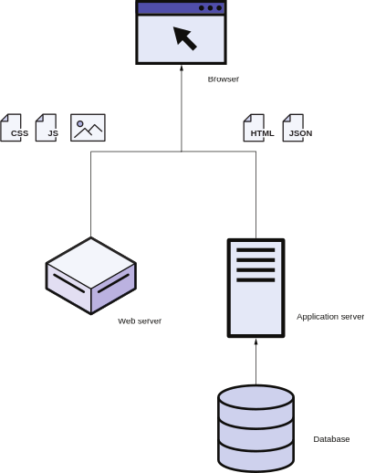
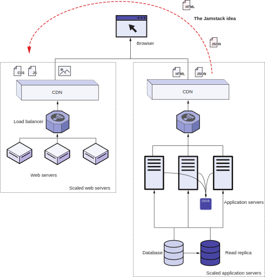
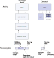

# 1.1 Jamstack中的技术栈

要全面理解Jamstack，我们首先需要理解Web技术栈的概念。 web技术栈是用于web应用程序开发的软件集合。 一些流行的Web技术栈包括LAMP(Linux Apache MySQL PHP)、Microsoft.NET(IIS、ASP.NET、MS SQL Server)、MEAN(MongoDB Express Angular Node.js)和MERN(MongoDB Express Reaction Node.js)。 图1.1显示了基于非Jamstack的网站典型web技术栈。

网页由静态资源和动态资源组成。 不同的服务器在技术栈中服务这些资产。 像Apache或IIS这样的Web服务器主要在传统的Web技术栈中托管静态资产，如图像、JavaScript和CSS。 这些静态文件不会在多个用户之间更改。 第二组资产是动态内容，可以有所不同。 它基于提供的请求参数，其中包括URL，请求标头，cookie或相关的HTTP POST数据。 安装了PHP、ASP.NET或Express等软件的应用程序服务器会获取这些参数并创建响应。 它可能需要对保存网站内容的数据库服务器 (如MySQL或MongoDB) 进行一系列请求。 应用程序服务器获取该内容，并使用应用程序逻辑将其缝合成JSON响应(如MEAN/MERN中)，或使用HTML模板缝合成HTML内容(如LAMP中)，然后将其提供给Web浏览器。 通过执行JavaScript并使用CSS对提供的内容和图像进行样式化，将网页组装在浏览器中。

自从互联网问世以来，这种网页架构基本上是一样的，但持续不断增加的流量给这种架构带来了压力。 增加服务器中的CPU和RAM (称为垂直扩展) 无法处理来自现代互联网的流量。 如此大的负载负载要求我们向技术栈中添加多台计算机(称为水平扩展)。

图1.1用于开发的传统web技术栈。 非Jamstack网站有一套技术栈，其中包含提供静态资产的Web服务器。 应用程序服务器提供动态内容，通过使用存储在数据库服务器中的数据生成，并在web浏览器中组装和呈现。

Web服务器（注:指图中静态服务器）易于扩展。 因为内容不会更改，所以我们可以在共享负载的多台计算机上复制它。 CDN执行跨地理上更接近最终用户的节点复制这些资产的任务，并为最终用户以更快的速度提供所有网络流量的互联网扩展。 图1.2显示了左侧web服务器的缩放策略。

图1.2传统Web技术栈需要扩展以处理Web上的负载。 水平缩放web服务器 (左) 很容易。 我们可以根据需要添加任意数量的Web服务器来处理负载。 而扩展应用程序技术栈 (右) 是困难的。 我们不可能拥有数百台数据库服务器(水平扩展)，而且我们可以在这些服务器中拥有的RAM和CPU容量(垂直扩展)也是有限的。 需要多种缓存技术来解决此问题。 Jamstack建议(顶部)将尽可能多的工作从动态应用服务器转移到静态Web服务器。

应用层 (应用程序和数据库服务器) 很难扩展。 如果我们通过在客户机上管理用户的状态来保持请求的无状态(通过JavaScript或Cookie)，我们就可以水平地扩展应用服务器。 因为这些服务器处理应用程序逻辑，所以很难将它们移动到CDN。

数据库层是最难扩展的。 CAP定理告诉我们，在互联网规模上无法扩展常规数据库。 (我们不能横向扩展到数千台MySQL服务器。) 该定理指出，在分布式数据库中，我们最多可以同时具有三个CAP属性中的两个:

- 一致性（Consistency）-每次读取都会收到最新的写入或错误。
- 可用性（Availability）-每个请求都得到一个 (非错误) 响应。
- 分区容忍性（Partition tolerance）-尽管节点之间的网络会丢弃(或延迟)任意数量的消息，系统仍可继续运行)。

诸如最终一致性之类的解决方案存在于应用程序技术栈中，其中数据库开始可能不一致，但在一段时间后变得一致。 这些变通方案导致应用程序逻辑上的困难，以及对我们实现某些事情的使用服务器技术出现强制约束。

尽管存在这些问题，但传统的web技术栈仍在互联网规模中幸存下来。 尽管存在数据库可伸缩性问题，技术栈仍能正常工作的最大原因之一是负载的类型。 在大多数情况下，数据库更改比检索该数据要少一个数量级。 我们可以通过增加缓存层来减轻数据库检索负载。 读取数据库的副本和应用程序服务器上基于RAM的缓存都是解决方案。 我们甚至发现，许多网页不会在多个请求之间发生变化。 许多网站可以在应用程序层上添加cdn以减轻负载。 图1.2的右侧显示了此解决方案。

仔细观察图1.2，应用层类似于web服务器层。 在为动态计算构建的应用程序服务器中管理缓存层要困难得多。 Jamstack通过将大部分逻辑从应用程序中移出到web服务器层来颠覆传统的web技术栈。


**NOTE**
Jamstack不是传统意义上的Web技术栈。 它没有规定任何用于开发网站的特定技术。 它提供了一种Web开发路径，其中大部分网站都是预先构建的，主要由客户端脚本增加动态化。 这改变了传统技术栈中软件的性质和排列方式。


显式地尝试缓存所有内容会使缓存管理变得简单得多。 我们可以预先计算和缓存大量需要动态计算的工作。 这种预计算(在Jamstack中也称为编译和预渲染)提供了增强性能的额外好处，因为当用户请求数据时，不需要在服务器中进行计算。

Jamstack不禁止服务器端或客户端处理。 它建议只有在必要时才使用这些工具。 部署期间的预计算效率更高，并且与应用程序服务器相比，web服务器的安全问题和维护需求更少。

图1.3提供了在首次发出获取HTML页面的请求运行时Jamstack与传统Web技术栈的比较。 对于经典开发路径中的初始HTML，查询需要通过互联网访问服务的原始服务器。 然后，负载平衡器选择一个应用程序服务器。 应用程序服务器可以向数据库发送多个请求，以获取其所需的数据。 它根据应用程序逻辑和作为应用程序代码一部分的HTML模板组装响应，以创建传递给客户端以进行呈现的最终HTML。 使用Jamstack，编译步骤已经执行了数据库处理和基于应用程序逻辑的拼接。 这种HTML生成并不是针对每个请求都发生的。 因此，该请求不需要通过互联网访问原始服务器。 而是在地理位置上靠近客户端的CDN提供内容。 

图1.3表达了首个请求运行时在传统web技术栈与Jamstack体系结构中影响的比较。 在传统开发路径中，当我们请求初始的HTML页面时，它会通过负载均衡器到达应用程序服务器。 应用程序服务器进行多个数据库调用以获取数据，然后基于模板创建HTML页面。 在Jamstack开发路径中，HTML是预先计算的，并且来自CDN。

注意，图1.3仅显示了对数据的初始请求。 正常情况下，还会有对图像、JavaScript和CSS文件的额外调用。 这些请求可能要求从源服务器或第三方服务获取更多数据。

