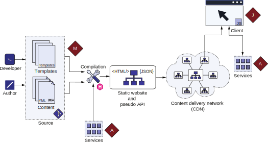

# 1.2 Jamstack是如何工作的？

Jamstack提供的简化技术栈在幕后进行了大量处理。 Jamstack对编译过程的重视对Web平台来说是新事物。 图1.4解释了Jamstack的各个部分。

图1.4 Jamstack的内部工作原理视图。 开发和内容团队维护基于Jamstack的网站的源代码。 该代码由网站数据和一组模板组成。 Jamstack构建器在编译过程中获取代码以创建静态网站的HTML/CSS/JS内容。 构建器还可以在编译时调用服务并输出充当API的JSON文档。 该输出被提供给CDN以在地理上进行分配。 客户端从最近的CDN端点获取网站。 客户端执行可以从服务中请求其它数据的JavaScript代码。

相当一部分的万维网由CMS管理的网站组成。 内容管理系统 (CMS) 是用于创建和管理数字内容的工具。 大多数网站中的内容与表示逻辑分开，可以由不同的人管理，这需要开发和维护与业务逻辑不同的技能集。 在基于Jamstack的网站中，我们将内容存储在标记文档中，而不是存储在数据库中。 与数据库表中的单元格不同，标记文档允许使用常规的基于文本的编辑器查看和编辑页面内容。 如果需要，内容作者或编辑者可以直接编辑这些文件或使用图形CMS。 开发人员维护模板和业务逻辑以组合数据并创建网站。 这些文件可以在像Git这样的版本控制系统中进行管理，并托管在GitHub这样的基于云的存储库系统上，以管理更改。 这形成了网站的标记(M)层。

像Hugo这样的网站构建器使用存储在标记文件中的数据将网站编译为HTML和CSS文件，JavaScript和基于图像的资产。 构建者可以通过API与外部和内部服务进行通信，以获取要编译到网站中的数据。 构建器还可以将网站内容构建成像JSON这样的机器友好格式。 JSON文件充当标记页面中的JavaScript代码或原生移动应用程序使用的API(称为伪API)。


**老式做法**

编写内容并将其保存在磁盘上的文件夹中，然后将其上传到管理内容的共享主机提供商。这种开发路径看起来很像早期网页开发，我们过去通过FTP上传HTML和PHP文件。 相似之处很容易看到。 这些相似之处引发了这样一个问题：这一次有什么不同？

自从我们放弃控制完整的服务器以来，网页技术已经成熟了很多。 现在，前端技术执行许多功能，而这些功能在当时需要服务器代码。 此外，共享托管平台已将自身升级到云，你可以在其中将托管和计算扩展到互联网规模。 即使是传统的基于Web技术栈的服务也是云托管的。

相较那个时代的另一个重大变化是工具。 以前像FrontPage这样的工具最初是同时针对设计师和最终用户的，让网站变成了一个复制粘贴的脚本网络，就连网站作者都不理解。 现代工具以帮助开发人员为目标，并有助于优化、维护和性能。 现在我们用这些工具设计网站，而不是把它们混在一起。 我们从早期的网页工作中吸取经验。 我们有一个更好的系统，具有足够的能力和灵活性，可以构建任何所需的应用程序而无需做妥协。


地理分布的CDN的机器托管已编译的网站以供使用。 距离终端用户最近的CDN节点将该内容提供给终端用户。 所有静态内容都是与用户无关的，并且可以快速产生。 对于动态数据，可以使用JavaScript代码。 JavaScript是Jamstack的J层。 JavaScript为网站提供了互动性和个性化。

JavaScript层可以与各种服务通信以提供动态内容。 这些服务公开了构成Jamstack的A层的API。 这些API封装了传统技术栈的应用程序服务器的剩余部分。 Jamstack建议使用托管服务，如第三方拥有的服务或FaaS(功能即服务)云解决方案上托管的服务，以最大限度地减少维护。


**Exercise 1.1**

在Jamstack中，大部分逻辑应该驻留在哪里？
- a. Server
- b. Microservices
- c. Compiled templates
- d. Client
- e. JavaScript
