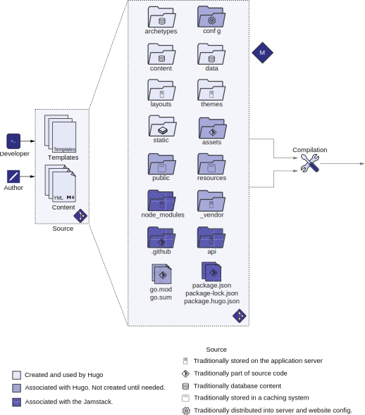

# 2.1 你的第一个Hugo网站

Hugo提供了具有大量功能的命令行，包括引导新网站。 本节向你介绍Hugo命令行。

## 2.1.1 Hugo命令行

Hugo是一个精心设计的命令行工具，提供了Hugo的所有功能。 它通过迁移数据、创建占位符、分析性能以及构建网站的核心任务来提供帮助。 Hugo命令行有两个不同的部分:

- Commands—确定你想让Hugo做的任务。 你可以通过在命令行上使用hugo [command]来提供命令和子命令。 Hugo的命令是分层次的。 直接调用`hugo`运行默认命令会开始构建站点。 发起`hugo new`以创造新目标事项。 `hugo new`的默认行为是创建新内容页面。 你可以使用`hugo new site`来构建一个网站骨架，并用`hugo new theme`来生成一个主题。
- Flags (也称为命令行参数)—指定通过提供不同的配置选项来修改命令结果。 Flags是特定于命令的，并且每个命令都可以有独立的标志。 例如，
--format yaml在`new site`命令中是将元数据格式从默认TOML更改为YAML。
学习Hugo命令行的直观方法是使用 --help 标志。 Hugo的帮助是分层次的： `hugo --help`为hugo命令提供帮助，并可将hugo new等列为子命令； `hugo new --help`为new命令提供文档，并可将site作为下级子命令。 Hugo的帮助还显示了每个命令可用的所有标志。 你还可以生成手册页格式的Hugo命令行文档(就像基于Unix的操作系统中的man命令所使用的那样)。 为此，使用`hugo gen man`或使用`hugo gen doc`生成Markdown文件。
让我们通过创建我们的首个网站来看看这一切是如何结合在一起的。 要在Hugo中创建一个新的网站，我们将在下面的清单中使用该命令。


```shell
hugo new site acme-corporation --format yaml
```


该命令使用YAML作为元数据语言，在当前文件夹的一个名为acme-corporation的子文件夹中创建Hugo框架文件夹结构。 该命令的各个部分在图2.2中已标记说明。 请注意，对于本书，我们将使用YAML(https://yaml.org/))而不是缺省的TOML(https://toml.io)元数据语言。 YAML在通用编程社区中更为普遍，比TOML的冗长程度更低，并且GitHub对它的支持更好。 它是一种更容易入门的语言，对于整个Hugo生态系统的新用户来说是更好的选择。 我们将在第3章讨论YAML作为Hugo的元数据语言。 附录B讨论了TOML作为元数据语言选项。 请注意，官方的Hugo文档提供了所有支持的语言的元数据。

 <!-- begin columns block -->

<--->
图2.2 hugo的command部分提供对Hugo命令行功能的访问。 我们可以通过此命令行使用Hugo的所有功能。 你可以使用它来编译Hugo网站、运行开发服务器、测量构建性能以及访问模块。



**Exercise 2.1**

以下哪一项可以让你在Hugo问题上获得帮助？
- a. --help flag
- b. man command
- c. Hugo website
- d. All of the above


## 2.1.2 添加到源代码控制

任何项目的第一步都是将更改提交到版本控制存储库。 命令行界面不支持本机撤消/重做。 如果你删除文件，则该文件不会转到回收站或垃圾箱文件夹。 任何运行的脚本都有可能导致数据丢失，包括hugo命令。 除非你对源代码进行了版本化，否则可没有回头路。
版本控制系统允许恢复已删除的文件并恢复到较旧的版本。 本书使用的版本控制系统是Git。 Git是最流行的系统，GitHub对其进行了紧密的集成。 这也包括互联网上最受欢迎的静态网站主机GitHub Pages。 将每个检查点提交给版本控制是一个好主意。 你可以使用git命令或像SourceTree或Fork这样的GUI客户端来执行这些任务。 在命令行上，可以使用多个Git命令执行此操作，如清单所示。 为了帮助进行版本控制，请注意代码检查点，你可以在其中暂停工作检查代码。





即使我们创建了一个网站骨架，也并不意味着我们有一个正常工作的网站。 hugo命令创建的大多数骨架文件夹都是空的。 至少，我们需要提供一些内容（content）和主题（theme）以将其呈现在我们的网站上。


**CODE CHECKPOINT**
https://github.com/hugoinaction/hugoinaction/tree/chapter-02-01



**NOTE** 额外的文件(Readme.md、License.md和.gitignore)被添加到服务器上的存储库中，以便更好地支持GitHub。



**迁移到Hugo**

Hugo支持从Jekyll导入内容，并自动将内容从该格式转换为Hugo理解的格式。 你可以使用hugo import jekyll <source jekyll folder> <target hugo folder> 命令将文件夹等效内容从Jekyll导入到Hugo网站。 此命令不提供同步，但我们可以将其用于一次性导入。


## 2.1.3 Hugo源文件夹的结构

在添加主题或内容之前，让我们先来看看Hugo网站的组成。 一个Hugo 源代码文件夹不仅仅是模板和内容。 hugo new命令生成六个文件夹，我们将在使用Hugo的功能时创建更多文件夹。 如图2.3所示，我们网站中的关键文件夹包括以下内容:
- archetypes —包含内容文件的模板。 Hugo试图尽量减少创建内容所需的复制和粘贴工作。 我们可以为该文件夹中的Markdown文件或文件夹创建模板，Hugo使用它们来创建基本内容文件。 我们将在第5章介绍Archetypes。
- content—包含传统上应该进入数据库的所有内容。 我们可以根据需要将内容组织成文件和文件夹。 默认情况下，Hugo基于该文件夹的结构直接生成网站输出，尽管我们可以使用每个文件中的元数据覆盖该输出(称为Front Matter，我们将在第3章中讨论)。 我们将在整本书中一直使用content文件夹。
- data—以YAML、TOML、CSV或JSON文件的形式存储结构化内容，这些文件可作为全局变量在整个网站中使用。 传统数据库存储的不仅仅是网页内容。 可能还有与结构化数据相关联的表，这些表无法放入在content文件夹中，因此当我们从Hugo外部生成内容并将该信息作为JSON或CSV文件传递给Hugo时，此data文件夹就会派上用场。 我们将从第5章中的data文件夹中读取数据。
- layouts—覆盖主题的部分内容。 Hugo让我们可以灵活地混合和匹配来自主题的页面，并编写我们自己的定制页面。 在此文件夹中，可以进行主题的所有自定义。 我们可以使用该目录来存储这些被覆盖的主题布局。 主题和布局之间的界限是模糊的，Hugo给了我们完全的灵活性，通过逐个覆盖页面来逐步创建主题。 我们将在本章中使用布局文件夹来更新主页，并在第6章和第7章中再详细介绍布局。
- themes —包含我们用来使content文件夹中的内容呈现的代码。 我们可以使用Go模板语言来编写主题。 我们将在本章中添加已有主题，并在第7章中创建自己的主题。



图2.3 位于source文件夹中的Hugo网站源代码和内容。 hugo new命令创建一组基本的文件夹，用于指定Hugo网站的各个部分： archetypes文件夹 (用于内容模板)， content文件夹(用于文本内容)， data文件夹 (用于结构化内容和键值对)， layouts和themes文件夹(用于模板和某单个页面设计)， 和static文件夹 (用于需要托管但不适合任何其它类别的其它内容)。 在使用过程中还会加入其它文件夹和文件包括assets(用于待处理的图像和JS/CSS文件)， config (用于设置和元数据，最初作为单个文件生成)， resources(用于缓存已处理的资产)、public (用于保存输出)、 vendor和go.sum/mod (用于Hugo Modules)，package*.json和node_modules (对于JavaScript)， .github/netlify.toml(用于持续集成)和API(用于自定义的第一方API)。

- config —容纳网站的配置。 此目录包含跨网站共享的元数据，包括主题的名称以及需要传递给Hugo或主题以呈现内容的任何参数。 默认情况下，Hugo创建一个config.yaml文件。 Hugo支持将此配置文件拆分为多个文件，并对应不同的测试和生产环境。 这会将配置转换为文件夹。 我们将在第4章中详细介绍该配置。
- static—存储静态内容，如字体或pdf文件。 Hugo将此内容按相同方式复制到输出目录中。 此文件夹在某种程度上相当于Apache/Nginx Web服务器根文件夹，你可以在其中放置任何要渲染的HTML文件。 建议在content，data，themes和layout文件夹中放置尽可能多的内容，以对其进行编程访问，并从Hugo的渲染管道中受益。 在static文件夹中，我们可以存储二进制文件，如.pdf、.woff(用于Web字体)和.zip文件，用于存放不属于任何其它地方的可下载内容。 我们将把一些文件放在本章的static文件夹中。

在所有这些文件夹中，content文件夹是我们通常花费最多时间向网站添加内容的文件夹。 themes文件夹包含开发人员可以在网站之外管理的主题。 相比之下，我们不经常更改其它文件夹(数据驱动网页的data文件夹除外)，只有在需要添加重要内容时才会更改。


**Exercise 2.2**

以下哪个文件夹包含网页上显示的文本？
- a. markup
- b. markdown
- c. content
- d. data
- e. text


在构建基于Hugo的网站时，以下是你将遇到的其它一些文件和文件夹:
- `assets` 文件夹—将图像、JavaScript和CSS文件作为待处理的源内容放置在网站上供全局使用。 此文件夹允许我们在编译期间处理这些文件。 Hugo可以调整图像大小，捆绑和缩小JavaScript文件，并通过其资产管道 (Hugo Pipes) 将SCSS转换为CSS。 我们将在第6章中学习图像操作和资源打包，并在第10章中使用JavaScript资源。
- `public` 文件夹—Hugo的默认输出目录，其中hugo命令生成要在CDN部署和缓存的HTML输出。
- `resources` 文件夹 —在处理数据时，Hugo将繁重操作的结果缓存在这个文件夹中。 我们应该将此文件夹放入我们的版本控件中，并跨构建重用其数据。 这个文件夹是Hugo获得出色表现的关键因素之一。 处理图像是CPU密集型操作，需要时间。 大多数资产在构建过程中不会发生变化，只要处理过的图像不发生变化，缓存它们就可以显著提高Hugo的性能。
- `go.mod` 和 `go.sum` 文件—Hugo Modules使用这些文件来同步项目依赖关系。 我们很少查看这些文件，但我们确实需要将这些文件放在版本控制中。 我们将在第8章介绍这些文件。
- `vendor` 文件夹—存储我们可以通过Hugo模块包括的第三方依赖项。 我们将在第8章中使用Hugo模块时创建此文件夹。
- `node modules`, package.json, package-lock.json, 和 package.hugo.json files—将Hugo与JavaScript生态系统联系并集成在一起。 我们将在第10章中详细讨论与Hugo一起使用JavaScript。
- `.github` 文件夹和 netlify.toml 文件 —将Hugo与持续集成服务GitHub和Netlify联系起来。 我们将在整本书中使用这些服务。
- `api` 文件夹—尽管不是标准的，我们将在第11章中创建这个文件夹来存放定制的API。


**Exercise 2.3**

将文件类型与最有可能放置文件的文件夹匹配。

- 1. YAML
- 2. Markdown
- 3. PDF
- 4. HTML
- 5. CSS
<---> 
- a. assets
- b. static
- c. content
- d. config
- e. themes

  