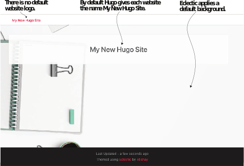
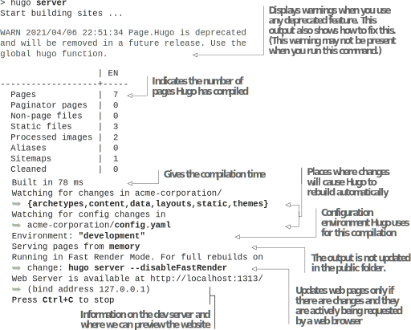

# 2.2 添加主题

回到Acme Corporation的示例网站，在该网站能够亮相之前，它需要一个主题和一些内容。 Hugo中的主题代表了将标记文档转换为可呈现网页的所有逻辑。 它由模板代码、JavaScript和用于图标和背景等常见元素的图像组成。 创建一个自己的Hugo主题非常耗时，所以首先尝试一些预先构建的主题是一个好主意。


**NOTE** 如果你计划使用其他人创建的主题，你可能不需要学习Go模板语言即可使用Hugo。


你可以通过学习Markdown之类的标记语言和YAML之类的元数据语言来创建网站。 你可以随时修改主题来定制用户界面，但如果你想建立一个网站并专注于内容，你只需要知道内容标记和元数据语言。 对于Acme Corporation，我们将从可以使用的预先构建的主题开始。 有多种方式可以获得主题：

- 使用Hugo模块整合主题。 Hugo 模块(Modules)是Hugo的包管理系统，允许主题有依赖关系。 使用Hugo模块构建站点时，Hugo可以自动获取主题所需的依赖项。 带有依赖项的主题不能与其它集成方法一起使用。 Hugo模块有设置要求，我们将在第8章介绍它时讨论。
- 使用Git子模块引用Themes文件夹中的主题。 Git版本管理系统可以为你设置主题。 这允许一个Git存储库在其中包含另一个存储库作为模块。 可以将依赖项链接到另一个服务器位置并独立构建。 虽然submodule特性是Git的一部分，不需要单独安装，但仍然需要设置。
此功能不如Hugo模块有效。 没有更新主题以支持Hugo模块的主题作者提到，Git模块是其主题的集成方法。 但是，随着时间的流逝，Git子模块的使用在Hugo世界中会减少，我们不建议在较新的主题和网站上使用它。
- 下载主题并将其复制到themes文件夹。 下载复制方法是最简单的技术。 因为主题代码在本地可用，所以我们可以很容易地阅读它，以了解主题正在做什么，修改它，并查看我们网站的更新。 在开发新主题时，这种方法允许快速进行更改，并使我们免于管理不同存储库的麻烦。 为了简化入门，我们将对本书的前七章使用下载和复制方法。

## 2.2.1 为网站添加主题

我们可以在Hugo网站上找到主题，网址是 https://themes.gohugo.io/。 虽然大多数主题都可以使用下载和复制方法，但有些主题可能具有必需的Hugo模块依赖项。 我们将使用Eclectic的主题，它没有这样的要求。 本书随附的代码示例中提供了Eclectic主题的副本 (https://github.com/hugoinaction/hugoinaction/tree/chapter-02-resources/01)。 它也可以在 https://github.com/hugoinaction/Eclectic 上获得

我们需要将Eclectic文件夹下载并粘贴到我们网站的主题文件夹中，才能使其可用。 这些文件位于适当的子文件夹中，以便你可以将它们放置在网站的根文件夹中。 每个列表都带有文件的路径和需要进行更改的文件名。 为了加载Eclectic为我们的网站的主题，我们需要在网站配置文件中使用theme键指定它。 清单2.3 告诉Hugo在themes文件夹中查找名为Eclectic的文件夹，并从该文件夹加载主题。


**NOTE** 在整本书的章节资源中，文件位于网站根目录的正确相对路径中，并且需要放置在与你的网站完全相同的相对位置。



```yaml
... # hugo new命令生成的现有内容。
theme: Eclectic
```



**CODE CHECKPOINT**	https://chapter-02-02.hugoinaction.com, and source code: https://github.com/hugoinaction/hugoinaction/tree/chapter-02-02.



**NOTE**   你可以通过导航到 https://github.com/hugoinaction/hugoinaction/compare/chapter-02-01..chapter-02 来比较各种GitHub分支，其中chapter-02-01和chapter-02是分支名称。 https://github.com/hugoinaction/hugoinaction 的 readme自述文件提供了每个代码检查点 (及其相应的部分) 、到托管版本的链接以及与先前代码检查点的差异。 在阅读本书的相应部分之前，最好先阅读一下代码检查点的托管版本。


## 2.2.2 运行开发服务器

我们可以在命令行上使用命令`hugo server`以开发模式运行我们的Acme网站 (我们也可以使用`hugo serve`)。 此命令会创建提供本地内容的开发服务器。 开发服务器模式会在代码更改后自动编译代码。 它近乎实时地更新了网站的本地托管版本(俗称实时重载)，从而改变内容。 Hugo的默认端口 (定位服务的位置) 是1313的，除非在该端口上运行其它内容 (在这种情况下，它可以通过 --port <number> 标志进行更改)，否则开发模式网站应该可以在那里被访问。  你可以在浏览器中打开 http://localhost:1313 以访问默认网站，如图2.4所示。 默认主页对于大多数主题是独特的，但需要配置才能使用。

清单2.4显示了如何使用Hugo服务器命令运行Hugo开发服务器。 默认情况下，此命令在 http://localhost:1313/ 托管基于Hugo的本地网站。 它会在内容更改时自动重建服务器，以便我们可以在Web浏览器中查看它。



图2.4具有Eclectic主题的默认网站。 当我们为基于Hugo的网站选择Eclectic主题时，Hugo基于该主题创建了一个索引页，即使我们不为该页提供内容，该网站也可以呈现该索引页。 (将来我们配置页面后，它看起来会更好，但是其实它可以在没有任何额外工作的情况下使用。) 这个页面可以作为开发网站其余部分的起点。 (背景图片由Pixabay上的glassdesk制作。)





如果我们不使用其它参数运行hugo，Hugo将编译整个网站并将文件放在public文件夹中。 我们也将开发模式称为服务器模式或实时重载模式。 它监听文件系统中的更改，并使用更新内容重建网站。 Hugo还支持开发模式中的快速渲染，这涉及仅构建按需请求的页面。 因为Hugo的速度非常快，我们没有注意到重建网页的延迟。 We can disable fast rendering or live reload if it interferes with the JavaScript state by using the command-line flags --disableFastRender and
--disableLiveReload, respectively. 请注意，你可以使用--Environment命令行标志在开发模式下运行网站的生产版本。 第4章讨论了各种构建环境之间的区别。

在本书的大部分内容中，没有必要退出Hugo开发服务器，因为它支持实时重新加载，因此我们可以轻松地切换内容。 但是你可以随时通过按Ctrl-C并再次运行hugo server命令来中止它。


**TIP** Hugo开发服务器针对内容更改进行了优化。 重新加载时，影响多个文件的主题更改容易出错。 如果你更改了主题的内容，浏览器中的缓存或使用开发服务器进行的增量构建可能会妨碍查看更新。 重新启动dev服务器，清除浏览器缓存，并可以在这些情况下使用 `hugo server -- noHTTPCache -- disableFastRender` 以提供帮助。



**Exercise 2.4**

Hugo的默认端口是 _____。


当你第一次在开发模式下运行网站时，由主题提供的图像及其JavaScript和CSS文件将由Hugo进行优化，并缓存在我们在本章前面讨论的资源文件夹中。 此过程可能会导致构建速度变慢。 可以将resources文件夹提交到源代码管理中，以防止Hugo再次生成它。


**NOTE** 大多数Hugo主题需要一些配置和内容才能起作用。 如果你尝试用不同的主题替换Eclectic主题，并且没有为Hugo提供适当的配置，则可能会出现空白屏幕。
