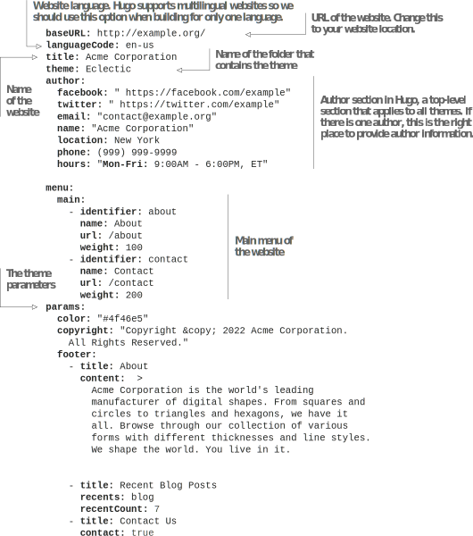
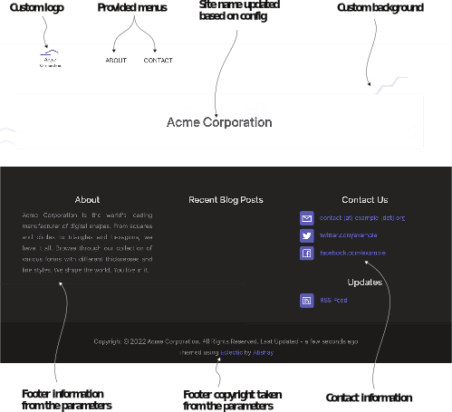
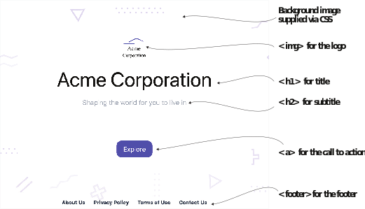

# 2.3 添加内容

我们将转换与Eclectic主题产生的空页面为一个功能齐全的网站。 这包括通过为主题提供一些设置和元数据来配置主题，添加诸如“隐私策略”和“使用条款”之类的页面，以及覆盖主题的自定义登录页面。


**NOTE** 主题的自定义数据不可移植。 你将不得不查看主题的文档以找出主题特定的配置。 如果你在开发网站时仍在犹豫选主题，建议你首先关注基于模板的标准内容页面(如“通用内容帖”)，而不是独特的页面(如“登录页面”和“联系我们”页面)。



**Exercise 2.5**

____命令在开发模式下运行Hugo。


## 2.3.1 配置

网站用两行代码就可以正常运行，这就是Hugo经过深思熟虑的默认设置的魔力所在。 我们可以通过为我们的网站传递正确的选项来做得更好。 配置文件有两个截然不同的部分：顶层配置和特定于主题的参数部分，前者在主题中是通用的，后者在不同的主题中有所不同。 让我们在配置文件config.yaml中添加一些数据。 这是Hugo Eclectic模板取得成功所必需的。 根据Acme Corporation中Eclectic主题的要求，以下修改提供了填充菜单，页脚，版权声明以及标题和作者信息的信息。
本书更新的配置文件位于 (https://github.com/hugoinaction/hugoinaction/tree/chapter-02-resources/02)。 你还不需要了解整个文件。 我们将在接下来的章节中继续使用这些设置，这些设置将变得更加清晰。 清单2.5 显示了我们将用于Acme Corporation网站的配置文件。 典型的Hugo配置文件包含：

- 所有主题的标准配置选项 (例如网站的URL，其名称-name和语言-language)
- 针对特定Hugo特性的选项(如菜单-menu)
- 主题特定参数 (如params)





Hugo通过一个称为Taxonomy的特性来支持内容的多个作者(在第4.4节中讨论)。 Hugo还提供了一种定义菜单的标准方法。 配置文件中的菜单部分具有键，每个键指定一个菜单名称。 每个菜单都有一个条目列表，该列表可以具有唯一标识符，要显示的名称，URL和对菜单项进行排序的权重。 在配置文件中，params部分是特定于主题的；其内容可能因主题而异。

我们用YAML元数据语言编写了清单2.5中的配置文件，我们将在第3章中讨论。 它使用冒号分隔的键和值提供结构化信息。 YAML是人类可读和区分大小写的，但是间距的变化会导致YAML解析器出现问题。

Hugo还支持更“间隔友好”的TOML格式。 本书的资源还包含配置文件的TOML版本。 如果你想使用它作为替代，则应该删除config.yaml。


**NOTE** 在发布之前记得更新网站的实际基URL，而不是配置文件中的http://example.org/。 遗漏example.org修改会破坏网站中的绝对链接。


Eclectic主题允许我们提供我们的Logo，通过将它放置在assets/image文件夹中 (不是在themes/Eclectic/assets/image文件夹中) 来控制网站背景图像。 我们将在此文件夹中放置logo.svg和backack.svg以个性化网站。 如果不存在此文件夹，我们将需要创建它。(你可能需要重新启动开发服务器才能使更改生效。) 这些文件存在于此处 (https://github.com/hugoinaction/hugoinaction/tree/chapter-02-resources/03) 第2章的代码包中。


**CODE CHECKPOINT**	https://chapter-02-03.hugoinaction.com, and source code: https://github.com/hugoinaction/hugoinaction/tree/chapter-02-03



Hugo在配置文件中标准化了一些先前指定的部分(如菜单和标题)。 我们将在第4章中介绍这些部分。 其它部分(如参数)对于每个主题都是不同的。 甚至像logo.svg这样的图像位置都是特定于主题的。


**Exercise 2.6**

以下哪项用于提供网站端点（endpoint）供Hugo编译？
- a. baseURL
- b. endpoint
- c. website
- d. url
- e. host
- f. domain
- g. server


你可以立即看到在Acme网站上提供元数据的影响。 使用前面提到的配置，站点应该看起来类似于图2.5。



图2.5配置主题后，Acme Corporation网站看起来更加完整。 现在，配置文件中添加的主菜单和页脚部分在所有页面上都可用。 一旦我们放置图像文件，logo和background图像就会更新。(图片由BiZkettE1在www.freepik.com创建。)

## 2.3.2 内容页面

网站的目标是提供内容，而我们漂亮的网站到目前为止还没有这样的网站。 网站顶部菜单添加的条目链接到不存在的页面! 我们需要在网站上创建页面，使其发挥作用。 我们将首先在本章菜单中向链接的页面添加内容，然后在第3章中对内容进行格式化。

我们可以在content文件夹中将内容页面创建为文本或标记文件。 我们可以在该文件夹中放置一个privacy.md文件，其中包含基于Markdown的内容，以获取 https://localhost:1313/privacy 网址。   类似地，我们可以添加about.md、redits.md、terms.md和contact.md页面 (https://github.com/hugoinaction/hugoinaction/tree/chapter-02-resources/04)。 Hugo会自动应用主题，并且在添加文档后立即呈现页面。 通过这种方式，我们可以添加任意数量的页面来生成网站的核心结构。 Markdown提供了多种格式选项，我们将在第3章中研究这些选项。

## 2.3.3 索引页

索引页面 (也称为主页或登录页面) 是网站的第一页，负责为用户确定预期的向导。 它的内容是独一无二的，不同于所有其它页面。 基于文本的内容在某些页面上效果很好，但是许多网站为索引页面实现了自定义内容。 网站甚至有定制的画廊和带有大量图像的部分，这需要定制实现。 Hugo认识到这一点，并为索引页面提供了一个唯一的模板，称为索引模板。 在许多主题中，索引模板是以特定于主题的方式定制的，并且索引页配置不能跨主题移植。


**NOTE** 大多数Hugo主题都提供了一个名为exampleSite的文件夹，其中包含一个使用该主题的入门网站。 此文件夹在概览学习特定于主题的配置和自定义选项时非常有用。


Hugo的模板是HTML文件，但这些模板可以是任何基于文本的文件格式 (例如，JSON，XML，甚至是纯文本)，并带有其它模板标签，这些模板标签会在编译步骤中使用。 对于试图构建自定义Hugo模板的用户来说，最好从索引模板开始，因为它只影响网站的一个页面。 可以使用layouts文件夹中文件覆盖Hugo模板。 在本章中，我们将不使用任何模板标记，而是从一个普通的HTML模板开始，我们将把该模板放置为layout/index.html。 它仍然是Hugo模板，可以访问所有变量，这些变量是可选的。

对于Acme Corporation的索引页，我们将用一个定制页面覆盖主题的索引页，该页面用HTML和CSS硬编码，如图2.6所示。 此页面将包含网站徽标，标题，副标题，带有号召性用语的按钮 (告诉读者进行更多探索) 以及带有指向其它页面的链接的页脚。

在layouts文件夹中，我们将放置一个名为index.html的新文件，其中包含自定义HTML内容 (https://github.com/hugoinaction/hugoinaction/tree/chapter-02-resources/05)。 因为我们不使用Hugo的模板语言，所以我们将对所有路径进行硬编码，并使用到各种支持托管位置的相对位置。



图2.6我们可以在Hugo网站中创建自定义登录页面，方法是将一个名为index.html的文件放在layouts文件夹中。 此页面覆盖主题提供的主页。 对于Acme Corporation，我们使用了一个带有硬编码的HTML和CSS的登录页面，并避开了特定于Eclectic主题的特性来创建基于结构化数据的页面。

如清单2.6所示，我们可以通过在layouts文件夹中放置HTML模板文件来覆盖Hugo主题中的模板。 这里这样做是为向理解HTML的人提供了一种快速定制网站的方法，而不需要学习Hugo。 自定义HTML对于特定网站可以是唯一的。 除非我们使用Hugo的模板语言，否则我们必须小心使用我们正在编写的HTML，因为定制的HTML页面不会在它链接的内容更改时自动更改。


```html


资源的相对路径。 当我们在托管环境中使用子文件夹发布此代码时，绝对路径会导致问题。


Assets from the static folder. Assets referred to in the HTML should be provided in the static folder for correct links in the final website.


Hardcoded menus. In plain HTML, we have to assume that the URLs of the menu entries and their names match what is specified.
```



**NOTE** Hugo不会修改模板中提供的HTML。


纯HTML文件需要图像和index文件才能正常运行。 assets文件夹中的图像(我们为Eclectic主题放置的图像)需要使用Hugo管道。 (我们将在第6章讨论Hugo 管道。) 对于不需要Hugo处理的内容，我们必须使用static文件夹。 在我们开始使用Hugo的资产处理管道之前，我们需要在static文件夹中放置资产的第二个副本。 这包括static/index.css、static/image/background.svg、static/image/logo.svg和static/favicon.ico。 这些资产随章节资源 (https://github.com/hugoinaction/hugoinaction/tree/chapter-02-resources/06) 一起提供。


**Exercise 2.7**

为了主题独立，建议在纯HTML中自定义哪个页面？
- a. privacy
- b. index
- c. robots.txt
- d.  English
- e.  settings



**CODE CHECKPOINT** https://chapter-02-04.hugoinaction.com, and source code: https://github.com/hugoinaction/hugoinaction/tree/chapter-02-04.
↻ Restart your dev server.


