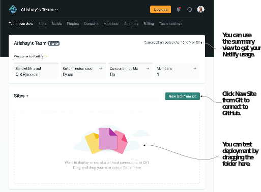

# 2.4 持续交付

Hugo和Jamstack的一个巨大好处是维护成本低、托管成本低、效率高。 我们通过从代码存储库中持续交付来获得这种能力。 持续交付是以持续不断的方式将我们的代码更改进行部署的概念。 良好的持续输送管道是自动化的，需要最少的人工努力。

有很多方法可以通过Hugo实现持续交付，比如编写一个脚本来将我们的代码推送到像Amazon S3这样的存储提供商，或者将其与Apache/Nginx放在web服务器层，就像与任何其它web技术栈一样。 我们将重点介绍Hugo社区中最流行的方法。 你可以在Hugo网站(https://gohugo.io/hosting-and-deployment/)上找到更多的托管信息，该网站维护着各种流行的托管提供商和脚本的运行列表，以设置基于Hugo的托管。

虽然在公共云上部署基于Hugo的网站可以访问许多其它服务和强大的功能，但Netlify和GitHub页面的简单性是开始学习Hugo的最佳途径。 这些方法也支持持续部署，一旦我们将代码提交到代码存储库，就会立即进行更新上线。 在本书中，我们将重点介绍Netlify和GitHub页面作为我们的托管解决方案。


**NOTE** 以下部分假设网站的源代码已上传到GitHub。 书中的每个代码检查点都是提交更改并将其部署以获得新构建的好时机。


## 2.4.1 Netlify 托管

Netlify是一家领先的静态网站托管服务公司，其创始人创造了Jamstack一词。 Netlify为Hugo提供内置支持的部署服务。 Netlify负责持续集成，并提供API供网站使用。 我们可以连接我们的GitHub存储库，并免费在Netlify上获得静态托管 (即使是私有存储库)，直到我们达到其带宽限制。 Netlify提供了一个方便的命令行工具，可以在不离开终端的情况下执行任务。 我们还可以通过名为netlify.toml的配置文件提供构建说明。 Netlify还支持域名购买、域名解析和CDN管理，还支持定制http头等功能。


**TIP** 如果使用Netlify，请尽量使用分支签出功能。 Netlify可以对每次拉取请求进行不同网站构建和托管，并可以通过分支维护不同的版本。 我们将使用此功能来托管我们在本书中演示的网站的各种版本。 到目前为止，你可以导航到 https://chapter-02-04.hugoinaction.com 查看包含本章内容的实时网站。


一旦我们注册了Netlify (https://app.netlify.com/signup)，它就会提供一个分步向导来托管我们的网站。 如果我们已经将我们网站的源代码推送到GitHub，我们可以在登录到Netlify开始部署后，点击New Site from Git，如图2.7所示。

New Site from Git按钮将我们带到可以与托管提供商连接的 https://app.netlify.com/start, (图2.8)。 一旦我们选择了托管提供商，我们就需要登录并授权Netlify访问我们的代码库。

图2.7注册后，Netlify为我们提供了一个屏幕，其中列出了Netlify使用情况的摘要，并提供了建立新的Netlify网站的方法。 我们可以连接到主机提供商或直接上传我们的网站。 建议连接到提供程序，以便在推送代码时获得持续部署。

图2.8 Netlify支持与多个主机提供商的连接。 连接到它们就像点击按钮然后登录一样简单。

一旦我们提供凭据，Netlify就可以浏览我们的存储库列表，并在Netlify的用户界面中提供所有存储库名称，以供我们选择要部署的名称(图2.9)。 请注意，Netlify默认情况下不会读取GitHub组织，因此我们需要通过使用底部的链接来配置Netlify以提供访问权限。

图2.9登录后，我们可以通过Netlify在代码存储库中搜索要托管的代码。

接下来，我们可以指定要构建的分支、构建命令和输出目录(图2.10)。 我们用命令行参数`hugo --minify --baseURL $DEPLOY_PRIME_URL`向hugo提供网站网址。 baseURL标志用Netlify用于构建分支的设置覆盖了config.yaml中的设置。 如果我们使用拉取请求预览和分支部署，最好给每个部署一个适当的URL。 我们还可以在名为netlify.toml(https://docs.netlify.com/configure-builds/file-based-configuration)的文件中指定构建参数。


**NOTE** 要指定Hugo的确切版本，可以在指定构建命令时单击Show Advanced按钮，然后使用正确的值添加环境变量HUGO_VERSION，这就是我们要使用的Hugo的版本(例如0.91.2)。 如果未指定版本号，Netlify不保证设置最新版本的Hugo。 最好是通过手动提供来控制构建版本。


图2.10 指定用于持续集成的分支，并提供构建命令和输出文件夹来部署我们的网站。 我们可以通过单击 “Show Advanced” 按钮来指定要与高级选项一起使用的Hugo版本。

## 2.4.2 GitHub Pages

GitHub是开发的瑞士军刀。 GitHub在开发人员社区中非常受欢迎，并且能够对开放源代码进行无限免费托管，因此是开始使用静态托管的完美场所。 Pages服务可以从我们的源代码存储库中的分支或文件夹中呈现静态HTML。 GitHub操作执行持续集成。 Hugo的GitHub Actions marketplace上有多个操作可用。 在本节中，我们将使用此Hugo设置(https://github.com/marketplace/actions/hugo-setup)。

在GitHub页面上托管我们基于Hugo的Acme Corporation网站的步骤如下。 清单2.7提供了启用GitHub页面的代码。

1 在创建GitHub操作文件 .github/workflows/gh-pages.yml，它告诉GitHub要采取的行动 (https://github.com/hugoinaction/hugoinaction/tree/chapter-02-resources/07)。 当这些更改被推送到GitHub时，这些操作会自动执行，使用我们网站的编译版本创建gh-Pages分支。
2 在存储库的GitHub设置中，从gh-Pages分支存储库中启用GitHub页面 (请参见图2.11)。 启用后，网站的URL将在界面中可见。
3 部署后，将GitHub Actions文件和config.yaml文件中的基本URL从sample值更改为GitHub操作中提供的正确URL，然后再次推送。 我们可以在GitHub的Actions选项卡上查看更新，如图2.12所示。





一个使用GitHub页面的示例网站托管在 https://hugoinfotion.github.io/GitHubPages/，源代码在 https://github.com/hugoinaction/GitHubPages/ 。 我们可以导航到GitHub UI中的Actions选项卡，以查看运行GitHub Actions的结果，GitHub Actions将部署网站。

图2.11 GitHub页面作为静态网站主机的选项。 对Hugo使用分支：gh-pages选项。

图2.12 GitHub上的Actions选项卡显示所有已执行的操作。 每次代码推送都可能运行GitHub操作。

现在，该网站应该可以在web上使用，并且一旦它上线，我们应该能够在页面部分中导航到GitHub提供的链接。 GitHub提供了一个CDN，在全球范围内分发网站，在其配额限制下(大小不到1 GB，每月带宽100 GB，在撰写本书时每小时约10个构建)，网站是免费的。 这是个人网站或测试Jamstack的好地方。 许多GitHub页面记录了GitHub上已经存在的源代码，Hugo是生成源代码的一个流行工具。


在go中编辑

有一种流行的误解认为，除非你设置了开发环境，否则很难编辑使用Jamstack架构构建的网站。 大多数现代Jamstack网站都具有连续的环境设置，我们可以通过简单的签入将其推向生产。 该系统使Jamstack比传统的基于数据库的网站技术栈更加灵活。 我们不仅可以更改内容，还可以更改设计，配置甚至业务逻辑，而无需设置开发环境。 由于不需要考虑可伸缩性，在Jamstack上编辑比使用传统的Web技术栈更容易。

如果进行较小的编辑，GitHub的web界面是一个有价值的工具，它提供了在任何地方编辑网站的能力。 有CodeHub、Pocket-Hub或Working Copy(在移动和平板电脑上都可用)等应用程序可以从Git存储库创建或修改Markdown文档。 我们可以在任何我们想要的地方进行更改，持续集成系统确保它们在提交后的几秒钟内上线。 与传统技术栈不同，为Jamstack设置本地开发环境要容易得多，而且当我们不得不这样做时，不需要几天的时间。


## 2.4.3 Vercel、Cloudflare、AWS Amplify和其它专用Jamstack主机

与Netlify一样，其它专用Jamstack主机也提供类似的功能集，例如分支/提交预览，自动连续集成和部署以及API创建支持和管理。 Vercel为管理Java脚本提供了强大的支持，如果我们的网站越来越多地使用JavaScript，这将是一个优势。 Cloudflare页面由地球上最大的cdn之一构建，提供无限的带宽，比大多数其它服务更好的性能，以及定义明确的方法来创建我们的API (使用Cloudflare Workers和Cloudflare Workers KV)。 AWS Amplify是一项AWS服务，可与AWS的其余部分完美集成。 Cloudflare、AWS Amplify和Vercel的Hugo主机设置与Netlify类似，在选择这些提供商中的任何一个都不会出错。

## 2.4.4 AWS、Azure和Google云文件存储

如果你正在将公共云功能用于Jamstack的其它部分，或者希望获得比标准化托管提供的更细粒度的控制，也可以从Hugo部署到云。 Hugo附带一个内置命令，hugo deploy(https://gohugo.io/hosting-and-deployment/hugo-deploy/)，可以将网站部署到AWS S3 bucket、谷歌云存储或Azure存储。 一旦我们在机器上设置了身份验证凭据，我们就可以在config.yaml文件中的deployment.targets.URL部分中指定指向特定服务的链接。 例如，要部署到AWS S3，你需要输入 s3://<Bucket Name>?region=<AWS region> 。 Hugo会自动识别云和当前构建之间的更改，并在运行hugo deploy <target name> 时同步这些更改。 我们还可以在同一节中指定云向网站用户公开的缓存策略。

图2.13使用Jamstack发布。 即使Bob获得了额外的资源来继续使用现有的技术栈，Alex也不会放弃Jamstack。