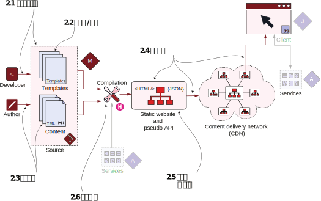

# 第2章 30分钟上线你的网站


**本章涵盖**
- 运行Hugo命令行
- 建立一个有主题和内容的Hugo网站
- 概述基于Hugo的网站结构
- 建立持续的部署工作管道
- 衡量性能和分析网站可维护性
  

Hugo很快，很容易上手。 你可以下载Hugo，然后使用基本的文本编辑器和web浏览器就可以工作。 如图2.1所示，本章将浏览Jamstack流程的整个过程。 我们将为一家名为Acme Corporation的公司创建一个网站。 Acme公司是数字形式的直线、圆形、正方形和三角形等形状的领先制造商。 我们将使用Hugo命令行引导网站 (第2.1节) 预先构建的主题 (第2.2节) 和一些已经可用内容 (第2.3节)。 我们还将在互联网上托管网站(第2.4节)，并分析本章中做出的技术选型的性能和可维护性(第2.5节)。 请注意，我们将在整本书中逐步增强此网站。

图2.1 本章贯穿了Jamstack的整个流程--从开发人员到发布的网站。

附录A提供了与Hugo一起启动和运行的信息。 你也可以使用官方网站https://gohugo.io/下载Hugo以及参考它的文档。 Hugo可在所有主要平台上使用。 对于这本书，你需要Hugo的版本不低于0.91.2。
