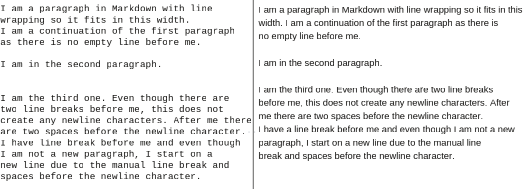
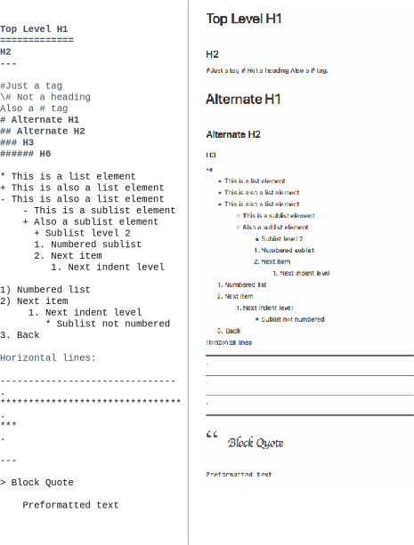
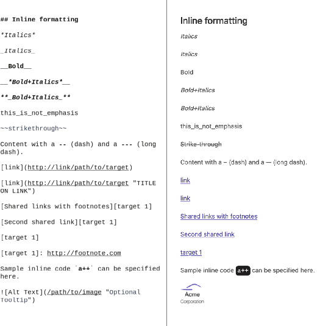
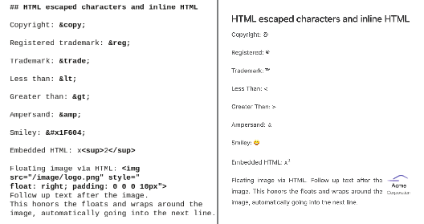
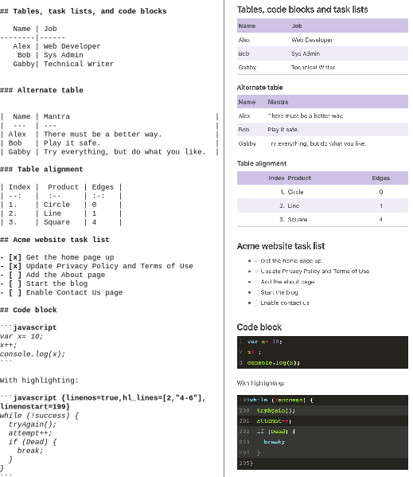
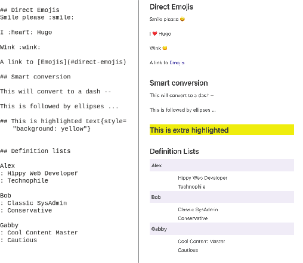

# 3.1 用Markdown编写内容

到目前为止，我们已经使用纯文本为我们的网页提供内容。 然而，对于纯文本，我们没有结构，一团文本读起来并不有趣。 Markdown是一种轻量级文档格式，用于编写易读易写的文档，并支持基本格式和使用基于文本的构造来组织内容。 2004年，约翰·格鲁伯 (John Gruber) 和亚伦·斯沃茨 (Aaron Swartz) 创建了Markdown作为一种人类可读的基于文本的格式语言。 它标准化了用于指定格式的基于文本的机制。 尽管编译器和渲染器可以提高文档可读性，但是如果没有它，文档会很容易理解。 这种可读性使Markdown成为一种流行的格式化语言，从命令行Git提交消息、自述文件、纯文本框和聊天室都可以见到它。

最初的Markdown具有有限的功能集，由CommonMark (https://commonmark.org/) 扩展，并进一步发展为GitHub风格的Markdown (GFM)，这是Markdown流行的变体 (请参见https://github.github.com/gfm/)。 Hugo支持GFM的大部分，并对其进行了进一步扩展。 Hugo解析使用文件名扩展名创建的文件。医学博士或。降价作为降价。 第2章中的privacy、credits、terms和about文件已经具有.md扩展名，并且可以与Markdown的格式化功能一起使用。


**Markdown编辑器**

Markdown是一种可以在纯文本编辑器中读取和写入的语言，而不需要任何对此格式的支持。 许多用户没有Markdown的专门编辑器。 Sublime Text和VS Code等简单的文本编辑器提供颜色编码，以帮助识别Markdown中的特殊格式。 它们还支持以输出格式实时预览Markdown内容。

如果你正在寻找一个专门的Markdown编辑器，像Typora(HTTPS：//typora.io/)和IA Writer(https://ia.net/writer))这样的工具提供了许多功能来帮助创建好的Markdown文档。 这些工具支持键盘快捷键和内联以及实时预览。 像Dropbox Paper(https://www.dropbox.com/Paper)这样的在线工具也支持Markdown的一个子集。 除此之外，panDoc(https:// pandoc.org/)可以接受许多文件格式，包括Microsoft Office、Open Office、Latex和MediaWiki，并将它们转换为Markdown。


## 3.1.1 Markdown中的段落

Markdown已经在段落之间使用空行对文本块进行格式化(HTML中的<p>标记)。 由于此功能，我们在第2章中提供的各种页面看起来并不难看。 图3.2显示了段落和换行符元素的呈现方式。

如果我们提供两个以上的换行符，则渲染内容会折叠它们。 在此过程中，渲染还会忽略单行换行。 我们还可以在没有自动文本换行的文本框中使用标记，并且可以在不影响输出的情况下添加换行符，从而保持可读性不变。 要创建常规换行符(HTML中的<br>标记)，请在行尾添加两个空格，然后使用Enter(回车)键添加一个换行符。



图3.2 Markdown中的元素，第1部分: 段落和换行符

## 3.1.2 标题、列表和其他块元素

我们需要标题，列表和其他块元素，以提供Acme Corporation网站的使用条款和隐私政策页面的适当结构。 图3.3显示了这些元素以及它们在浏览器中的呈现方式。 为了创建顶级标题，

- 在标题文本之前，使用井号标记(#)。 单个 # 符号创建1级 (H1) 标题，两个 ## 符号创建2级 (H2) 标题。 在大多数解析器中，我们可以使用这样的散列标记来达到六个级别的标题(##、###等等)。
- 在标题文本下，为1级标题添加一行等号=，或为下一级标题 (H2，H3等) 添加连字符 (破折号-)。 这条下划线(由等号和破折号创建)突出了标题，使它们不仅更具可读性，而且更容易定位。

GFM在井号标记后需要一个空格，才能被视为正确的标题，以区分issues标签。 对于标题，井号需要在我们要用于标题的文本之前开始一个新行的开始。 文本中间 (从一个标题到下一个标题) 不会创建标题，而是我们的内容。



图3.3 Markdown中的元素，第2部分：标题、列表和水平线

我们可以通过使用 *，- 或 + 在句子的开头添加项目符号列表 (<ul> 块元素)。 通过在项目符号字符前插入四个空格来添加子列表。 数字后跟圆点(.)的数字或右括号())创建编号或有序列表(&lt;OL&>块元素)。 我们可以在Markdown中嵌套不同的列表。

我们可以使用一系列破折号或星号 (至少三个) 创建水平线 (<hr> 标签)。 要添加块引用，我们在文本前面加上&gt;作为该行的第一个元素。 任何以四个空格或制表符开头的文本都被认为是预格式化的代码块，它完全按照你写的方式显示，保持换行。 图3.4显示了Acme Corporation的使用条款页面(左侧)，以及相应的标题和列表块元素(右侧)。 图像中突出显示的块元素是留给读者的练习。 为此，读者应使用这些元素更新隐私政策页面。 你可以统计你的变化


图3.4向Acme Corporation网站的使用条款页面添加标题和列表以及相应的块元素，这些内容在章节资源(https://github.com/hugoinaction/ hugoinaction/tree/chapter-03-resources/01)中提供。


**CODE CHECKPOINT**	https://chapter-03-01.hugoinaction.com, and source code: https://github.com/hugoinaction/hugoinaction/tree/chapter-03-01.



**Exercise 3.1**

以下列表中的哪些符号可以帮助识别Markdown中的标题？(选择所有适用的。)
- a. Asterisk (*)
- b. Underscore (_)
- c. Hyphen/dash (-)
- d. Equals sign (=)
- e. Plus sign (+)
- f. Hash mark (#)


##3.1.3 格式、内联链接、代码、图片

虽然块元素赋予页面其结构，但内联元素强调页面的重要部分。 图3.5显示了这些内联元素(左侧)以及它们在浏览器中的呈现方式(右侧)。

请注意，Hugo会自动在页面上格式化超链接，并将其转换为HTML锚标签。 这种自动链接是Hugo的Markdown解析器提供的一个特性，所以我们不需要编写任何特殊的东西来启用它。 我们也可以使用 [可见文本](http://example.org/path/to/file) 格式创建链接。 我们也可以使用[Visible Text](http://link“TITLE”)格式，其中“TITLE”作为工具提示。

我们可以通过将对它们的引用写为 [可见文本] [目标1]，然后使用格式 [目标1] 添加具有引用值的脚注，https://example.org/path/to/target. 跨文本共享链接: 共享链接也直接在脚注位置工作；例如，[目标1]自动链接到我们刚刚设置的目标1链接。

Markdown使用基于文本的标记提供基本的格式设置支持。 我们可以用_(下划线)或*(星号)来表示斜体，或者用(双下划线)来表示粗体来括起所需的文本。 对于粗体和斜体，我们可以使用 ** _<text>_ ** 或 *<text>*。 双波浪线(~~)用于删除线。

我们可以通过使用像这样的反单引号来指定内联代码，“内联代码”，我们可以将其放置在自由流动的内容中。 它在HTML&lt;code&gt;标记中使用等宽字体格式化。

Markdown创建  标签以显示与内容内联的图像。 不支持指定块图像、图像尺寸或其他细节；这留给主题来实现。 

Figure 3.5 Elements in Markdown, part 3: Inline elements including bold, italics, underline, links, and images

我们可以使用与链接类似的语法来内联图像，并在它们前面加上一个！(感叹号，通常称为bang)。 要在文本中内联渲染图像，我们会写。 我们也可以在图像标记中使用相对路径。
使用这些功能，我们可以为Acme Corporation网站正确格式化隐私政策的重要部分。 格式化的隐私政策页面现在看起来更加完整和专业。 图3.6显示了右侧的 “完成的隐私策略” 页面的一部分，左侧标记了内联元素。 更新隐私策略页面以匹配此设计对读者来说是一项练习。 已完成的隐私策略页面可在代码检查点中使用，也可在资源章节 (https://github.com/hugoinaction/hugoinaction/tree/chapter-03-resources/02) 中提供。


图3.6 Acme Corporation的隐私策略页面使用块元素、内联链接和其他格式。 请注意，HTML将mailto url用于电子邮件链接，如contact@example.org和电话号码。 图像只标记内联元素，但标题也需要标记。


**CODE CHECKPOINT**	https://chapter-03-02.hugoinaction.com, and source code: https://github.com/hugoinaction/hugoinaction/tree/chapter-03-02.
↻ Restart your dev server.


## 3.1.4 HTML

虽然我们可以在简单的Markdown中做很多事情，但纯HTML和CSS甚至更强大。 没有办法用Markdown来表示大量的HTML功能。 幸运的是，Markdown认识到这个问题。 如果Markdown文档包含一个HTML标记，Markdown解析器将按原样输出该HTML标记，并且它将出现在生成的输出中。 例如，如果我们将粗体与 <em> 强调 </em> 一起使用，则将其转换为 <strong> 粗体与 <em> 强调 </em></strong>。 因此，Markdown是一个超集的HTML。

从技术上讲，任何有效的HTML也是有效的Markdown。 我们可以使用带有Markdown的HTML标签来将这些标签传递给我们的内容。 我们也可以使用HTML和XML文档中常见的转义语法编写Unicode字符。 此功能提供对整个Unicode字符集的访问，包括本地化字母、表情符号、符号等。 图3.7显示了这些元素以及它们如何在浏览器中呈现。



图3.7 Markdown中的元素，第4部分：转义HTML和内联HTML

尽管我们可以使用任何HTML来提供Markdown无法使用的其他功能，但这样做并不是一个很好的做法。 事实上，强烈建议尽量减少在Markdown内容中使用嵌入的HTML。 如果我们不信任内容创建者，内联HTML可能会带来安全风险，因为他们可以添加任意内容


脚本和css。 在尝试更新主题时，对主题创建者手中的嵌入式HTML几乎没有控制权可能会变成一个大问题。 此外，当我们可以自由地创造性地使用HTML，向内容添加布局、对齐、颜色和其他风格特征时，清理起来就变得困难了。 雨果默认禁用内联HTML。 我们可以在Markdown中通过在config.yaml文件的markup/goldmark/render部分中的unsafe键启用它，如下面的清单所示。 注意Unicode字符没有被禁用。 此外，我们将在第5章中讨论的具有短码功能的内联HTML几乎没有必要。


```yaml
markup: 
  goldmark:
    renderer: 
      unsafe: true
```


当我们为Acme Corporation的网站创建配置文件时，我们将版权指令指定为copyright ©。 在图3.7中，你可以看到基于Unicode的版权符号的转义HTML。 默认情况下，为config.yaml中的任何键输入的文本都是纯文本，但主题作者可以选择将其视为Markdown (更多详细信息，请参见第6章)。 许多主题支持基于Markdown的配置参数，使我们能够为我们的内容定制格式。

在隐私政策页面中，我们在第一行使用TM表示Acme Corporation的商标。 现在是将其替换为&trade；以获得HTML商标符号的好时机。 请注意，你也可以插入直接的Unicode字符，如™商标符号。

## 3.1.5 表、任务列表和代码块

Hugo支持由GitHub推广为GFM的Markdown扩展，包括表，任务列表和代码块的语法。 图3.8显示了这些扩展以及它们在浏览器中的呈现方式。

为了创建表，我们可以每行写一行，用管道 (|) 字符分隔每一列。 我们可以写一行破折号(-)来给表头行加下划线。 Hugo还支持一种较短形式的Markdown表，我们可以忽略行外边缘的管道字符。 你可以在表中使用冒号和破折号来定义列对齐方式。 例如: -- 是左对齐的，:-: 是居中对齐的，--: 是右对齐的，而 --- 是未定义的 (默认是基于语言和主题)。

任务列表遵循GitHub样式，其中我们编写破折号(-)后跟方括号([])来声明任务。 你甚至可以在已完成作业的括号之间添加十字 (x)。 Hugo中的任务列表显示为禁用；没有自动启用，因为在不涉及服务器编辑文件的情况下，不可能通过单击“复选框”来更新内容。



图3.8 Markdown中的元素，第5部分: 表、任务列表和代码块

Markdown支持在代码块的开始和结束处使用三个反单引号(```)(通常称为代码栏)来支持代码块。 语言名称可以跟随开头的代码围栏，以获得特定于语言的代码高亮显示。  默认情况下，Hugo不在代码中启用行号。 我们可以通过将全局配置文件中的markup/highlight/lineNos设置为true来允许这些，如下面的清单所示。


markup: 
    highlight:
        lineNos: true
   	

Hugo通过将附加选项传递给代码栏来支持突出显示代码片段或覆盖代码段。 例如，传递 {linenos=true, hl_lines=[2,"4-6"],linenostart=199} 告诉Hugo覆盖行号配置，允许这些配置存在，在199处开始行号，并突出显示第2、4、5和6行。

## 3.1.6 表情符号、ID和其他Hugo扩展

Hugo通过增加的功能扩展了Markdown，使我们对Markdown的日常使用变得更加轻松和有趣。 表情符号或表情符号是用来描述想法或情感的符号。 表情符号默认情况下不启用，你需要在配置文件中添加一个条目才能使用它们。 下面的清单显示了如何启用这些功能。


```yaml
...
theme: Eclectic
enableEmoji: true
```


通过在config.yaml中进行此更改，我们可以在内容中使用表情符号，方法是用冒号包围表情符号名称 (例如: :smile:)。 Slack、GitHub、Basecamp、Trello、Gitter和BitBucket的语法相似，Hugo支持相同的表情符号集。  你可以使用https://www.unicode.org/emoji/emoji/emoji-list.html中的表情符号备忘单作为支持的表情符号列表。

Hugo自动将标题转换为ID，这样我们就可以直接链接到它们。   我们可以将自定义类、id或属性添加到任何Markdown元素中，方法是在花括号中的文本之后提供它们 (例如，## heading {#id .className attribute="value"}创建一个二级标题，其中文本为“heading”，id属性为“id”，css类为“clasName”，自定义属性名为“attribute”，值为“value”)。

Hugo还支持HTML定义列表，HTML中的另一种列表 (除了有序和无序之外) 使用相对较少。 要声明定义列表，可以在一行中指定术语，后跟：(冒号)，并在下一行中指定定义。 图3.9显示了这些元素以及它们如何在浏览器中呈现。 除此之外，Hugo还支持定制的shortcodes，我们可以通过添加呈现HTML的定制元素来扩展Markdown，我们将在第4章讨论这一点。 你可以在官方网站https://gohugo.io/getting-started/configuration-markup阅读有关Hugo对Markdown的扩展的更多信息。



图3.9 Markdown中的元素，第6部分：表情符号、智能转换和定义列表


**NOTE** 并非所有主题都支持所有Markdown功能。 如果你计划依赖第三方提供的内容，我们建议你首先检查是否支持你要使用的所有Markdown功能。 为了弄清楚Markdown在新主题中的支持，本书代码内容中的markdown.md可以作为所有Markdown功能的一个很好的示例。



**Exercise 3.2**

Hugo‘s Markdown本身不支持以下哪项功能？
- a. Bold
- b. Smaller font size
- c.  Italics
- d.  Table
- e. Headings
- f. Horizontal lines
