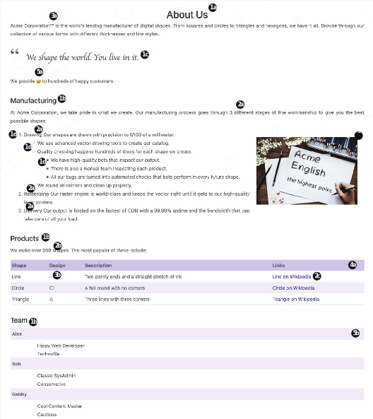

# 3.2 Markdown实战

使用所有这些内容功能，我们现在将更新Acme Corporation网站的About Us页面，使其更美观。 图3.10显示了已完成的页面。 About页面的核心元素已经出现在第2章的示例文本中。 以下更改将使页面更具观赏性。

图3.10使用高级Markdown功能的Acme Corporation的 “关于我们” 页面: 1) 块元素，如标题和列表，2) 内联元素，如粗体、斜体和链接，3) 内联HTML和字符代码，4) 表格，以及 5) 定义列表和表情符号。(Peax Webdesign的字体; PxHere的图像基于Creative Commons CC0。)

- 1 Block elements
  - a Add a top-level title with the text About Us.
  - b Make Manufacturing, Products, and Team second-level headings.
  - c Make the following a blockquote: We shape the world. You live in it.
  - d There is a numbered list in the Manufacturing section. Make some bulleted sublists for it.
- 2    Inline elements
  - a Format the text “three different” and the item names in the numbered list in the Manfacturing section as bold.
  - b Format the text “200 shapes” in the Products section as both bold and italicized.
  - c Convert text in the Products table to links.
- 3 Inline HTML and character codes
  - a Add a trademark sign after Acme Corporation at the top of the page.
  - b The character code for a circle is ? and for a triangle it’s ?. Add these to the Design column of the Products table. Note that two dashes automatically convert to a line.
  - c Add the embedded HTML for a right-floating image with a 20 px margin pointing  to  /image/draw.jpg  in  the  Manufacturing  section.  (You’ll  find draw.jpg in the resources for this chapter, but you need to move it to the static/image folder.)
- 4 Tables
  - a Convert the comma-separated list to the Products table.
- 5 Emojis and definition lists
  - a Convert the text “smiles” to the emoji (:smile:).
  - b Convert the description of team members in the Team area to an HTML definition list.

完成的关于页面在章节资源 (https://github.com/hugoinaction/tree/chapter-03-resources/03) 中提供，并作为代码检查点进行比较。


**CODE CHECKPOINT**	https://chapter-03-03.hugoinaction.com, and source code: https://github.com/hugoinaction/hugoinaction/tree/chapter-03-03.
↻ Restart your dev server.


