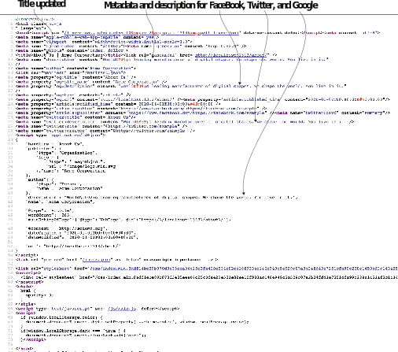
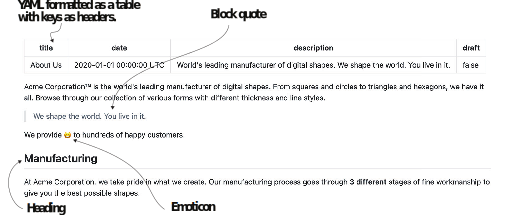
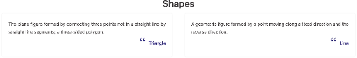

# 3.6 Front matter

除了全局站点范围的配置之外，我们还需要特定于页面的元数据，如创建日期、标记、URL、作者姓名等。 Hugo需要此信息来组织网站中的页面，并将有关此页面的信息提供给更广泛的internet，例如搜索引擎和社交网络。 我们还可以在页面的侧边栏中显示一些元数据。

为了提供特定于页面的元数据，Hugo具有front matter的概念。 首要问题是一组键-值对，它们定义内容之前提供的内容的元数据。 有了前面的事情，我们可以在同一个文件上提供元数据作为主要内容。 前面的问题也称为页面元数据部分(页面元数据或简称为元数据)以及页面配置。 这些术语在本书中可以互换使用。

要将YAML内容放在页面的前面，我们需要用三个破折号(-)将其括起来，并将其放在页面的顶部。 下面的清单显示了如何使用三破折号格式将YAML标识为内容元数据语言。



    

Hugo处理元数据很聪明，并提供了一组合理的默认设置。 这就是为什么我们能够相处到目前为止，提供很少的元数据并且仍然能够呈现内容。 默认情况下，Hugo从文件名、Git版本控制系统(如果使用)和操作系统属性(如修改日期)接收信息。 只有当我们需要做一些雨果无法猜测自己或需要覆盖它来执行特定任务时，我们才需要处理前面的事情。


**Metadata before content**

自编程开始以来，在内容之前具有元数据的概念一直存在于计算机中。 Pascal表示字符串的长度，后跟该长度的原始二进制数据。 许多二进制文件格式以签名开始，该签名是与文件相关联的元数据。 例如，如果你打开一个Pdf文件在文本编辑器中，它以 % PDF开头，.png文件 .gif的GIF文件。 第一个现代静态站点构建者Jekyll在所有静态站点构建者的首要问题中引入了元数据，Hugo采用了这个概念。


## 3.6.1 前端的常见元数据元素

front matter由与特定页面相关联的所有元数据属性组成。 就像网站具有配置文件 (config.yaml) 一样，我们可以在页面本身上放置特定于页面的YAML内容。 我们可以在前面的问题中覆盖这些属性。 表3.3显示了一些最常见的属性。

表3.3雨果的共同前front matter属性。 所示的示例是Acme Corporation网站上的 “关于我们” 页面。


要更新Acme Corporation网站的About Us页面中的这些属性，我们可以将清单3.11中的代码添加到页面顶部(https://github.com/hugoinaction/hugoinaction/tree/chapter-03-resources/04). 我们可以以YAML格式提供前物质，将其包含在三个破折号中 (-)。


```yaml
--- 
title: About Us 
date: 2020-01-01T00:00:00Z 
description: World's leading manufacturer of digital shapes. We shape the world. You live in it. 
draft: false
--- 
<page content>
```


Eclectic的主题将标题放在页面上，因此我们不需要手动添加它。 除此之外，似乎没有重大变化。 当你查看生成的HTML时，你应该看到更新的描述，并且文档标题也应该显示在选项卡栏中(参见图3.11)(参见图3.12)。


图3.11带有前内容的地址栏更新


**CODE CHECKPOINT**     https://chapter-03-04.hugoinaction.com, and source code: https://github.com/hugoinaction/hugoinaction/tree/chapter-03-04.



**NOTE** 本书的其余部分将讨论更多的front matter条目和用例。 本章缺少的一个关键特征是第7章中涉及的级联前置事项条目。



**Exercise 3.4**

We can use the ________ front matter entry in Hugo to define a custom URL endpoint for the web page.


我们只能通过front matter启用一些功能，如draft。 一旦我们在第4章开始进入taxonomy，前面的问题将变得更加重要。 front matter和content构成了创建者必须定期进行的内容更新。 有了这两个领域的工作知识，我们可以在网站上设计任意数量的内容页面。 当我们在前面的内容中使用YAML时，GitHub支持渲染前面的内容和Markdown，使得导航内容变得容易。 图3.13显示了GitHub上的 “关于我们” 页面。


图3.12元数据随front matter更新


图3.13 GitHub对前物质的默认渲染以及Markdown


**Front matter language conversion**

Hugo并行支持所有元数据语言。 不同的文档可以使用其他元数据语言，Hugo正确解析这些。 Hugo还可以在元数据语言之间转换内容。 我们可以通过输入Hugo convert toTOML <内容文件>，使用hugo命令行将内容转换为TOML。 同样，我们可以通过分别使用toJSON和toYAML更新命令来转换为JSON/YAML。

没有真正的理由进行这种转换，因为Hugo在前面支持所有这些语言。 大多数用户坚持选择他们开始使用的元数据语言，但如果你需要切换到不同的语言，可以使用一个简单的命令行界面。


## 3.6.2 使用前置内容的数据驱动的登录页面

Front matter不仅仅是元数据; 我们可以用它来指定页面的数据。 主题作者可以自由地在任何页面上使用前面提供的结构化数据。 诸如轮播之类的某些元素受益于结构化数据。 我们可以为旋转传送带提供单独的页面作为键-值对。 与Markdown相比，主题作者可以更轻松地将它们嵌入模板中的正确位置，Markdown充当一个大blob。

例如，兼收并蓄的主题支持照片和文本旋转木马、基于图标的列表、推荐信、客户图标等，所有这些都是由我们可以在页面首页提供的数据驱动的。 你可以将提供的data-driven.md文件 (https:// github.com/hugoinaction/hugoinaction/tree/chapter-03-resources/05) 放在内容文件夹中，以尝试此功能。 你可以在http：//localhost：1313/Data-Driven查看相应的页面，以获得类似于图3.14所示的页面。


**CODE CHECKPOINT**	https://chapter-03-05.hugoinaction.com, and source code: https://github.com/hugoinaction/hugoinaction/tree/chapter-03-05.




图3.14 Acme Corporation网站的画廊，该画廊使用数据驱动的方法，并使用具有Eclectic主题的front matter。 我们可以将data-driven.md放在content文件夹中以获得此页面。

一些主题 (如通用主题) 也可以获取全局config.yaml中的信息或从数据文件夹中读取信息。 你应该阅读主题的文档以了解如何使用这些功能。

在前端，作为全局配置或数据文件夹中提供结构化元数据的方法是有代价的。 因为结构化数据是特定于主题的，所以如果你切换主题，你的自定义数据不会自动拾取。 对于许多用户来说，使用预先构建的主题和提供结构化数据最适合他们的需求，因为他们可能为这些功能选择了该主题。 以像YAML这样的格式维护数据也比以普通的HTML格式维护数据更容易。

主题提供了许多内置功能和复杂的逻辑，以在呈现我们的数据时实现跨屏幕尺寸的兼容性。 我们将在第6章创建我们的结构化数据库网页。


**Exercise 3.5**

对或错: 从理论上讲，我们可以建立一个雨果网站，所有内容都在front matter，而在网页的Markdown正文中没有任何内容。
