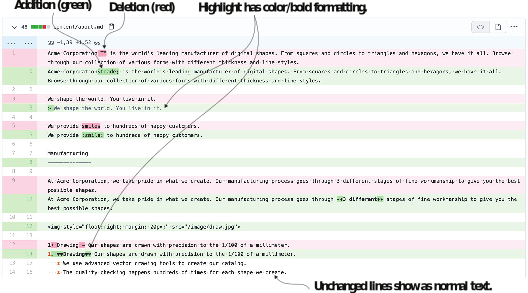
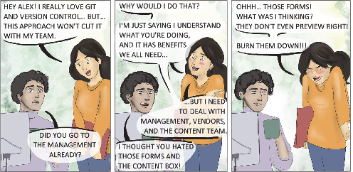
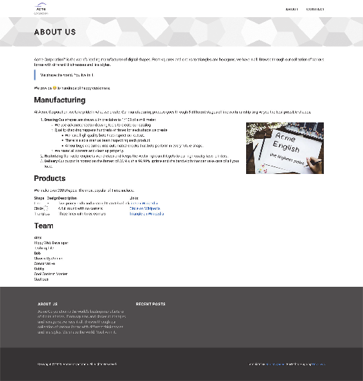

# 3.7 使用标记和元数据语言的好处

在Jamstack中，我们使用跨多个文件的标记和元数据语言来取代数据库在传统Web堆栈中的角色。 当我们移动到Jamstack时，放弃数据库的好处并不明显。 数据库经过30多年的优化，提供了强大的存储优化和查询功能。 数据库 (SQL和NoSQL) 都需要对它们存储的数据进行某种结构化。 数据库需要一些模式，即使它在每个文档中是不同的。 如果根本没有模式/结构，它们就不是很有用，就像格式化文本的情况一样。

在大多数面向数据库的内容管理系统中，网页的格式化内容被放入单个列或分配给单个键。 通过将文本内容保存为文件存储在磁盘上，我们可以访问大量用于处理文本文件的实用程序，从标准的bash工具 (如grep) 到通用软件 (如版本管理系统 (Git))。

## 3.7.1 内容版本控制

当我们使用版本控制系统编写和提交文本内容以及代码时，我们继承了为源代码构建的强大版本控制方案，并可以将其用于版本控制内容。 有了Markdown，格式修改在diff视图中很容易理解。 我们完全支持forks、branches和内容pull reuests。 我们可以为网站内容提供适当的软件生命周期，包括staging、branch views和版本化内容发布。 如果需要，我们可以编写脚本来校验内容，检查拼写或修复结构，这些脚本可以触发代码提交，就像我们在第2章中构建了用于GitHub部署的网站一样。

这种支持不仅存在于Hugo中，而且存在于整个Jamstack中。 Jamstack通过将内容从数据库移动到标记文件来实现这一点。 我们可以通过导航到提交页面来查看GitHub上的diff视图，以了解我们对Acme Corporation网站所做的更改。 图3.15中显示了一个示例diff视图。

图3.15 GitHub上的About页面的示例diff视图。 我们可以将每个内容更改作为代码查看、查看和管理。

图3.16 Web表单上的内容语言： Acme Corporation网站的首席编辑Gabby试图了解从web表单到内容输入文档的含义。

## 3.7.2 主题独立性

网站从Markdown到配置的许多迁移过程都是标准化的。 内容作者将文本颜色和HTML间距等内容放在Markdown中。 我们移动这些元素使内容在多个主题之间保持稳定。 我们可以切换主题，并看到我们的页面几乎还能正确呈现。 虽然Hugo为所有的Markdown生成了正确的HTML，但它仍然取决于主题作者为所有的Markdown功能提供良好的样式。
如果你有兴趣检查代码跨主题的可移植性，那么可以尝试一些跨主题功能。 Acme Corporation网站的About Us页面(图3.17)在Universal主题中看起来也还不错。


**CODE CHECKPOINT**	https://chapter-03-06.hugoinaction.com, and source code: https://github.com/hugoinaction/hugoinaction/tree/chapter-03-06.


图3.17 使用Hugo Universal主题渲染的Acme Corporation网站的About Us页面

## 3.7.3 清洁度

WordPress等工具中的WYSIWYG(所见即所得)编辑器生成的HTML标记可能过于复杂和不可读。 我们也面临着所见即所得创建器将任意JavaScript粘贴到内容中的风险，这可能会变成安全问题。 Markdown是一种比HTML干净得多的语言。 当我们编写可读文本时，额外标签和错误的可能性要低得多。 同样，使用Markdown，我们可以使用表单在传统内容管理系统中输入元数据。 在许多网站中，管理部分的支持都很简陋，纯文本元数据语言提供了比任何一种形式都更大的灵活性和功能。