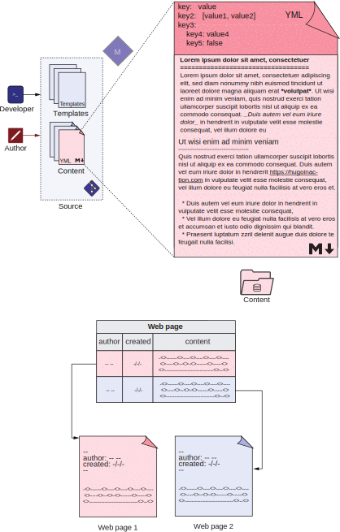

# 第3章 使用内容标记


**本章涵盖**
- 使用Markdown创建内容
- 使用Hugo对Markdown的扩展
- 了解Hugo支持的标记语言
- 在基于Hugo的网站中使用YAML进行元数据
- 了解front matter的各种元素


Hugo网站的content文件夹中的大多数文档由标记语言的文本内容及其元数据语言的关联元数据组成。 Markdown是最流行的标记语言，也是使用最广泛的。 YAML是编写键值配置最流行的语言之一，其中对人的可读性至关重要。

图3.1 基于Hugo的网站中的大多数内容文档由某些元数据语言 (如Markdown) 的标记和元数据语言 (如YAML) 的结构化元数据组成。 本章的重点是设置单个Markdown文档的格式(在顶部)。 底部显示了我们内容的数据库存储与基于文件的存储的比较。

图3.1(上图)显示了本章的重点区域。 在第3.1至3.3节中，我们将重点介绍提供内容的Markdown语言，从第3.4节开始，我们将研究添加元数据的YAML语言。 我们还将查看网站前面内容中的典型元数据条目。 在本章中，我们将格式化为第2章为Acme Corporation构建的网站创建的页面。

在传统的Web堆栈中，网页的内容存储在单个数据库单元格中，而相关的元数据填充内容表中的其它列或数据库中的其它表。 在Jamstack中，内容 (front matter) 是最重要的，并且被放置在一个单独的文件中，其余的元数据从头部部分被移出 (如图3.1在底部所示)。