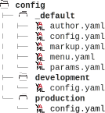
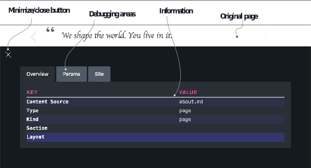

# 4.1 使用Hugo配置进行定制

在Acme Corporation网站上，到目前为止，我们只有一个配置文件，即config.yaml，我们一直在其中堆积我们的配置。 如果我们看一下Hugo文档，我们注意到许多配置参数可以更改，这很快就会变得千头万绪。 单一的配置文件势必成为瓶颈。

我们的配置文件的另一个问题是，我们不能在一个文件中有不同的开发和生产设置。 Web开发的一个基本实践是拥有不同的环境。 这样，许多团队可以独立贡献。 为了方便调试，Web开发人员需要没有经过压缩(minification-减小文件大小的过程，以便在互联网上更快地提供服务)的HTML。 在测试环境中，我们可能需要更多的日志记录，以使开发团队能够快速重现问题并修复错误。 内容团队需要一个生产级别一样稳定的网站。

Hugo认识到这些问题，并支持通过config文件夹将具有特定于环境的覆盖的配置文件拆分为基本配置。 在本节中，我们将配置文件拆分为多个文件，构建覆盖默认配置的单独文件。 为此，我们将创建一个名为config的文件夹，并在config文件夹中添加一个名为 _default的文件夹，并将Acme Corporation网站移至这些文件夹。 _default文件夹是特殊的； Hugo指定该文件夹是存放默认内容。 这个名称不仅用于配置，而且还用于模板，以后我们将在第7章中看到。

如果我们将config.yaml文件移动到config/_default文件夹，则网站将继续保持相同的状态。 但现在它的内容在一个文件夹中，我们可以将配置文件划分为多个文件，用于多个属性。 现在，我们可以将配置文件中的作者部分移动到config/_default/author.yaml，并且可以将params和标记部分移动到单独的文件中。 当Hugo解析配置时，文件名会自动映射到一个键。 这样，这些信息是独立的，更易于管理。 我们还将在menu.yaml中拆分菜单，并在第4.2节中对其进行扩展。 本章的资源中也提供了拆分文件 (https://github.com/hugoinaction/hugoinaction/tree/chapter-04-resources/01)。

Hugo支持使用config文件夹中每个环境的文件夹覆盖特定于环境的配置。 这些环境从_default文件夹中继承值，并用特定环境的值覆盖。 现在，我们可以创建一个名为production的文件夹，并在该文件夹的配置参数中放置特定于生产级的覆盖。 同样，我们可以为特定于开发的配置添加一个名为development的文件夹。 清单4.1提供了分割Acme Corporation网站的配置目录的代码。 (列表中的.yaml文件文档图标由Noun项目的IYIKON提供; 文件夹图标来自flaticon。)

当Hugo通过Hugo服务器与实时重新加载服务器一起运行时，它默认使用开发配置 (默认情况下，“development” 和 “production” 的名称在Hugo中是硬编码的)。 当使用Hugo命令构建时，默认情况下，模式会更改为生产模式。 我们可以通过在环境变量HUGO_ENV中指定配置或在Hugo命令行中使用 --environment标志来将配置覆盖到我们想要的任何名称。 例如，此重写技巧可用于在开发服务器模式中调试仅用于生产的错误。



    


**环境世界**

大多数托管软件都有环境的概念。 如果我们需要确保在开发过程中没有中断，我们需要有一种方法来确保只有稳定的版本才能上线。 关键的一点是标记稳定的构建，并将它们移到更高的环境层，以便在投入使用之前进行进一步测试。 环境的数量取决于所涉及的人数以及独立任务所需的独立性程度。 大型项目中的一组标准环境可以包括：
- 开发-这是活跃开发发生的地方。 开发人员可能有单独的分支或特定于分支的环境，但我们需要一个共享分支，所有开发团队都可以在其中合并他们的代码并解决冲突。 开发模式是Hugo在live server模式下运行时的默认模式。
- 测试—当前正在进行自动和手动测试的所有完整功能的环境。
- Staging/Alpha—Stabler环境，用于跨公司团队进行测试。 有些公司还可能向一些正在帮助微调软件的选定客户提供访问此环境的权限。
- Beta—准备上线的公开预发行，公司邀请所有人验证其工作流程。
-生产 —服务于最终用户的当前实时/活跃环境。 当你在没有实时服务器的情况下运行Hugo时，生产环境是默认环境。

每个团队都是不同的，可以决定使用不同的环境集。 Hugo提供了完全的灵活性来命名环境并具有特定于环境的设置。 正在开发的功能的代码更改应该由Git这样的版本控制系统来管理。



在开发环境中，我们通过将minify设置为false来更新设置以禁用压缩。 (你也可以使用此设置控制单个文件类型的缩小设置。) 此外，Eclectic主题支持调试栏(最初由JGogerX创建)，它在网页上的可见部分中提供front matter，如图4.2所示。 我们可以通过在params section中将DebugMenu设置为true来启用此功能，并且可以通过单击调试栏右下角的红色扳手图标来启动。 在第8章中，我们将向你展示如何使用Hugo模块将该调试栏集成到其他网站中。



图4.2 Eclectic中的调试栏 (仅在开发环境中运行时)

清单4.2设置了开发环境的覆盖值，以启用调试栏、禁用压缩和构建草稿。 然后，清单4.3设置生产环境的覆盖，以启用robots.txt和minification。


```yaml
buildDrafts: true 
minify: false 
params: 
 DebugMenu: true -- Enables the Debug menu via params
```



```yaml
enableRobotsTXT: true 
minify: true
```


Hugo的默认设置是特定于环境的； 雨果了解开发和生产。 因此，许多使用Hugo的网站不需要单独的环境特定配置。


**CODE CHECKPOINT**     https://chapter-04-01.hugoinaction.com, and source code: https://github.com/hugoinaction/hugoinaction/tree/chapter-04-01.



**Exercise 4.1**

The two default environments in Hugo are development and _______.


你还可以使用环境变量为Hugo提供配置选项。 例如，如果将环境变量HUGO_ENABLEGITINFO设置为true，则将覆盖Hugo配置中的enableGitInfo配置设置，从而将其强制为true。 我们可以使用使用环境变量覆盖配置设置的功能，通过Hugo外部的配置系统在构建服务器上设置Hugo。 请注意，环境变量不同于命令行标志。 可以在运行的shell中设置它们，并且在设置它们之后运行的所有程序都可以访问它们。 你可以在https://help.ubuntu.com/community/EnvironmentVariables. 阅读更多关于环境变量的信息


图4.3 配置即代码。 Bob了解到，由于代价高昂，配置即代码不如实际代码灵活。