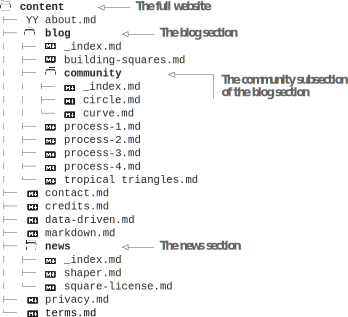
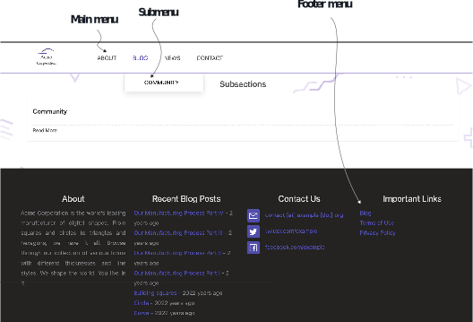

# 4.2 用sections和menus组织内容

布局内容的基本工具是我们将从中创建的网站的所需结构。 如果我们能够从物理上逻辑地表示我们想要在站点地图上表达的内容，那么它将使我们的生活更加轻松。 这一部分提供了一些关于如何布局内容的见解。

## 4.2.1 Sections

当一个网站有很多内容时，将所有这些内容放在顶级页面中会使管理内容变得具有挑战性。 因此，我们可以将内容分类为博客，新闻或产品等部分。 我们可以使用网页URL的路径成分来识别其部分。 例如，在URL https://example.org/blog/community/welcome中，名为welcome的页面属于网站example.org的blog section的community subsection。 在Hugo中，subsection实际上并不是一个特殊的构造；它只是一个section中的一个section。 Sections还有一个index页，如https://example.org/blog，它介绍了这些section并提供了subsection和页面的列表。

我们可以在主菜单或主页上列出网站中的所有区域。 要在Hugo中创建一个section，我们在content文件夹中创建一个子文件夹。 你可以为嵌套sections设置嵌套子文件夹。 从技术上讲，包含整个网站的主页 (也称为root页面或index页面) 的content文件夹 (也称为content root) 也是一个部分，所有网站部分都是content root的subsections。 我们可以使用content/_index.md文件覆盖主页的front matter。 content root是唯一一个其 _index.md是可选section。 因为我们在Acme Corporation网站中用一个普通的HTML文件覆盖了索引模板，所以在content/_index.md中添加特定于页面的标题没有任何效果。


**NOTE** 我们需要在每个section的根创建一个名为 _index.md的标记文件，即使为空。 Hugo使用此文件来标识网站section。 Hugo不认为没有此文件的文件夹是section，并且可能不会显示其内容。


每个section可以有多个构成其内容的页面。 这些sections有一个index页面的模板，我们可以在其中访问所有页面和subsections。 我们使用该section的index页来帮助用户导航该部分。 自定义参数和数据可以通过section文件夹中的 _index.md文件自定义索引模板。 我们可以自由选择页面的组织方式，因为我们希望获得我们想要的内容结构。

让我们在Acme Corporation的网站上添加一个新闻和一个博客部分。 在博客section，我们还为使用Acme产品的社区成员的博客文章添加一个社区subsection。 此外，我们还将通过在配置文件中设置enableGitInfo: true来启用内容的Git作者日期的自动设置。 以下列表允许在构建网站时访问Git提交信息。


```yaml
... 
enableGitInfo: true
```


章节资源(https://github.com/hugoinaction/hugoinaction/tree/chapter-04-resources/02)中提供了这些部分的内容  图4.4显示了相应的博客页面。 Acme Corporation网站上显示的sections在右侧显示为文件名。 以下列表提供了Acme Corporation网站各sections内容的组织代码。 (清单中的Markdown图标来自octoicons；文件夹图标来自flaticons。)


图4.4 Acme Corporation网站的博客，显示不同页面 (顶部) 和subsections (底部) 的摘要



    	

我们可以导航到http://localhost:1313/blog查看博客section的条目， 到http:// localhost:1313/blog/community查看subsection社区提供的条目帖子， 以及http://localhost:1313/news，以查看新闻section的内容。


**NOTE** 你需要将文件提交到Git存储库，以便Hugo从Git读取日期。


我们可以使用博客文件夹中的_index.md文件来提供显示在/blog页面上的设置和内容。 我们还可以为index页面添加Markdown内容以进行拾取，然后使用front matter覆盖设置。 index页可以访问博客部分中的所有页面和子部分。


**CODE CHECKPOINT**	https://chapter-04-02.hugoinaction.com, and source code: https://github.com/hugoinaction/hugoinaction/tree/chapter-04-02. Note: 尚无法从主页访问更改。



**内容摘要**

Acme Corporation网站中各section的index页会自动提供该section中帖子的摘要和标题。 如果我们不提供摘要信息，Hugo会自动生成摘要信息。 尽管index页面是我们可以使用帖子摘要的最常见位置，但也可以在其他地方使用-theme所在。 以下是提供摘要的方法：
- 自动-默认情况下，Hugo会选择内容的前70个单词作为主题的摘要。 网站配置文件中的摘要长度变量控制默认摘要中的字数。
- 手动-我们可以在内容的某个位置使用标记 &lt;!-more-> 指定摘要长度，以根据需要剪切摘要。 请注意，&lt;！--more-->由Hugo逐字匹配。 Hugo无法理解添加空格，更改为大写或没有适当的HTML注释。 你可以在content/blog/tropical triangles/index.md文件中看到它的使用情况。
- Front matter-我们可以使用Front matter中的summary变量来提供摘要文本。

请注意，summary变量与description变量不同。 Hugo中的summary变量是对内容的预告，而description变量更多的是发送给搜索引擎的内容。 description字段只能通过前面的内容提供，并且不具有基于content的自动值。 某些主题 (例如Eclectic) 赋予description更高的优先级，并在index页面中退回到summary。


## 4.2.2 Menus

我们添加到Acme公司网站的部分没有链接，因此无法从主页或任何内容页面中找到。 Hugo提供了一种通用方法来使内容显示在菜单中。 我们可以在一个网站上包含多个菜单，每个主题都定义了自己的一组菜单和子菜单。 每个菜单在Eclectic和Universal主题中都有一个名称，例如主菜单的main。 每个菜单由形成整个菜单的条目列表组成。

我们已经在第4.1节的配置文件中拆分了第2章中创建的菜单。 清单4.6显示了我们在menu.yaml中创建的配置。 让我们来看看该配置中的一些字段。 每个菜单项都有多个字段：
- identifier字段唯一定义菜单，以便Hugo可以找到它。
- weight字段对条目进行排序。
- url字段提供了从配置中定义的网站基本URL到页面的相对路径。

Hugo对其他字段和它们的用途是灵活的。 有些主题将name字段用于菜单的显示文本，而其他主题则使用title字段。 要创建子菜单，我们需要为parent字段提供父菜单的identifier(有关子菜单的示例，请参见清单4.9)。


```yaml
main:
  - identifier: about 
    name: About 
    url: /about 
    weight: 100
  - identifier: contact 
    name: Contact 
    url: /contact 
    weight: 200
```
    

Hugo提供了两种在网站菜单中包含页面的方法。 首先，我们可以在配置文件中为页面添加菜单项。 这种方法有助于定位和严密监控菜单。 第二种方法是在front matter中指定页面菜单。 这样，菜单变得更加动态，并由内容控制。 如果我们删除一个页面，菜单会自动修剪，我们不必担心清理过时的链接。 选择使用哪种方法取决于我们的用例。 如果目标是将菜单放在一个位置，则可以使用配置文件。 如果我们想在网站的不同内容部分的所有者之间分配菜单的所有权，那么使用front matter是可行的方法。 两者都可以根据需要混合和匹配。

Eclectic主题有两个菜单: 主菜单和页脚菜单。 到目前为止，我们只使用了主菜单。 让我们在博客部分的 _index.md文件的前面添加一个菜单项，以允许博客显示在主菜单和页脚菜单中。 清单4.7显示了这方面的配置。 我们还将在主菜单中添加一个新闻子菜单。 清单4.8显示了此配置，图4.5显示了启用所有菜单的结果。


```yaml
--- 
menu:
  main:
    name: Blog 
    identifier: blog 
    weight: 110
  footer:
    name: Blog 
    weight: 100
---
```



```yaml
--- 
menu:
  main:
    name: News 
    identifier: news 
    weight: 120
---
```
    



图4.5 Acme Corporation网站的博客页面，显示主菜单、子菜单和页脚菜单

社区部分的_index.md在博客菜单中为该部分启用了一个子菜单。 下面的清单显示了它的配置。


```yaml
--- 
menu:
  main:
    name: Community 
    parent: blog 
---
```

    	

我们还需要将使用条款和隐私策略添加到页脚菜单。 以下两个列表显示了这些配置。


```yaml
--- 
menu:
  footer:
    name: Terms of Use 
    weight: 200
---
```



```yaml
--- 
menu:
  footer:
    name: Privacy Policy 
    weight: 300
---
```


虽然页脚菜单有内容，但Eclectic不会显示它，直到我们通过在脚注部分的配置/_default/params.yaml文件中添加menu：true来显式地启用它。 下面的清单显示了如何做到这一点。 请注意，你可能需要重新启动开发服务器才能使这些更改生效。


```yaml
... 
footer:
  ... 
  - title: Contact Us 
    contact: true
  - title: Important Links 
    menu: true
...
```


因为主页还没有使用菜单，所以我们需要手动更新网站的主页来更改探索按钮以链接到博客页面 然后在layout/index.html的页脚中为博客和新闻页面添加一个条目。 以下列表可直接链接到网站页脚中的博客和新闻部分，并将 “Explore” 按钮更改为链接到网站index页中的博客页面。


```html
... 
<a href="./blog">Explore</a>
... 

<footer>
    <a href="./blog">Blog</a>
    <a href="./news">News</a>
... 
</footer>
```



**CODE CHECKPOINT**	https://chapter-04-03.hugoinaction.com, and source code: https://github.com/hugoinaction/hugoinaction/tree/chapter-04-03.
↻ Restart your dev server.



**Exercise 4.2**

Which menu placement is better if we want to cut and paste pages from one Hugo website to another?
- a. Layouts
- b. Front matter
- c. Theme
- d. Config



**使用图形用户界面进行内容管理**

对于需要图形环境来管理内容而又不失去像Hugo这样的静态网站构建器的性能优势的作者和编辑， 有Forestry.io、Hokus CMS和Netlify CMS等包装器。 这些内容管理系统具有图形形式，而不是YAML和Markdown。 像这样的工具可以帮助有不同需求的团队加入进来，并获得使用Hugo的好处。 喜欢图形形式的非技术团队成员可以从Jamstack中受益，并带有舒适的GUI。 这些表单将文件放置在合适的位置，并更新前置内容和配置文件中的相应条目。 我们可以互换使用它们，同时直接编辑文件。

附录C将Netlify CMS与你的网站集成为内容管理系统的管理界面。 从第04-03章开始，相应的更改将在所有代码检查点中进行。
