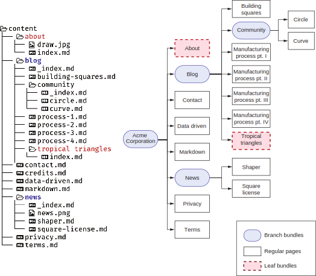

# 4.3 更好地整合页面bundles

网站源代码的一个常见问题是内容分散在数据库、文件系统和第三方位置里。 此外，与页面关联的图像位于不同的位置。 这使得我们从网站上删除页面后很难进行适当的清理。 由于页面不能跨网站移植，因此作者需要访问多个地方才能创建它们。 然而，雨果试图使网页的内容更加独立。 front matter中的menu字段 (我们刚刚了解到) 是Hugo用来执行此操作的功能之一。

Front matter menus允许每个页面拥有自己的菜单项，并允许我们独立地添加和删除它们。 启用此独立性的另一个功能是页面bundles。 页面bundles是文本和非文本资源(如图像、PDF文件和字体)的集合，足以表示单个或一组相关页面。 页面bundles可以独立放置或从Hugo网站中删除，以添加相关的网页。 

它们帮助内容作者将对网页或section的更改本地化到磁盘上的特定文件夹。 页面bundles主要有两种类型: leaf bundle和branch bundle。 除此之外，我们还有不太常用的headless bundles。

## 4.3.1 Leaf bundles

leaf bundle是独立表示单个网页核心内容所需的文本和非文本元素的集合。 leaf bundle的文件夹包含特定于页面的标记、元数据和资源(图像、PDF文件等)。 这些可能还包括特定于页面的CSS和JS文件。

我们可以将Hugo中的任何Web页面转换为leaf bundle，方法是在与标记文件相同的位置创建一个名称相同的文件夹(不带扩展名)，然后将标记文件移动到这个新文件夹中，并将其重命名为index.md。 我们也应该将所有特定的资源移动到这个文件夹中的网页上。 网页可以使用此文件夹及其子文件夹中的任何资源，包括图像、PDF文件和元数据(YAML、TOML或JSON)文件。

我们可以将leaf bundle独立移动到另一个Hugo网站，以便该网站提供正确渲染它所需的一切。 一个leaf bundle可以有多个标记文件，但在呈现过程中，它被视为单个网页，不能直接访问该包中除index.md之外的任何其他标记文件。


**index.md vs. _index.md**

虽然 _index.md和index.md是相似的名称，但它们是两个非常不同的文件: index.md表示单个网页的内容，而_index.md表示一个section的根，即一组网页。 为了更好地理解这一点，让我们看一个例子。

设想一个具有以下URL端点的网站：/(根)、/about、/blog、/terms、/blog/process-1和/blog/process-2。 在此网站中，/about，/terms，/blog/process-1和/blog/process-2页面没有子页面，并且代表单个网页。 这些页面可以由index.md表示。 / 和 /blog端点还具有子页面，因此需要用_index.md表示。

注意，对于像/about这样的单页面端点，如果我们不想使用页面bundle，我们可以创建about.md。 对于/blog和/，我们没有这样的选择。


leaf bundle的独立性提供了大多数其他静态站点构建器中不存在的内容创建和管理功能。 两个作者可以在他们的分支中独立处理内容，合并冲突的可能性很小。 通过清空内容文件夹，然后将其用于内容创建，可以轻松创建网站的精简版本，而编译开销最小，并完全支持预览。 承包商可以被指派使用通用的Hugo主题开发内容，他们可以将他们的leaf bundle提交到主网站。 整合工作将是最小的。

Acme Corporation网站中的About页面是将其变成leaf bundle的完美页面。 draw.jpg图像在页面中使用，而不是在其他任何地方使用，我们应该将其本地化到该页面。 我们将在Content文件夹中创建一个名为about的子文件夹，并将draw.jpg从static/image文件夹和about.md从content文件夹移动到这个about文件夹，将about.md重命名为index.md。 对于正确的页面bundle，图像现在应该相对于网页，我们应该从页面中引用它。 img标记中的路径需要替换为本地路径：从/image/draw.jpg到draw.jpg。 如果我们想将图像资源保留在这样的文件夹中，我们可以在leaf bundle中创建一个图像文件夹，并将路径设置为image/draw.jpg。 我们可以导航到http://localhost:1313/about并验证页面看起来与以前一样。

leaf bundle不特别需要除index.md以外的任何文件。 我们可以将任何页面转换为leaf bundle，方法是创建一个文件夹，将.md文件移到其中，然后将文件重命名为index.md。 例如，我们可以通过创建文件夹并将原始文件作为index.md移动到该文件夹来将content/blog/tropical triangles.md转换为页面bundle。


**CODE CHECKPOINT**	https://chapter-04-04.hugoinaction.com, and source code: https://github.com/hugoinaction/hugoinaction/tree/chapter-04-04.



**哪些图像文件放在哪里**

我们已经提到了三个存储图像的地方: 一个页面bundle和两个分别名为static和assets的文件夹。 当我们试图决定将哪个图像放到哪里时，这可能会让人感到困惑。 这个决定实际上很简单。 特定于页面bundle的图像属于该页面bundle。 当我们创建更多的网页时，我们应该尝试留在content文件夹中，并且很少更新此文件夹之外的任何内容。 主题用来呈现网站的图像不属于该文件夹。

文件夹static和assets在内容类型上是相似的，只有一个不同之处: assets文件夹中的图像可以由Hugo进行预处理和优化 (通过Hugo Pipes，我们将在第6章中介绍)。 我们需要按原样使用static文件夹中的图像。 理想情况下，我们应该将尽可能多的图像移动到assets文件夹中，以便为这些文件利用Hugo的完整图像优化功能集。 static文件夹，在这种情况下，应仅用于直接从HTML访问而无需Hugo处理的图像。


## 4.3.2 Branch bundles

Branch bundles形成了代表网站section的文本和非文本资源的集合。 从技术上讲，为博客创建的section文件夹，Acme Corporation网站的新闻section及其子页面以及 _index文件符合branch bundle的定义。 然而，为了符合精神上的定义，index页所需的所有资源也应存在于文件夹中。 理想的branch bundle包含该部分中所有页面的页面bundle，_index文件以及index页中引用的资源。

独立branch bundle的目标与leaf bundle的目标相同：允许将section放入网站，并在网站不进行其他更改的情况下实现功能。 理想情况下，branch bundle应设置其菜单项，并提供分支中引用的所有资产，然后再使用。 图4.6显示了到目前为止Acme Corporation网站中的各种branch和leaf bundle。



图4.6 Hugo中的leaf bundle。 左侧是创建页面bundle后的文件夹结构。 右侧显示站点地图。 branch bundle在站点地图中显示为带有子节点的节点(圆角)，而leaf bundle则是站点地图中的末端节点，就像常规页面一样。

我们在Acme Corporation网站的任何_index.md页面上都没有任何资源。 我们将向新闻部分添加一个图像(news.png)，并通过引用它将其转换为正确的branch bundle。 新闻部分的图像和相应的 _index.md在章节资源中提供 (https://github.com/hugoinaction/tree/chapter-04-resources/03)。 请注意，我们不能为与branch bundle关联的assets添加子文件夹。 对于此练习，我们将使用Markdown属性强制新闻图像到新闻页面中心。 下面的清单显示了如何添加此图像。


**重用页面bundle**

页面bundle用于隔离，而不是重用。 如果希望重用图像，我们需要将它们放置在顶级assets文件夹或static文件夹中。 我们可以在页面bundle中使用共享图片。 用于特定页面的一次性图像应该存在于页面bundle中，理想情况下，我们应该将共享图像 (用于大量页面) 放置在顶层文件夹中。 然而，共享资源会带来额外的清理和集成工作，但重用这些资源可以节省带宽和存储空间。 权衡是留给网络开发人员的选择，他们应该在个案的基础上对此进行评估。



```yaml
--- 
menu:
  main:
  name: News 
  identifier: news 
  weight: 120
--- 
{style="text-align:_center_"} 
---------------------------------------------
```


Branch bundles是网站分支到一个或多个页面的地方。 请注意，在Branch bundles尚未添加页面的边缘情况下，它将在站点地图中显示为叶子，尽管Hugo将其视为分支，并在呈现时显示子页面的空列表。 branch和leaf bundle的比较见表4.1。


**Exercise 4.3**

Which of the following files are suitable to be placed in a page bundle?
- 1. The logo of a section
- 2. A unique border image used in the theme
- 3. The website logo
- 4. The website font



**CODE CHECKPOINT**	https://chapter-04-05.hugoinaction.com, and source code: https://github.com/hugoinaction/hugoinaction/tree/chapter-04-05.


Table 4.1 Branch vs. leaf bundles


## 4.3.3Headless bundles

Headless bundles是leaf bundle，其中index文件的front matter将headless属性设置为true。 Headless pages没有单独的url，Hugo也没有渲染这些bundles。 一些主题使用它们来存储共享数据。 例如，主题作者可以将Headless pages bundle用于更非结构化的页脚，而不是为结构化的页脚选择参数。 名称为footer的Headless pages可以存储它及其关联资产的基于标记的内容。 此bundle提供了与页脚相关联的资产以及标记内容的管理优势。 使用Headless pages bundle的主题并不多，我们不会为Acme Corporation网站引入它们。


**页面bundle的巧妙用途**

页面bundles中链接的特定于页面的资产允许主题标准化这些assets的命名约定，这允许我们在不编写代码的情况下使用它们。 Eclectic支持在页面bundle中创建一个名为cover.png (或cover.jpg) 的文件，并将其用作页面的封面图像。 然而，这并不比像Universal Use这样的主题提供更少的前置事件条目(例如，横幅)的可发现性。 为了使事情变得简单，我们可以在页面的原型 (在第5章中讨论) 中放置默认图像。

Acme Corporation网站上所有页面的封面图像都包含在章节资源 (https://github.com/hugoinaction/hugoinaction/tree/chapter-04-resources/04) 中。 你可以用它们来让你的博客帖子看起来更像样。 请注意，本书提供的通用主题版本通过页面bundle支持封面图像，但这在Hugo中不是标准的，并且大多数主题都不支持。



**CODE CHECKPOINT**	https://chapter-04-06.hugoinaction.com, and source code: https://github.com/hugoinaction/hugoinaction/tree/chapter-04-06.
