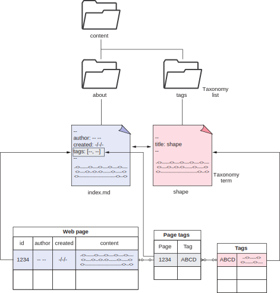
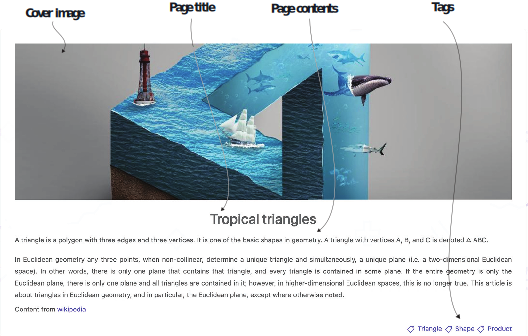
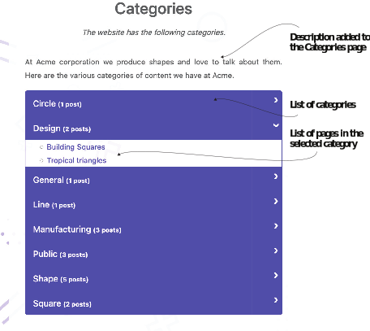
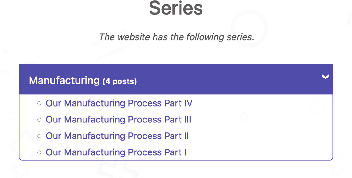

# 4.4 不仅是标签: Taxonomies

要在Hugo中将内容组织成sections，我们需要物理地组织文件。 将每个网页的单个文件整齐地组织成文件夹和子文件夹会更容易。 在许多情况下，网站的逻辑组织与磁盘上的物理组织相匹配。 这就是为什么Hugo默认情况下会生成具有section名称作为URL一部分的URL。 但仅有这一点可能不足以实现良好的内容发现。 有无限的方式来组织内容，每个场景都是不同的。

当我们组织内容时，我们很快意识到需要对页面进行分组，以便同一页面是多个类别的一部分。 例如，我们可以在iPhone和Android sections中放置一个有关iPhone和Android之间差异的网页和两者都有关。 有两份复件对维护来说是很糟糕的。 两个不同的url会引起许多问题，因为我们需要同步评论，社交媒体外观和搜索引擎内容。 在这种情况下，最好有一个用于实际内容的URL，它可以同时显示在iPhone和Android类别的index页中。

除了类别之外，可能还有其它需要具有具有唯一index页面的组。 我们的用户需要标签支持才能找到相似的内容。 网站可能需要有链接到所有作者帖子的页面。 可能会有一个系列，读者应该按照作者预先定义的特定顺序阅读这些帖子。

Hugo理解需要无限的方式来组织内容，并提供了一个通用的解决方案。 在内容组织的顶层，Hugo允许我们定义所谓的taxonomies。 taxonomies是更高级别的结构，我们可以使用它来对描述网页之间关系的页面进行分组。 在第一章中，我们将内容从数据库移动到标记文件。 我们获得了更好地表示非结构化内容的能力，但失去了一些提供结构化关系的能力。 Taxonomies试图在网页之间建立关系。

图4.7显示了定义关系的关系数据库方法和Hugo方法之间的概念映射。 在关系数据库中，内容位于表格单元格中。 这些表有一个标识符单元格。 来自两个表的标识符放在第三个表中，以在这些表中的内容之间建立多对多关系。 在Hugo中，表中的每一行都对应于文件系统中的单独文件。 要定义关系，我们可以在内容文件的前面提供相关文件的名称(作为标识符)，Hugo负责创建这些关系。 我们不必创建联接查询来获取这些关系。 它们在两个页面中都可以作为变量使用。

Taxonomy有两个部分: 列表和项。 每个Taxonomy列表都是Taxonomy项的集合。 页面可以与许多Taxonomy项相关联，而Taxonomy项可以与许多页面相关联。 Hugo在页面和taxonomies之间建立了多对多关系。 我们可以自由定义Taxonomy，并根据我们想要的任何领域来组织我们的内容。 例如，如果我们正在建立一个关于电影的网站，我们会希望页面上有类型或演员名字等分组的电影列表。 我们还希望按导演，演员，音乐总监等列出电影。 在Hugo中，这些将转化为Taxonomy列表，其中每个特定的流派或演员名称都会成为一个带有index页的Taxonomy项。



图4.7从传统数据库结构到Hugo分类法的映射，以定义网页之间的关系

默认情况下，Hugo将类别和标签定义为Taxonomy列表。 我们可以将内容分为类别（categories）和标签（tags）。 因为标签和类别是逻辑结构(它们与文件系统不匹配)，所以我们可以拥有具有多个标签的多个类别的网页。 请注意，如果我们没有其它内容要提供，则不需要为使用的每个分类列表或项创建单独的页面。 在编译过程中，Hugo会找出网站中使用的列表和项，并为它们创建页面。

让我们为Acme公司网站进行Taxonomy分类。 首先，我们将为其帖子添加标签和类别。 我们可以将这些直接添加到页面的front matter。


**单个页面的多个格式副本**

一个页面可以有多个url。 使用front matter的使我们可以多次呈现相同的内容。 模板作者可以针对不同的表示方式不同地实现页面的用户界面 (UI)。 一个页面拥有多个副本的能力并不意味着这是一个好主意：
- 搜索引擎惩罚副本。
- 来自一个页面的评论不会流入另一个页面。
- 用户之间对同一个功能那个是网站内的绝对正确页面感到困惑。

由于向后兼容等情况，我们应该使用此功能来提供多个格式副本。 如果你来自不同的URL方案或过去支持各种URL的东西，并且想维护链接，那么别名就派上用场了。 主题创建者在主题的head section提供规范的引用，以防止搜索引擎对这些别名的处罚。 内容有多个副本的其它管理问题仍然存在，但是Hugo提供了一种机制，即使在许多主题中可能不存在每个句柄都有一个唯一的模板。 请注意，我们不建议创建单个页面的多个副本。



这一额外信息将自动填充内容中的标签，并生成一个类别页面。 在tropical triangles的index.md中，我们将添加tags和categories以获得类似于图4.8的视图。 下面的清单显示了这方面的语法。


```yaml
---
title: Tropical triangles
tags: [triangle, shape, product] 
categories: [shape, design]
---
```


Eclectic主题显示页面右下角的标签和带有摘要的索引页面中的类别。 Hugo还为网站上的每个标签创建索引页(例如，/tag/shape)，并创建列出网站上所有标签的顶级/标签网页。 相应的文件在章节资源 (https://github.com/hugoinaction/hugoinaction/tree/chapter-04-resources/05) 中可用。


**CODE CHECKPOINT**	https://chapter-04-07.hugoinaction.com, and source code: https://github.com/hugoinaction/hugoinaction/tree/chapter-04-07.


我们还将在页脚菜单中添加顶级类别页面。 尽管我们可以使用配置文件来执行此操作，但是我们可以为类别Taxonomy列表创建一个branch bundle，以独立此信息。 下面的清单创建了一个显示在页脚菜单中的顶级类别页。



图4.8添加标签后页面的元素。 该图显示了封面图像、页面标题、其内容和标标签。(图片来自Alexandr Nebesyuk on Pixabay)


```yaml
---
title: Categories
menu:
  footer: 
    weight: 150
    name: Categories
---

 
```


相应的文件存在于章节资源 (https://github.com/hugoinaction/hugoinaction/tree/chapter-04-resources/06) 中。  生成的类别页面应该如图4.9所示。 你可能需要重新启动开发服务器，修改才能生效。



图4.9 Acme Corporation的类别Taxonomy列表页面，其中列出了网站中所有可用的类别及其页面

我们还可以为每个类别创建Markdown页面。 我们可以使用这些页面来提供描述类别的Markdown内容。 为此，我们将在content/categories/<term> 创建一个对应branch bundle。 通过将_index.md文件放在content/categories/design文件夹中，我们可以为design类别生成页面提供信息。


**CODE CHECKPOINT**	https://chapter-04-08.hugoinaction.com, and source code: https://github.com/hugoinaction/hugoinaction/tree/chapter-04-08.
↻ Restart your dev server.


tags和categories是默认的Taxonomy。 对于我们的示例网站，Acme Corporation有关于产品系列的帖子。 我们需要将其迁移到新网站。 为此，我们需要创建一个名为series的新Taxonomy(参见图4.10)。 要创建新的Taxonomy，我们可以修改站点配置 (config.yaml) 中的taxonomies选项，或者创建一个名为taxonomies.yaml的新文件
(https://github.com/hugoinaction/hugoinaction/tree/chapter-04-resources/07)	在config/_default文件夹中，包含以下清单中的内容。



图4.10 Acme公司的系列Taxonomy列出了Acme公司网站上提供的所有产品系列。


```yaml
category: categories 
series: series 
tag: tags
```

    	
Hugo要求Taxonomy同时使用复数值和单数值（译注：英文单复数（singular/plural）词性）。 利用这些信息，Hugo为索引页创建位于<domain>/<plural value>的页面，并为分类列表中的各个项创建了位于<domain>/<plural value>/<term>的页面。 Hugo在渲染项页面时使用模板中的单数值。

我们可以在Acme Corporation网站上更新与产品系列相关的帖子，并为其分配到”产品系列“。 一旦我们将series: [manufacturing]添加到帖子的首页，我们可以在http://localhost:1313/series看到系列的索引页，在http://localhost:1313/series/manufacturing/看到”manufacturing 系列“的索引页 (你可能需要重新启动实时服务器才能查看此内容。) 我们可以根据需要向网站添加尽可能多的series。 它与tags和categories一样有效地对内容进行分组。


**Exercise 4.4**

在一个多作者网站中，我们希望使用Hugo Taxonomy来代表作者。 以下哪个选项最适合列出单个作者的作品？
- a. Taxonomy list
- b. Taxonomy term
- c. Single post page
- d. A list/index page
- e. The website index
- f. We need to create a new page



**CODE CHECKPOINT**	https://chapter-04-09.hugoinaction.com, and source code: https://github.com/hugoinaction/hugoinaction/tree/chapter-04-09.
↻ Restart your dev server.

