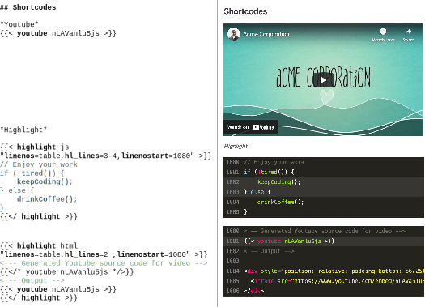
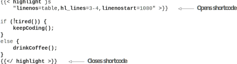

# 4.5  通过shortcodes提供YouTube、Gists和其它代码片段

尽管Markdown功能强大，但它没有我们在内容页面中可能需要的所有可能功能。 像YouTube视频、GitHub Gists、Tweets等所需的元素并不是普通Markdown的一部分。 虽然我们可以将这些添加为HTML，但Hugo提供了一个更好，更清洁的解决方案-shortcodes。 shortcodes是我们可以包括在内容文件中的模板片段。 这些在编译时被实际内容替换。 它们等同于编程世界中的函数。

使用shortcodes，我们可以将可重用的HTML片段包装到页面编译期间编译的函数中。 通过这种方式，内容创建者不必处理作为shortcodes作者才需要处理一些特定情况，就能生成完美的HTML。 shortcodes可以采用可以在模板代码中处理的参数。 shortcodes作者可以访问整个网站配置及其所有变量、Hugo的内置函数和整个主题以生成HTML。

shortcodes可以在标记中使用双大括号，后跟类似HTML的角括号: (\{\{<...>}})。 尖括号和内容之间的空格是可选的。 Shortcode采用Shortcode的名称，后跟一些参数。 Shortcode既支持命名参数(如果Shortcode支持)，也支持未命名参数。 下面的清单显示了我们如何调用称为myshortcode的Shortcode。



    	

Acme Corporation网站上有一个预告片视频，该公司希望将其包含在About页面中。 在 “About” 页面中，我们可以添加 \{\{< youtube nLAVanlu5js >}} 或 \{\{< youtube id="nLAVanlu5js" >}}，以获取带有嵌入式ID nLAVanlu5js的YouTube视频。 幸运的是，Hugo提供了一个内置的Shortcode来呈现YouTube视频。 注意，YouTube视频的ID可用作YouTube URL中v之后的参数 (例如，https://www.youtube.com/watch?v=nLAVanlu5js是Acme公司视频的URL)。 你还可以将自动播放等参数传递给YouTube Shortcode(参见图4.11)。


**NOTE** 目前正在进行积极的讨论，以将Hugo中内置的ShortCode从Hugo的核心转移到单独的存储库中。 这将允许我们链接到特定版本的Shortcodes，并在Hugo发布周期之外进行更新。


你可以在Acme Corporation网站的layouts/shortcodes文件夹中找到像youtube和highlight这样的本书中使用的shortcodes副本，以防止不兼容问题 (https://github.com/hugoinaction/hugoinaction/tree/chapter-04-resources/08)。

CODE CHECKPOINT     https://chapter-04-10.hugoinaction.com, and source code: https://github.com/hugoinaction/hugoinaction/tree/chapter-04-10.

图4.11在Hugo中有多种使用内置Shortcode的方法。 你可以直接调用youtube Shortcode，也可以将内容传递给highlight shortcode或其它内嵌Shortcode。

## 4.5.1 带内容的Shortcode

Shortcode也可以将内容作为Shortcode作者可以使用Go模板语言处理的参数。 这样，Shortcode创建者可以在呈现最终的HTML之前对传递的内容进行处理。 我们给Hugo Shortcode的内容可以是HTML或标记的形式。

我们可以在双花括号内使用类似于HTML的左尖括号和右尖括号来提供Shortcode的开始标记和结束标记。 Hugo将Shortcode边界中的内容按现状传递给Shortcode，然后Shortcode作者可以根据需要对所提供的内容进行任何处理。

Hugo中使用的一个流行Shortcode是Highlight ShortCode，它提供语法高亮显示。 此ShortCode是代码区域功能的替代，并提供相同的功能 (请参见图4.11)。 下面的清单显示了添加highlight shortcode的语法。



    

## 4.5.2 嵌套Shortcode

我们可以通过在另一个Shortcode中插入一个Shortcode来构建嵌套的ShortCode。 首先处理最内部的Shortcode，然后将其结果传递给最外层的Shortcode。 此功能的一个巧妙用途是通过将其传递给highlight Shortcode来查看Shortcode处理的代码结果。 下面的清单显示了如何做到这一点。 请注意，\{\{</*…*/>}}为Hugo Shortcode的注释语法； Hugo不将此块中的内容作为Shortcode处理 (参见图4.11)。



    	

## 4.5.3 内置Shortcode

Hugo自带内置通用Shortcode。 一些主题可能会与用户的Shortcode捆绑在一起。 我们还提供了社区构建的Shortcode，我们可以将其添加到我们的网站中并根据需要使用。 我们可以自由地在layout文件夹内的shortcodes子文件夹中创建自定义Shortcode。 一些内置的Hugo shortcodes包括以下内容:
- gist—以用户和gist ID为参数，并呈现GitHub gist。 如果GIST有多个文件，也可以传递文件名。
- ref—在Hugo网站中获取文件路径，并提供指向该文件的绝对链接。 如果URL或slug在页面的前部被覆盖，则ref shortcode将跟随在新提供的位置之后。
- relref—提供Hugo网站中文件的相对链接。 此ShortCode的工作方式类似于ref。
- figure—渲染带有标题的图像。
- tweet—呈现具有给定ID的推文。
- instagram—嵌入带有给定ID的Instagram图像。
- vimeo—渲染具有给定ID的Vimeo视频。
- youtube—使用给定的ID呈现YouTube视频。
- highlight—为提供的源代码添加语法突出显示。
- param—打印传递的参数(对于调试也很有用)。