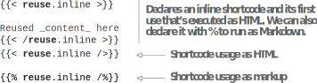

# 4.6 使用自定义Shortcode进行内容共享

虽然共享复杂的逻辑是Shortcode的一种使用目的，但我们也可以使用Shortcode来最大程度地减少复制和粘贴的工作，并保持内容的清洁。 Shortcode可以是简单的，比如需要共享以防止重复的HTML片段，甚至是Markdown内容。 有了一个唯一的来源，管理内容变得容易得多。 在创建内容时，如果我们发现正在重复复制和粘贴某些文本，最好将该文本包装在Shortcode中，然后调用该Shortcode来提供内容。 对于内容共享，我们可以创建两种类型的ShortCode，如以下各节所述。

## 4.6.1 HTML shortcodes

我们可以使用自定义Shortcode在Markdown文件中放置内联的HTML，方法是在layout/shortcodes文件夹中添加一个HTML文件。 然后，我们可以使用该文件名作为Shortcode在文档中呈现它。

我们将通过使用ShortCode添加分隔符来修饰Acme Corporation网站的About页面(图4.12)。 为此，我们将在布局文件夹中创建一个名为divider.html的文件，并添加章节资源 (https://github.com/hugoinaction/hugoinaction/tree/chapter-04-resources/09) 中提供的内容，以在纯HTML中创建一个漂亮的分隔符。 然后我们可以在我们网站的任何地方使用这个文件在页面上放置一个分隔符。 下面的清单显示了如何将此分隔符添加到 “About” 页面上的多个位置。 请注意，你可能需要重新启动开发服务器才能使更改生效。


```html
<div style="background-image: 
 linear-gradient(to right, transparent, #4f46e5, transparent); 
 margin:15px 0;height:2px;position:relative">
 <!-- Additional trick: We can add Unicode 
 characters as-is in HTML to render them.-->
 <span style="position:absolute; 
 left:calc(50% - 10px);
 line-height:2px;
 font-size:30px; 
 padding: 0 5px; 
 background: white; 
 color:#4f46e5">☺</span>
</div>
```



**CODE CHECKPOINT**	https://chapter-04-11.hugoinaction.com, and source code:  https://github.com/hugoinaction/hugoinaction/tree/chapter-04-11.
↻ Restart your dev server.


图4.12在 “关于” 页面中使用自定义shortcodes 为Acme Corporation创建个性化分频器" >}}

## 4.6.2 基于标记的Shortcode

虽然大多数Shortcode是HTML，但我们可以选择使用Markdown等标记语言编写ShortCode。 如果我们使用百分号(%)而不是尖括号(<>)来调用Markdown快捷代码，Hugo会将它们转换为HTML。 这样，我们可以在共享的地方移动数据，然后从需要的任何地方使用它。

我们可以将产品信息表从About页面移到一个Shortcode中，并在Acme Corporation网站上关于制造过程的博客文章中共享它。 让我们在layouts/shortcodes文件夹中创建一个名为productInfo.md的文件，并将产品信息的内容移动到此页。 然后，我们可以将字符串{{——% productInfo %}}放在内容中的任何位置，以获取产品信息表。 让我们在Acme Corporation网站上的 “About” 页面和 “manufacturing process” 页面上执行此操作 (https://github.com/hugoinaction/hugoinaction/tree/chapter-04-resources/10)。


**CODE CHECKPOINT**	https://chapter-04-12.hugoinaction.com, and source code: https://github.com/hugoinaction/hugoinaction/tree/chapter-04-12.


## 4.6.3 内联shortcodes

我们在一个单独的文件(如productInfo.md)中构建了Shortcode，该文件可在全局范围内使用，并在整个网站中共享。 或者，如果我们希望有一个特定于页面的Shortcode，我们可以在页面的Markdown内容中声明该Shortcode，并在该页面中使用它。 这个Shortcode可以做普通Shortcode所能做的一切。 这不会在页面之外创建变量，因此可以加快编译速度，同时保持全局Shortcode清单的清洁。 这些Shortcode被称为Inline（内联） Shortcode，因为它们是在我们调用它们的文件中内联声明的。

默认情况下禁用内联Shortcode，因为Shortcode可以访问整个网站配置。 如果所有内容都来自受信任的来源，这不是问题。 我们可以通过使用设置enableInlineShortcodes: true创建安全配置文件 (config/_default/security.yaml) 来启用内联shortcode。 一旦我们这样做了，我们就可以在我们的内容中声明一个Shortcode，在我们想要赋予Shortcode的名称后面使用.inline。

内联Shortcode一声明就执行，不能嵌套。 我们既可以生成HTML，也可以生成基于标记的内联快捷代码。 下面的清单显示了如何使用内联Shortcode。 与常规的Shortcode不同，我们在内容中声明这些Shortcode。





我们可以用Shortcode做更多的事情，所以我们将在第5章中探讨一些高级Shortcode。 本章总结了Hugo作为内容管理系统的用法。 利用到目前为止讨论的功能，并依靠Eclectic的现有主题，我们可以构建和维护复杂的网站。

许多Hugo用户只需要学习Hugo到这个程度就够了。 虽然我们可以在Hugo主题的范围内做很多事情，但Hugo模板系统中还有更多的能量。 在下一组章节中，我们将构建一个独立主题的片段，该主题以各种方式获取数据，包括从front matter、单独文件或通过互联网创建自定义网页。 此外，我们还没有完成Hugo的内容管理功能。 在接下来的章节中，我们将介绍一些功能，如层叠属性。