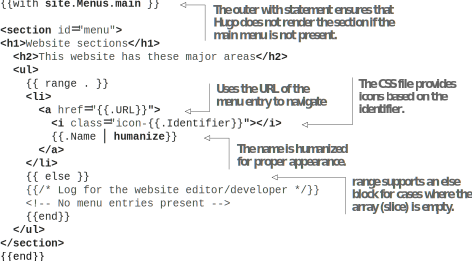
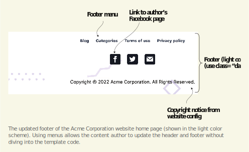
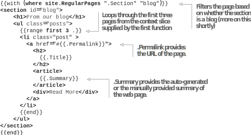
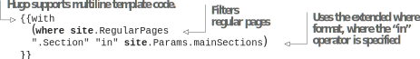

# 5.2 使用外部数据添加内容

虽然我们可以从标记文档中获取大部分网页数据，但我们也可以在标记文档之外获取一些数据。 这些数据包括菜单、其它sections、网站的页面和Hugo从网站或网页数据生成的内容。

## 5.2.1 添加菜单

主页上到各页的链接破坏了这些页面的独立性。 如果我们删除其中一个页面，我们就会有一个空置的链接。 向该页面添加链接涉及复制和粘贴内容，然后更改HTML文件中的文本。 此解决方案不可扩展。 更好，更可扩展的解决方案是为此内容提供一个菜单。 这样，页面就可以独立地分配给具有配置或front matter的菜单。

虽然我们可以为此信息创建一个新菜单，但Acme Corporation网站的一个更好的主意是在主页上呈现整个网站中使用的主菜单。 主菜单已经存在于site.Menus.main变量。 我们可以循环执行此操作，为主页上的各个菜单项创建锚标记。 清单5.21使用此信息为当前上下文区域下的菜单添加了一个新部分。 稍后，我们将增强菜单以匹配图5.4。





    

在清单5.21中，range是Go模板语言中的主要循环函数。 range函数在每次运行下一个菜单项时更新上下文(.)。 如果没有条目，Hugo不处理范围内的代码块。 如果需要，我们可以为此提供else代码块。 范围函数还具有替代形式来填充变量，而不是用值更新上下文并提供索引。 尽管如此，上下文更新版本更受欢迎。

site.Menus是一个Hugo生成的对象，该对象具有网站上每个菜单的子属性，该对象内部包含根据提供的权重排序的所有菜单项。 每个菜单项都提供了名称和URL子属性。 请注意，主菜单具有子菜单，在这种情况下，我们将忽略这些子菜单。 我们可以使用humanize函数将姓名的第一个字母大写，从而透明地处理所有小写条目。

else代码块引入了Go模板语言中的注释。 我们可以自由地使用HTML注释来实现这一点，但它们确实有一些问题：
- HTML注释生成并在输出中公开。 除非我们在压缩时把它们去掉，否则它们会增加页面大小。
- Hugo执行任何带有花括号(\{\{...}})的GO模板代码，即使在HTML注释块中也是如此。

- HTML注释适合主题或页面开发人员向网页内容作者发送消息。 另一方面，GO模板注释在编译时被剥离，仅对主题或布局开发人员有帮助。

- 虽然菜单只需要name，identifier和weight，但我们可以将自定义的pre和post属性添加到菜单项中，以向模板提供可在菜单之前或之后使用的其它数据。 在参考资料中，我们向主菜单(https://github.com/hugoinaction/hugoinaction/tree/chapter-05-resources/04)添加了一个post属性，该属性可用于填充内容。 现在，我们可以在模板中使用此属性，如下面的列表所示，更新主页上主菜单的呈现。






**创建新菜单**

在Hugo中创建一个新菜单没有什么特别需要做的。 我们所需要做的就是为菜单分配页面。 例如，我们可以将以下内容添加到 “About” 页面以创建单独的主菜单:
```yaml
menu:
  home:
    name: About 
    identifier: about 
    weight: -500
```

这样，我们就可以在Site.Menus.home中运行范围循环，而不是在Site.Menus.main中循环，并保持其余代码不变。


我们还可以使用相同的主菜单生成网页的页眉。 我们将网站徽标从intro部分移动到header，并如图所示呈现

5.5. Listing 5.23 provides the code to set up the header.




```html
<header>

<a href="{{ site.BaseURL | absLangURL }}">

Acme Corporation
</a>
{{with site.Menus.main }}
<nav>
<button class="hamburger">☰</button>
<ul>
{{range .}}
<li>
<a href="{{.URL}}">{{.Name | humanize}}</a>
</li>
{{end}}
</ul>
</nav>
{{end}}
</header>
```


请注意，当我们开发主页时，我们可以使用.Permarink链接到当前page.Using站点。BaseURL作为主页的链接确保我们可以在其它页面中重用此标题 (我们将在下一章中进行此操作)。 我们还可以以类似的方式更新网站的页脚，以使用页脚菜单而不是硬编码的文本。 最后，absLangURL函数将URL转换为当前语言的绝对链接。 当我们在第13章中转换为多语言网站时，这个功能将派上用场。


**Exercise 5.4**

通过生成与https://chapter-05-09.hugoinaction.com匹配的HTML，为Acme Corporation网站构建页脚以匹配图5.6中的视图。
- a. 要填充社交媒体图标，请使用配置中提供的作者信息。
- b. 版权信息存在于网站参数中。
- c. 页脚菜单已在网站内容中提供，你应该使用它。



Acme Corporation网站主页的更新页脚 (在浅色方案中显示)。 使用菜单允许内容作者更新页眉和页脚，而无需深入研究模板代码。


默认情况下，CSS文件会制作一个浅色的页脚，但是我们可以通过将dark类添加到页脚标签来使其变暗。 我们将在网站的其余部分使用深色页脚。 我们还将借此机会将链接添加到页脚中的 “Credits” 页面。 在Credit.md中，添加以下内容：

```yaml
---
menu:
  footer:
    name: Credits 
    identifier: credits 
    weight: 400
---
---
```


**CODE CHECKPOINT**	https://chapter-05-09.hugoinaction.com, and source code: https://github.com/hugoinaction/hugoinaction/tree/chapter-05-09



**作为菜单的Section页面**

在网站的各个部分编写带有指向index页面的链接的菜单项是一项非常常见的任务，以至于Hugo用一个更容易的默认设置定义了这一点。 例如，如果我们将sectionPagesMenu: sections添加到我们的配置参数sectionPagesMenu: <name> (https://gohugo.io/templates/menu-templates/#section-menu-for-lazy-blog-gers)，然后，将自动创建一个名为Sections的菜单，其中包含网站中每个Sections的条目。 我们的内容中不需要对Sections菜单的任何引用，只需在我们的配置中使用sectionPagesMenu：Sections来使用指向每个部分的index页的链接来填充Sections菜单。


## 5.2.2 添加最近的博客文章

到目前为止添加的数据大多是静态的，不会频繁更改，因此在使用模板时几乎没有什么好处。 静态站点框架的主要好处是使用更改的数据自动更新页面。 我们将向Acme Corporation网站的主页添加最近的博客帖子列表，随着我们添加更多的博客帖子，该主页将自动更新为新条目。 为此，我们将在网站的主页上再创建一个Section，其中包含最近的博客文章列表 (https://github.com/hugoinaction/hugoinaction/tree/chapter-05-resources/06)。 图5.6显示了这一部分的输出。



为了提供内容，我们将获得属于博客部分的网站的子页面列表，然后在带有标题和摘要 (手动或自动生成) 的小卡片布局中呈现它们。 我们将在下一章的博客文章中添加图片。 清单5.24提供了我们将在Acme Corporation网站的主页上进行的更改。 这些措施包括过滤网站页面上的博客文章，并获得前三个。 模板中最有趣的代码是过滤逻辑，在图5.7中有详细描述。







在列表中，我们使用来自网站上RegularPages属性的where语句内容过滤了页面。 此属性为我们提供了所有内容页的列表，不包括support页，如taxonomies和index，按日期字段降序排序。 虽然我们可以使用排序函数更改排序顺序，但按日期降序通常是所需的行为，我们不需要更改它。 where函数接受一个slice(列表)、一个key和一个value。 它根据提供的键 (.Section) 处的值与值 (blog) 匹配的元素过滤列表。 虽然默认操作符是等于(=)，但我们可以通过在值之前传递自定义操作符来覆盖它。


**NOTE** 因为site是全局的，所以site.RegularPages在所有模板中都可用。


外部的with语句执行两个任务： 它会更新上下文变量，以便我们不需要重复两次where检查，并确保博客部分中有内容 (如果存在该部分)。 Hugo的模板引擎足够智能，可以识别with语句中的空slice，在本例中不会呈现。

虽然我们使用的过滤代码是函数性的，但我们已经对模板中的key blog进行了硬编码。 如果我们有一个不同的版面名称的网站布局，这将成为一个问题。 Hugo对此方案有一个标准化的key，其默认值Hugo自动生成。

我们可以使用site.Params.mainSections来获取网站内的主要section。 默认情况下，它包含具有最大页数的部分，但是我们可以覆盖此变量以支持多个sections或添加或删除它们。 因为它是一个列表，所以缺省的相等性检查操作不起作用，我们需要为此提供in操作符。 下面的清单更新了页面过滤逻辑，以查找主要section而不是硬编码的blog section。






**CODE CHECKPOINT**	https://chapter-05-10.hugoinaction.com, and source code: https://github.com/hugoinaction/hugoinaction/tree/chapter-05-10.
