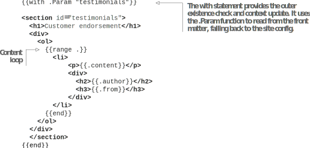
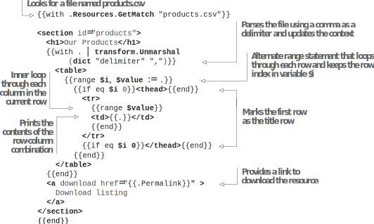

# 5.3 使用结构化数据

网页中有两种常见的数据类型：非结构化、自由流动的文本(由Markdown文档表示)和结构化或分组数据(由数据库中传统上定义的键和值或行和列表示)。 例如，在购物车应用程序中，产品描述应该是非结构化的，但是如果我们将价格字段放在Markdown中，提取价格以在多个位置显示将是乏味的。 有多种方法可以单独提供结构化数据。 一种方法是从磁盘读取文件。 另一种选择是使用front matter随元数据一起提供结构化数据。

## 5.3.1 将front matter用于结构化数据

站点中的.Params对象和页面级变量属于主题。 主题作者可以自由决定向这些变量添加什么以提供结构化数据。 让我们将这个概念用于Acme Corporation网站主页。 我们将使用前面的内容在网站主页上添加推荐列表，如图5.8所示。 然后，在清单5.26中，我们将在front matter添加一个名为testimonials的字段，并将所有的testimonials放在(https://github.com/hugoinaction/hugoinaction/tree/chapter-05-resources/07)中。




**Exercise 5.5**

以下哪些结构化数据示例将受益于将Markdown内容移至结构化数据之外并移至前端或单独的文件中？(选择所有适用的。)
- a. Music playlists
- b. Author biography
- c. Reviews of physical products
- d. List of top ten most liked blog posts
- e. Affiliate link to the product in review




```yaml
testimonials:
  - author: Brad
    from: Fictional Incorporated
    content: >
            We have been using the shapes from Acme in our products for ages. They are precise, smooth, and very well built.

  - author: Random
    from: Random Education
    content: >
            Sharp and sturdy - Just like you want them.

  - author: Richter
    from: Richter Measures
    content: >
            Undoubted accuracy. Safety guarantee. We love what Acme delivers.
```


现在我们可以在页面上读取该变量并适当地呈现它。 清单5.27提供了显示testimonials的更改。 这种类型的逻辑支持在HTML中使用数据驱动的定制元素，这些元素使用提供的结构化数据作为参数。 最好检查它们的存在，如果列表为空，则不要在列表周围创建HTML标签。 如果它不是空的，我们可以遍历它并访问内部属性，如Content、From和Author。



    	


**CODE CHECKPOINT**	https://chapter-05-11.hugoinaction.com, and source code: https://github.com/hugoinaction/hugoinaction/tree/chapter-05-11.


在清单5.27中，如果前面的内容中没有提供推荐部分，则顶层调用可确保不添加任何内容。 但是，如果它存在，我们将遍历testimonials列表，并将每个testimonial打印在HTML中。

我们在3.6.2节中使用了相同的技术，使用Eclectic模板构建了数据驱动的登录页面。 主题作者使用结构化数据来创建sidebars、carousels、accordions和其它高级用户界面元素。

## 5.3.2 解析文件中的数据

为了与其它系统的互操作性，基于文件的数据收集方法非常有用。 Hugo支持解析结构化内容，我们可以使用这些内容从基于CSV的电子表格、基于JSON的API输出或单个YAML文件中提供原始数据。 我们可以将这些数据转换为Hugo中的slices (数组) 和dictionaries (映射)，然后使用它们将数据呈现为HTML。 在创建基于另一个系统的网站时，此功能非常有用，该系统以机器可读的格式提供输出。

有很多方法可以访问文件。 例如，可以将JSON、CSV、YAML或TOML文件与content文件夹放在一起放到同级的data文件夹中。 文件中的数据作为字典在site.data变量中可用。 我们还可以将文件放在固定位置，并使用readFile获取其内容，然后使用Transform.Unmarshal将其从原始文本转换为词典。 Page bundle也可以用于这些文件，我们可以在其中使用 $.Page.Resources.Get，然后是transform.Unmarshal。

对于Acme Corporation，我们有一个名为Products.csv的文件，它列出了该公司销售的产品信息。 其它库存管理系统管理和导出Excel支持的CSV格式。 我们需要在网站的主页上以表格的形式呈现它(图5.9)。



我们可以将Products.csv放在内容文件夹的根目录下，使其成为index页面(https://github.com/hugoinaction/hugoinaction/tree/chapter-05-resources/08)的branch bundle的一部分 下面清单中的代码在products.csv文件中循环并打印表中的值。我们将把表格的第一行标记为标题。



 


**CODE CHECKPOINT**	https://chapter-05-12.hugoinaction.com, and source code: https://github.com/hugoinaction/hugoinaction/tree/chapter-05-12.

 
我们可以使用资源API在当前页面的page bundle中找到products.csv文件。 资源api是访问资源并处理，管理和转换资源的强大方法。 在第6章中，我们将更深入地研究Hugo管道的资源API。

在上一个清单中，我们使用逗号 (,) 作为CSV的分隔符对文件进行解析，该分隔符返回表示二维数组的slices (嵌套数组)。 在外部循环中，我们使用范围表达式的另一种形式。 代替设置上下文变量，返回范围内的相应值 $value 及其索引 $i。 接下来，我们使用索引来标识标题行。 最后，我们循环遍历具有内部范围的条目，以创建表的所有行。 在这一节的底部，我们使用相同的资源API提供了指向CSV文件的可下载链接。