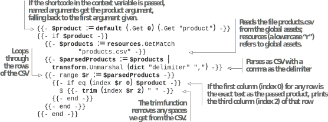

# 5.4 使用Go模板语言改善生活

我们可以用模板语言做更多的事情，而不仅仅是构建网页模板。 我们可以在不同的地方使用GO模板语言来消除重复的工作，并增强处理内容的日常工作流。 我们可以发明新的ShortCode来增强Markdown以提供新功能。 我们可以为内容创建原型或模板，这样当我们稍后开始编写内容时，我们就有了一个预先填充了基本元数据的页面。

## 5.4.1 ShortCode中的模板代码

ShortCode(我们在第4章中用到的)不仅仅是HTML的片断。 它们是可以访问完整模板功能的模板片段。 我们可以在其中访问站点的所有变量，并可以使用这些变量以及传递的参数和内部内容来编写呈现ShortCode的逻辑。

使用到目前为止我们已经开发的Go模板语言技能，我们可以编写一个ShortCode，该代码采用产品名称，解析价格并将其呈现到网站。 要使ShortCode在整个网站中运行，我们需要将Products.csv移动到更易于访问的位置，例如Assets文件夹。 (assets文件夹是通过Go模板语言可访问的内容的全局文件夹。) 请注意，我们还需要更新索引页面模板以使用这个新位置(使用resources.get而不是.Resources.Get)。 下面的清单提供了执行这些任务的自定义ShortCode (https://github.com/hugoinaction/hugoinaction/tree/chapter-05-resources/09)。



    

清单5.29中需要注意的主要一点是，上下文变量， .， 在ShortCode中是不同的。 这是因为它指的是ShortCode，而不是呈现它的页面。 此外，在清单中，我们使用{{- -}}代替标准的{{ }}Go模板双花括号(八字胡是双花括号的另一个常见名称)。 使用 {{- -}} (虚线胡须) 的原因是它们从字符串输出的两侧删除了所有空格。 在大多数情况下，我们不需要大幅削减空格，因为我们确实需要一个空格，而HTML会忽略额外的空格。

在像当前示例这样的情况下，我们需要绝对零空间来允许在Markdown文档中进行完全的空间控制，虚线胡须和trim函数很方便。 我们也可以有像{{- …}这样的单虚线胡子}}或{{… -}}分别从左侧和右侧修剪空格。

我们可以使用Hugo中的索引函数来访问特定索引处的列表中的值。 我们可以通过使用参数\{\{< price "Square">}}或命名参数\{\{< price product= "Square">}}来调用此ShortCode。 我们将把它添加到Building Squares和Circle blog帖子中，如下面的代码片段所示。 此外，通过使用resources.GetMatch而不是.Resources.GetMatch，我们将内容定位为全局assets文件夹。

{-{< price "Circle" >}}         $4
{-{< price product="Square" >}} $2



## 5.4.2 ShortCode中的内部内容

ShortCode也可以采用内部内容 (在4.5.1节中讨论)。 我们可以使用GO模板语言访问这些信息，并对这些信息进行任何需要的处理。 例如，以下清单中的短代码重复n次内部内容，其中n作为参数提供 (https://github.com/hugoinaction/hugoinaction/tree/chapter-05-resources/10)。



    


**CODE CHECKPOINT**	https://chapter-05-14.hugoinaction.com, and source code: https://github.com/hugoinaction/hugoinaction/tree/chapter-05-14.


前面清单中的代码应该不难理解。 重复ShortCode要记住的关键是循环的性能成本。 我们应该避免在循环中进行繁重的处理，并尽可能预先计算(就像本例中运行Markdown解析器一样)。 我们可以在网站的 “About” 部分使用这种方法来提醒团队，重复五次，“The customer is our
**number 1** priority.” 下面的清单使用重复快捷代码来添加此提醒。


```html
Input

{-{< repeat 5 >}}
Customer is our **number 1** priority.
{-{< / repeat }} Nothing else.


输出
<ul>
<li>The customer is our <strong>number 1</strong> priority.</li>
<li>The customer is our <strong>number 1</strong> priority.</li>
<li>The customer is our <strong>number 1</strong> priority.</li>
<li>The customer is our <strong>number 1</strong> priority.</li>
<li>The customer is our <strong>number 1</strong> priority.</li>
</ul>  Nothing else.
```


## 5.4.3 用原型节省一些时间

编写内容所涉及的一组步骤是重复的。 它包括创建文件夹，填写前面的内容，在许多情况下，放置封面图片。 虽然这些任务是重复的，但它们是主题及其布局所独有的。 任何可以在所有网站上推广的事情，都已经通过为Hugo中的大多数前置事项和其他变量设置好的默认值来完成。

随着网站变得越来越复杂并添加了更多功能，为网页设置内容变得越来越复杂。 当我们开始将Markdown文件放在content文件夹中时，我们已经转移到了页面捆绑包。 在可预见的将来，我们可以想象带有日期，草稿等字段的密集front matter，这些字段可以成为必填字段。

原型是Hugo帖子的模板，我们可以使用它来自动创建文件夹结构，填写前面的内容， 并为内容提供占位符图像，以便我们可以快速进行写作。 当我们使用Hugo new<filename>时，会在content文件夹中创建一个占位符文件。 当我们为Acme Corporation制作网站时，第2章中的hugo new site命令创建了一个默认原型。 我们可以使用它作为模板，通过发出以下命令来生成博客文章：

```shell
hugo new blog/line.md
```

此命令在content文件夹中创建一个line.md文件，该文件被标记为draft。 我们可以开始添加内容，当我们准备发布此页面时，我们可以从前面的内容中删除Draft字段。 我们可以使用--buildDrafts让雨果服务器预览草稿页面。
虽然默认原型填充了基本内容，但我们可以在博客模板中添加更多内容。 对于常规Markdown帖子，我们可以在原型文件夹中创建一个新文件，例如blog.md (https://github.com/hugoinaction/hugoinaction/tree/chapter-05-resources/11)，内容如下所示。


```
---
date: {{ .Date }}
title: "{{ replace .Name "-" " " | title }}"
draft: true
tags:
-unknown
categories:
-general
---

Provide an awesome introduction here

<!--more-->

Here goes the main content.
```
    	

我们现在可以删除content/blog/line.md并生成一个新的。 这一次，Hugo自动为博客部分中的内容选取博客模板。


**Exercise 5.6**

Archetypes are a means for the 	to help the___with a great set of defaults.


我们还可以在原型中创建页面bundles。 要添加页面bundles，请在Archetypes文件夹中创建一个名为blog的子文件夹，并将blog.md移到其中，并将文件重命名为index.md。  如果我们愿意，我们也可以添加封面图像 (https://github.com/hugoinaction/hugoinaction/tree/chapter-05-resources/12)。  现在，我们可以使用new命令中的Kind标志为这行博客文章创建一个页面bundle。 为此，我们删除line.md并运行以下清单中的命令。


```shell
hugo new blog/line --kind blog
```



**NOTE** blog.md和blog文件夹不应同时存在。



**CODE CHECKPOINT**	https://chapter-05-15.hugoinaction.com, and source code: https://github.com/hugoinaction/hugoinaction/tree/chapter-05-15.


现在blog将有一个名为line的文件夹，其中包含index.md。 如果我们将图像添加到原型页面包中，Hugo会将其复制到模板中。 这样，我们可以用占位符数据定义复杂的模板，让内容创建者快速上手。 例如，当我们在开发模式下运行Hugo时，会显示Line页面，因为我们在开发配置中将buildDraft设置为true。 使用这些功能，我们可以通过将重复性工作移至ShortCode和原型来制作自定义页面或简化Hugo网站中的日常活动。