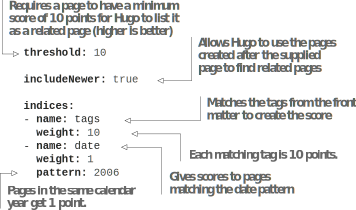

# 7.1 更多布局内容的方法

应用程序中有多种类型的页面，每种页面都有不同的外观。 例如，博客页面通常具有边栏，其中包含有关博客文章的其他信息。 各种类型的页面可以具有不同的CSS样式和不同的HTML结构，以适应其独特的设计。
我们在第6章中使用的一种不同样式页面的方法是对创建的每个页面类别使用新的内容类型。 虽然内容类型是提供隔离特定类型内容的呈现代码的机制的有效概念， Hugo中还有其他方法可以以不同的设计渲染内容-参数化的front matter或新布局。 所有这三种方法都有它们的用例、优缺点，我们可以在同一个网站中同时使用它们。
对于Acme Corporation网站，我们用于使用条款页面 (第6.1.4节) 的网页设计非常简单。 它不能很好地处理博客和新闻部分的内容页面。 我们需要对这些页面进行更精细的设计。 在News页面中所需的更改可以通过CSS来实现，而对于博客页面，我们想要添加一个侧边栏，这涉及到添加HTML内容。 让我们看看与Hugo一起实现这一目标的各种方式。

## 7.1.1 参数化front matter以区分新闻页面界面
当我们在两种不同类型的页面之间有微小的HTML更改时，我们可能不想创建新的内容类型。 我们可以公开一个变量，模板代码可以用来提供差异化的HTML。 使用条件语句if和else，如果需要，我们可以编写不同的HTML内容。 这样，较小的HTML更改就存在于同一文件中，并且我们不需要在磁盘上管理单独的文件。 我们可以最大限度地实现代码重用，而且我们不需要为了防止重复而将代码分成多个partials。
对于Acme Corporation网站上的新闻页面，我们不需要进行很多更改。 这些页面附带我们需要应用的封面图片。 请记住从第六章开始。页面上下文中的资源是指该页面的页面捆绑包中的资源。 我们可以使用with或if检查来确保如果资源不存在，则不会生成额外的HTML。 然后，我们可以将其添加到现有的single.html中，如下面的清单所示。


    


Acme Corporation网站的新闻部分(图7.2)中的页面与我们到目前为止开发的页面具有类似的HTML结构，并且所有更改都体现在CSS样式中。 由于HTML基本相同，因此切换CSS类的条件语句方法更适合此用例。 虽然我们可以将front matter中的类名作为变量，并通过调用$.Param函数使用它， 我们可以通过多种方式获取这些信息，而无需在网站的内容区域中编写任何内容。 如果我们没有设置内容类型，我们可以通过.Type属性为本例使用内容类型。



我们可以使用页面的文件夹位置来查找其section。 如果我们为新闻页面运行 {{path.Base (path.Dir .Page.FirstSection.File.Path)}}，我们将获得新闻section。 .Page.FirstSection指向新闻section的_index页面，我们可以使用.Page.FirstSection在其路径中找到文件夹名。 请注意，我们也可以将CurrentSection用于新闻页面，但这将破坏博客section的社区subsection。 我们可以使用这个文件夹位置来更改News页面的HTML类，并使其不同于其它页面，如清单7.2所示。


**TIP** 最大限度地减少在front matter输入数据的需求可以帮助保持内容区域的简单。 在创建内容时，我们必须考虑的front matter元数据越少越好。 我们做了一次主题，但我们不断向网站添加内容。



```
{{define "bodyClass"}}
{{ path.Dir .Page.FirstSection.File.Path) }} page
{{end}}
```



**TIP** 在定义块中显示网站标题部分的一个条目是很好的。 对于特定于页面的元数据或提供特定于页面的CSS/JavaScript文件，可以重写此功能，从而使主题可扩展。 我们甚至可以使用cover.* 这样的命名约定来加载额外的CSS/JS文件。


单个页面模板可以自动找到该部分的名称，并提供相应的CSS类以及这些更改。 由于此代码存在于Hugo中现代类型的Single Page模板中，因此我们需要将新闻section中的所有页面都分配给此内容类型。 我们将需要在新闻section的每个页面中添加type: modern。 考虑到可能有数百个新闻页面，这是大量的工作。 然而，对于新页面，原型 (在第5.4.3节中讨论) 可以帮助预先定义它们， 但文本仍将是必需的，这可能会导致印刷错误和其他错误。

## 7.1.2 使用级联属性将属性应用于多个页面的front matter

Hugo的一项核心原则是减少工作并最大程度地防止代码重复。 在一个部分的所有页面之间共享一个属性对于网站来说是很常见的。 Hugo认识到这一点，并提供了一种机制，可以一次编写此属性并将其应用于所有页面。 Hugo有一个名为casade的front matter属性(图7.3)，它的子属性作为front matter属性应用于该部分中的所有页面。



层叠的概念与CSS中的概念相同，后者代表层叠样式表。 我们在顶层定义一个通用属性，然后在需要重写时定义一个特定属性。 更具体的属性会覆盖泛型属性。 我们甚至可以做一个本地覆盖，其中级联属性适用于子页面，但不适用于当前页面，因为当前页面前面的属性具有更高的优先级。

在新闻section的_index页面上，让我们通过如清单7.3所示的cascade属性启用类型modern。 我们将把它还原为news/_index页面，因为现代类型没有分支列表页面的HTML布局。 默认情况下，casade属性应用于部分中的所有页面，包括子索引页面(list.html)和单个页面(single.html)。


```markdown
cascade:  type: 
  modern
type: _default
```



**NOTE**  我们可以在front matter的根级别类型字段中使用垃圾字符串。 如果磁盘上不存在前面内容中指定的类型，Hugo将返回到_default文件夹来查找布局。



**CODE CHECKPOINT** https://chapter-07-01.hugoinaction.com, and source code: https://github.com/hugoinaction/hugoinaction/tree/chapter-07-01.


新闻部分中的每个页面都已使用cascade属性分配给modern的内容类型。 一旦启用了这一功能，我们就可以看到新闻section中的子页面使用News页面的新的CSS样式呈现。 下一组需要不同设计的页面是博客页面。


**NOTE** 我们仍然可以通过在front matter中手动指定它来覆盖CASCADE属性； 例如，如果我们把类型: _default在新闻部分中的任何页面中，该特定页面都使用默认内容类型呈现，即使它位于设置了层叠内容类型modern的新闻部分中。 我们可以在图7.3中查看级联和重写的各种排列。


## 7.1.3 为博客内容提供不同的布局

博客部分的设计包括一个侧边栏 (图7.4)。 随着时间的推移，我们预计博客在设计上将与新闻页面或常规网页背道而驰。 将代码与不相关的页面保持在一起不是可扩展的解决方案。 当我们有两个以上的条件语句时，事情可能会变得复杂，特别是如果这些条件语句中的内容非常庞大的话。 如果要为各种内容共享具有不同生成的HTML的基本模板，则需要创建一个新的布局。



网页/叶bundle的默认布局是单一布局，因此我们有一个名为single.html的文件。 这是我们提供对基础模板的覆盖的地方。 但我们并不局限于这种布局。 我们可以把它覆盖到我们想要的任何东西。 内容类型中的布局共享该内容类型中的所有模板，包括呈现挂钩。 表7.1将内容类型与布局进行比较。

Table 7.1 Content type vs. layout


我们希望在博客部分有一个侧栏，以提供有关博客帖子的更多信息。 我们可以在前面的内容中提供标签之类的信息，在索引页中使用的摘要之类的信息以及在前面的内容中提供其他属性。 除此之外，Hugo还可以使用.ReadingTime属性生成一组其他元数据，例如使用.ReadingTime属性生成大约的读取时间，使用.WordCount属性生成大约的字数。

让我们在modern文件夹中创建一个名为blog.html的新文件 (https://github.com/hugoinfollowing/hugoinfollowing/tree/chapter-07-resources/01)。 在这个文件中，我们将定义博客页面的正文块以包括一个侧边栏。 下面的清单在提供Hugo生成的信息的HTML <aside> 标签中设置了一个侧边栏。



   	

我们还需要通过Casade属性指定博客部分的布局和类型，如下面的清单所示。 我们用它来更新博客部分的布局和内容类型。


---
cascade: layout: blog type: modern
---


现在，我们已经将博客文件夹中的所有页面从单一布局更新为博客布局。


**Exercise 7.1**
Hugo中的 _______ 可以与相同内容类型的其他模板共享基本模板和Markdown渲染挂钩 (在第6.4节中提到)。


## 7.1.4 级联目标

我们还为博客部分的社区小节提供了索引页面。 与新闻页面一样，我们不希望新模板覆盖博客部分的索引页。 防止这种覆盖的一种方法是在这两个地方的 _index.md中添加本地覆盖。 然而，当我们引入新的部分并忘记应用此设置时，这种方法可能会导致错误。 更好的解决方案是将覆盖范围设置到正确的页面集。 要做到这一点，与级联一起，我们可以使用键_target在front matter中提供目标信息。 我们可以使用此键来限制cascade选项仅适用于子路径，特定语言文件夹或Hugo中的特定类型页面。 要将目标限制为非索引页面，我们需要理解Hugo中页面类型的概念。

### HUGO的页面种类

与布局类似，Hugo中的每个页面都有一种。 一种是表示Hugo中的页面的内部数据结构。 模板可用的变量集取决于页面的类型。 例如，taxonomy页面类型始终可以访问分类法中的术语列表，而其他页面类型可能无法使用该列表。 页面的类型不能更改。 在Hugo中，页面种类为以下之一:
首页-整个网站的索引页。 默认情况下对应于index.html。
- page —单个网页。 默认情况下对应于single.html。
- section —网站部分或分支bundle的索引页。 默认情况下对应于list.html (请参阅第7.2节)。
- taxonomy —单个分类列表的索引页。 默认情况下，对应于terms.html (而不是taxonomy.html) (请参阅第7.3节)。
- term—单个分类术语的页面。 默认情况下，对应于taxonomy.html (而不是terms.html) (请参阅第7.3节)。


**主题、类型、布局、页面类型差异**

虽然它们似乎是同义词，但主题，类型，布局和页面类型在Hugo中是不同的:

- 主题代表整个网站的模板。 它包含多种类型。
- 一种类型(或内容类型)代表网站的一部分，该部分可以具有多个内容变体和多个模板，用于为每个变体生成HTML。 一个类型可以有很多布局。
- 布局映射到可以跨多个页面呈现单个设计的单个模板。 使用条件，我们可以使某些内容有所不同，但是必须有一个模板表示布局。
- Hugo中的一种页面类型定义了模板在呈现时可以使用的变量。 一个页面种类是固定的，不能更改。


### 在页面类上应用级联

我们的模板只针对单个页面，所有类型的页面。 我们可以通过在Hugo中选择这些页面作为目标来覆盖它们的类型和布局。 下面的清单显示了博客section中的各个页面。 有了这些更改，博客和社区索引页面应该会恢复正常，而博客section的其余页面将有一个侧边栏。


---
cascade:
- _target:
  kind: page layout: blog type: modern
---



**CODE CHECKPOINT**    https://chapter-07-02.hugoinaction.com, and source code: https://github.com/hugoinaction/hugoinaction/tree/chapter-07-02.


## 7.1.5 通过Hugo的相关页面

在博客部分，我们将介绍一个链接到更多与网站内读者相关的页面。 相关页面是Hugo的一项功能，它允许我们获得与提供的页面类似的页面。 相关的页面功能封装了页面的匹配算法，以实现这种复杂的操作，并且它具有出色的性能。 基于元数据进行相似性匹配，并使用网站配置中的相关部分控制前置事件参数。 可以将名为related.yaml的文件 (https://github.com/hugoinaction/hugoinaction/tree/chapter-07-resources/02) 放置在config文件夹中，以控制如何选择页面。 下面的清单显示了如何使用参数来查找给定页面的相关页面。





请注意，当提供阈值以获取相关页面的列表时，它需要是0到100之间的数字。 在搜索相关页面时，当我们添加更多内容时，cludeNewer参数可能会导致相关页面列表发生更改。

site.RegularPages.Relatent函数将一个页面作为参数，并向网站中与该页面相关的所有页面提供分数，然后对这些页面进行排序。 因为Hugo没有提供限制，所以这可能会变成一个巨大的列表，因此，筛选出前几个页面以显示给最终用户是一个好主意(例如，代码中有前5个页面)。

该页面的卡片视图与我们在主页上用于最近的博客文章相同 (请参见图5.8)。 我们可以把它移到partial。 为此，我们可以使用缓存的部分 (如第6章所述)，因为页面的再现在所有页面上都是相同的。 下面的清单使用site.RegularPages.Related查找相关页面，然后使用缓存的部分card.html在当前页面中呈现这些页面。



  	


**CODE CHECKPOINT**    https://chapter-07-03.hugoinaction.com, and source code: https://github.com/hugoinaction/hugoinaction/tree/chapter-07-03.



**Exercise 7.2**

哪个属性决定了Hugo中变量的内容和可用性？
- a. Type
- b. Layout
- c. Kind
- d. Content type
- e. Template name
- f. Permalink
- g. Containing folder
