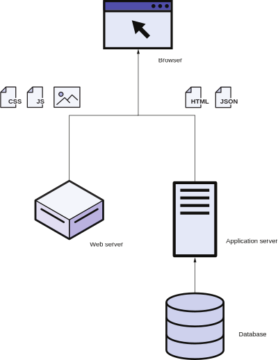
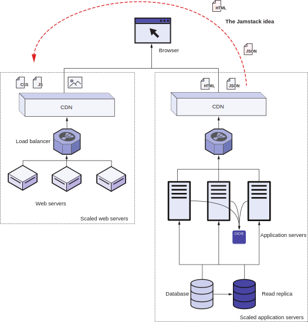
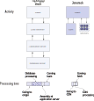

# 1.1 The stack in Jamstack

To understand Jamstack fully, we first need to understand the concept of a web stack. The web stack is a collection of software used for web application development. Some popular web stacks include LAMP (Linux Apache MySQL PHP), Microsoft .NET (IIS, ASP.NET, MS SQL Server), MEAN (MongoDB Express Angular Node.js), and MERN (MongoDB Express React Node.js). Figure 1.1 shows a typical web stack for a non Jamstack-based website.

A web page consists of static as well as dynamic assets. Different servers serve these assets in the stack. A web server like Apache or IIS primarily hosts static assets such as images, JavaScript, and CSS in a traditional web stack. These files do not change  across multiple users. A second set of assets is dynamic content, which can be different. It is based on the supplied request parameters, which include the URL, request headers, cookies, or associated HTTP POST data. An application server with software like PHP, ASP.NET, or Express takes these parameters and creates a response. It might need to do a series of requests to the database server (like MySQL or MongoDB) that holds the website’s content. The application server takes this content and uses the application logic to stitch it into a JSON response (in MEAN/MERN) or, with an HTML template, into HTML content (in LAMP), which it then serves to the web browser. The web page is assembled in the browser by executing the JavaScript and styling the provided content and images with CSS.

This web architecture has been mostly the same since the beginning of the internet, but growth and increased traffic have stressed this architecture. Increasing the CPU and RAM in the servers (called vertical scaling) cannot handle the amount of
traffic moving through the modern internet. This load requires us to add multiple machines (called horizontal scaling) to the stack.

Figure 1.1 A traditional web stack used for development. Non-Jamstack websites have a stack with web servers that provide static assets. Application servers provide dynamic content, generated by using the data stored in the database server and assembled and rendered in the web browser.

Web servers are easy to scale. Because the content does not change, we can replicate it across multiple machines that share the load. CDNs perform the task of copying these assets across nodes geographically closer to the end user and provide internet  scaling  of all network traffic at faster speeds for the end user. Figure 1.2 shows the scaling strategies for the web server on the left.

Figure 1.2 The traditional web stack needs scaling to handle the load on the web. Horizontally scaling the web servers (left) is easy. We can add as many web servers as needed to handle the load. Scaling the application stack (right) is difficult. We cannot have hundreds of database servers (horizontal scaling), and there is a limit to the RAM and CPU capacities (vertical scaling) we can have in these servers. A variety of caching techniques are needed to solve this problem. Jamstack suggests (top) moving as much work as possible from the application servers to the web servers.

The application layers (application and database servers) are a lot harder to scale. If we keep the requests stateless by managing the user’s state on the client (via JavaScript or cookies), we can scale the application servers horizontally. Because these servers handle the application logic, it is harder to move these to a CDN.

The database layer is the hardest to scale. The CAP theorem tells us that scaling a regular database is not possible at the internet scale. (We cannot horizontally scale to thousands of MySQL servers.) The theorem  states that in a distributed database, we  can simultaneously have, at maximum, two of the three CAP properties:

- Consistency—Every read receives the most recent write or an error.
- Availability —Every request gets a (non-error) response.
- Partition tolerance—The system continues to operate despite an arbitrary number of messages being dropped (or delayed) by the network between nodes).

Workarounds such as eventual consistency are present in the application stack, where the database is not consistent but becomes so after some time. These workarounds lead to difficulties in the application logic and force constraints on some of the things we can achieve with server technology.

Despite the problems, the traditional web stack has survived the internet scale. One of the biggest reasons why the stack has worked despite database scalability problems is the type of load. Database changes are an order of magnitude less, in most cases, than the retrieval of that data. We can relieve the database retrieval load by adding layers of caching. Read replicas for the database and RAM-based caching on the application servers are both solutions for this. We have even found that many web pages do not change across multiple requests. Many websites can add CDNs over the application layer to ease that load. Figure 1.2 on the right shows this solution.

Looking at figure 1.2 closely, the application layer is similar to the web server layer. It is a lot harder to manage the caching layers in the application servers built for dynamic calculations. Jamstack upends the traditional web stack by moving most of   the logic out of the application into the web server layer.


**NOTE**
Jamstack is not a web stack in the traditional sense. It does not prescribe any specific technology for use in developing websites. It provides an approach to web development where most of the website is prebuilt and client-side scripting adds dynamicity. This changes the nature and arrangement of software in the traditional stack.


Being explicit about trying to cache everything makes cache management a lot simpler. We can precompute and cache a lot of the work that needs dynamic computation. This precomputation (also called compilation and prerendering in Jamstack) provides an added benefit of enhanced performance because no calculation is needed in the server when the user requests data.

Jamstack does not prohibit server-side or client-side processing. It advises using these only when required. Precomputation during deployment is more efficient, and web servers have fewer security issues and maintenance needs than application servers.

Figure 1.3 provides a comparison of the Jamstack with the traditional web stack at run time for the first issued request that fetches the HTML page. For the initial HTML in the classic approach, the query needs to go through to the service’s origin server across the internet. The load balancer then selects an application server. The
application server may send multiple requests to the database to get the data it needs. It assembles the response based on the application logic and the HTML template that is a part of the application code to create the final HTML passed on to the client for rendering. With Jamstack, the compilation step has already performed database processing and application logic-based stitching. This HTML generation does not happen for every request. Therefore the request does not need to go across the internet to the origin server. A CDN location geographically close to the client serves the content. 

Figure 1.3 A comparison of the first request’s run-time impact in a traditional web stack with the Jamstack architecture. In the conventional approach, when we request the initial HTML page, it goes through the load balancer to the application server. The application server does multiple database calls to get the data and then creates the HTML page based on the template. In the Jamstack approach, the HTML is precomputed and comes from a CDN.

Note that figure 1.3 shows only the initial request for data. Normally, there are additional calls for images, JavaScript, and CSS files. These requests might ask for
more data from the origin server or from third-party services.

