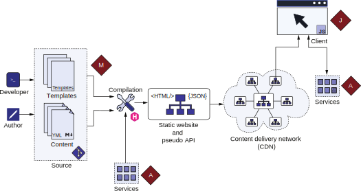

# 1.2 How does Jamstack work?

The simplified stack that Jamstack provides has a lot of processing going on behind the scenes. Jamstack’s emphasis on the compilation process is something new for the web platform. Figure 1.4 explains the various parts of the Jamstack.

Figure 1.4 Viewing the inner workings of the Jamstack. The development and content teams maintain the source code for a Jamstack-based website. This code consists of the website data and a set of templates. A Jamstack builder picks up the code in the compilation process to create the static website’s HTML/CSS/JS contents. The builder might also call services during compile time and output JSON documents that serve as an API. This output is given to the CDN to distribute geographically. The client gets the website from the closest CDN endpoint. The client executes the JavaScript code that can ask for additional data from the services.

A considerable portion of the world wide web consists of websites managed by a CMS. A content management system (CMS) is a tool used for creation and management of digital content. The content in most websites is kept separate from the presentation logic and can be managed by different individuals, requiring a different skill set to develop and maintain than the business logic. In a Jamstack-based website, we store the content in markup documents instead of in the database. Unlike a cell in a database table,    a markup document allows for viewing and editing the page contents with a regular text-based editor. The content authors or editors can directly edit those files or use a graphical CMS if they so desire. The developer maintains the templates and the business logic to combine the data and create the website. These files can be managed in a version control system like Git and hosted on a cloud-based repository system like GitHub to manage the changes. This forms the markup (M) layer of the website.

A website builder like Hugo uses the data stored in markup files to compile the website into HTML and CSS files, JavaScript, and image-based assets. The builder can communicate with both external and internal services via APIs to fetch the data to compile into the website. The builder can also build the website content into a machine-friendly format like JSON. JSON files act as APIs (called pseudo APIs) for the markup data that the JavaScript code or native mobile apps consume.


**Doing it old school**

The approach of writing content and saving it in a folder on a disk and then uploading it to a shared hosting provider that manages the content looks a lot like the early web, where we used to upload HTML and PHP files over an FTP connection. The parallels are easy to see. These similarities raise the question, what is different this time?

The web has matured a lot since we moved away from controlling full servers. Frontend technology now performs many features that required server code back then. Additionally, shared hosting has upgraded itself to the cloud, where you can scale hosting and computation to the internet scale. Even the traditional web stack-based services are cloud-hosted.

The other significant change from that era is tooling. Tools like FrontPage originally targeted designers and end users, making the website a mesh of copy-pasted scripts that even the website author did not understand. Modern tools target developers and help in optimization, maintenance, and performance. Now we engineer websites with these tools rather than mashing them up together. We’ve learned from the early days of the web. We have a much better system with enough power and flexibility to build any application desired without compromises.


The geographically distributed machines of a CDN host the compiled website for consumption. The CDN node closest to the end user serves this  content  to the end  user. All the static content is user-agnostic and fast to produce. For dynamic data, JavaScript code can take over. JavaScript is the J layer of the Jamstack. JavaScript provides interactivity and personalization to the website.

The JavaScript layer can communicate with various services to provide dynamic content. These services expose APIs that form the A layer of the Jamstack. These APIs encapsulate the remains of the application servers of the traditional stack. Jamstack recommends using managed services like those owned by third parties or those hosted on a FaaS (function as a service) cloud solution to minimize maintenance.


**Exercise 1.1**

In Jamstack, where should most of the logic reside?
- a. Server
- b. Microservices
- c. Compiled templates
- d. Client
- e. JavaScript
