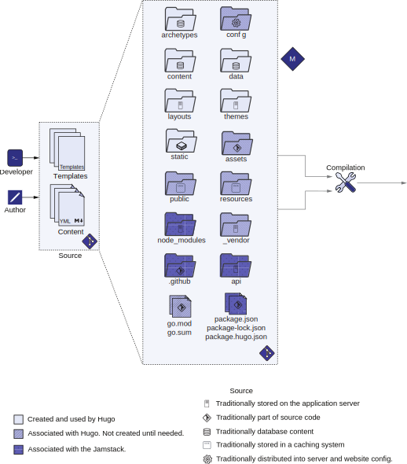

# 2.1 Your first Hugo website

Hugo offers an extensive command line that exposes all of its functionality, including bootstrapping a new website. This section introduces you to Hugo’s command line.

## 2.1.1 The Hugo command line

Hugo is a command-line tool that’s well designed and provides all of Hugo’s function- ality. It helps by migrating data, creating placeholders, and analyzing performance, along with the core task of building your website. The Hugo command line has two distinct parts:

- Commands—Determine tasks that you want Hugo to do. You can supply com- mands and subcommands by using hugo [command] on the command line. Hugo’s commands are hierarchical. A plain hugo call runs the default com- mand to build the site. Issue hugo new to create new things. The default for hugo new creates new content pages. You can use hugo new site to build a site skele- ton, and hugo new theme to generate a theme.
- Flags (also called command-line parameters)—Specify options that modify the result of the command by providing a different configuration. Flags are specific to the command, and each command can have independent flags. For example,
--format yaml in the new site command changes the metadata format from the default TOML to YAML.
An intuitive way to learn the Hugo command line is to use the --help flag. Help with Hugo is hierarchical: hugo --help provides help for the hugo command and lists hugo new as a subcommand; hugo new --help provides documentation for the new command and mentions site as a subcommand. Hugo’s help also shows all the flags available for each command. You can also generate the Hugo command-line documentation in the man pages format (as used by the man command in UNIX-based operating systems). For this, use hugo gen man or use hugo gen doc for Markdown files.
Let’s see how all this fits together by creating our first website. To create a new web- site in Hugo, we’ll use the command in the following listing.


```
hugo new site acme-corporation --format yaml
```


This command creates the Hugo skeleton folder structure with YAML as the metadata language in a subfolder called acme-corporation in the current folder. The various parts of this command are labeled in figure 2.2. Note that we’ll use YAML (https://yaml.org/) instead of the default TOML (https://toml.io) metadata language for this book. YAML is more prevalent in the general programming community, less verbose than TOML, and GitHub has better support for it. It is an easier language to get started with and a better choice for users new to the entire Hugo ecosystem. We will discuss YAML as a metadata language for Hugo in chapter 3. Appendix B dis- cusses TOML as the metadata language option. Note that the official Hugo documen- tation provides metadata in all supported languages.

 <!-- begin columns block -->

<--->
Figure 2.2 The hugo command provides access to the Hugo command line. We can use all of Hugo’s functionality via this command line. You can use it to
compile Hugo websites, run the development server, measure build performance, and access modules.



**Exercise 2.1**

Which of the following allow you to get help on Hugo?
- a. --help flag
- b. man command
- c. Hugo website
- d. All of the above


## 2.1.2 Adding to source control

The first step in any project is to commit the changes to a version control repository. The command-line interface does not have native undo/redo support. If you acciden- tally delete a file, it does not go to the recycle bin or to the trash folders. Any running script has the potential to cause data loss, including the hugo command. There is no turning back unless you have versioned the source code.
Version control systems allow for recovering deleted files and reverting to older versions. The version control system used in this book is Git. Git is the most popular system, and GitHub has tight integration for it. This also includes GitHub Pages, the most popular host for static websites on the internet. It is a good idea to commit each checkpoint to version control. You can use the git command or a GUI client like SourceTree or Fork to perform these tasks. On the command line, you can perform this using multiple Git commands as the following listing shows. To help with version control, take note of the code checkpoints where you can pause to check your code.





Even though we created a website skeleton, that does not mean we have a working website. Most of the skeleton folders created by the hugo command are empty. At the bare minimum, we need to provide some content and a theme to render it on our website.


**CODE CHECKPOINT**
https://github.com/hugoinaction/hugoinaction/tree/ chapter-02-01



**NOTE** Extra files (Readme.md, License.md, and .gitignore) were added to the repository on the server for better GitHub support.



**Migrating to Hugo**

Hugo supports importing content from Jekyll and automatically converts content from that format to a format that Hugo understands. You can use the hugo import jekyll <source jekyll folder> <target hugo folder> command to import the folder-equivalent content from Jekyll into a Hugo website. This command does not provide synchronization, but we can use it for a one-time import.


## 2.1.3 Structure of the Hugo source folder

Before adding a theme or some content, let’s look at what makes up a Hugo website. A Hugo source folder is more than templates and content. The hugo new command generates six folders, and we will create more as we use Hugo’s features. The critical folders in our website, as figure 2.3 shows, include the following:
- archetypes —Contains the templates for the content files. Hugo tries to minimize the copy and paste work needed to create content. We can create templates for Markdown files or folders in this folder, and Hugo uses them to create a basic content file. We will get to archetypes in chapter 5.
- content—Contains all the content that traditionally goes into the database. We can organize the content into files and folders as we desire. By default, Hugo generates the website output directly, based on this folder’s structure, although we can override that using the metadata in each file (called front matter, which we will discuss in chapter 3). We will work with the content folder throughout the book.
- data—Stores structured content in the form of YAML, TOML, CSV, or JSON files, which are made available as global variables throughout the website. A tra- ditional database houses more than just web page content. There can be tables associated with structured data, which have no place in the content folder, so this folder comes in handy when we generate content from outside of Hugo and pass that information in as a JSON or a CSV file for Hugo to consume. We will read from the data folder in chapter 5.
- layouts—Overrides parts of the theme. Hugo gives us the flexibility to mix and match pages from themes and to write our own custom pages. In this folder, all customization of the theme occurs. We can use this directory to store these overridden theme layouts. The line between a theme and layout is blurred, and Hugo gives us total flexibility to create a theme slowly by overriding pages one by one. We will use the layouts folder to update the home page in this chapter and go into layouts in detail in chapters 6 and 7.
- themes —Contains the code that we use to make the content in the content folder presentable. We can use the Go template language to write themes. We will add themes in this chapter and create our own in chapter 7.



Figure 2.3 The website source code and content in Hugo lies in the source folder. The hugo new command creates a basic set of folders, which designates the various parts of a Hugo website: the archetypes folder (for the content templates), the content folder (for the textual content), the data folder (for structured content, and key-value pairs), the layouts and themes folders (for templates and individual page designs), and the static folder (for additional content that needs to be hosted but does not fit into any other category). Other folders and files that show up during usage include assets (for unprocessed images and JS/CSS files), config (for settings and metadata, initially generated as a single file), resources (for caching processed assets), public (to hold the output), vendor and go.sum/mod (for Hugo Modules), package*.json and node_modules (for JavaScript), .github/netlify.toml (for continuous integration), and api (for custom first-party APIs).

- config —Houses the website’s configuration. This directory contains the meta- data shared across the website, including the theme’s name and any parameters that need to be passed to Hugo or to the theme to render content. By default, Hugo creates a single config.yaml file. Hugo supports splitting this configura- tion file into multiple files and having different environments for testing and production. That turns the configuration into a folder. We will go into the con- figuration in detail in chapter 4.
- static—Stores static content like fonts or PDF files. Hugo copies this content as is to the output directory. This folder is somewhat equivalent to the Apache/Nginx web server root folder, where you can place any HTML file for rendering. It is advisable to put as much content as possible in the content, data, themes, and layouts folders to have programmatic access to it and to benefit from Hugo’s ren- der pipeline. In the static folder, we can store binaries files like .pdf, .woff (for web fonts), and .zip files for downloadable content that does not belong any- where else. We will put some files in the static folder in this chapter.

Of all these folders, the content folder is where we usually spend the most time adding content to the website. The themes folder contains the theme that the developer can manage outside the website. In contrast, we change the other folders (except for the data folder for the data-driven web pages) infrequently, only when something signifi- cant needs to be added.


**Exercise 2.2**

Which of the following folders contains the text displayed on a web page?
- a. markup
- b. markdown
- c. content
- d. data
- e. text


When building your Hugo-based website, here are some other files and folders  that  you will encounter:
- `assets` folder—Places images, JavaScript, and CSS files as unprocessed source code to be consumed globally from the website. This folder allows us to process these files during compilation. Hugo can resize images, bundle and minify JavaScript files, and convert SCSS to CSS via its asset pipeline (Hugo Pipes). We will learn about image manipulation and asset bundling in chapter 6 and work with JavaScript assets in chapter 10.
- `public` folder—Hugo’s default output directory, where the hugo command gener- ates the HTML output to be deployed and cached at the CDN.
- `resources` folder —When processing data, Hugo caches the results of heavy opera- tions in this folder. We should put this folder into our version control and reuse its data across builds. This folder is one of the critical ingredients for getting outstanding performance with Hugo. Processing images is a CPU-intensive operation and takes time. Most assets don’t change across builds, and caching   the processed images for as long as they do not change provides Hugo with a significant performance boost.
- `go.mod` and `go.sum` files—Hugo Modules uses these files to synchronize project dependencies. We rarely look into these files, but we do need to put these files in version control. We will introduce these files in chapter 8.
- `vendor` folder—Stores third-party dependencies that we can include via Hugo Modules. We will create this folder while working with Hugo Modules in chap- ter 8.
- `node modules`, package.json, package-lock.json, and package.hugo.json files—Associ- ates and integrates Hugo with the JavaScript ecosystem. We will discuss using JavaScript with Hugo in detail in chapter 10.
- `.github` folder and netlify.toml files —Associates Hugo with the continuous integra- tion services GitHub and Netlify. We will use these services throughout the  book.
- `api` folder—Although not standard, we’ll create this folder to house custom APIs in chapter 11.


**Exercise 2.3**

Match the file type to the most likely folder to place the file.

- 1. YAML
- 2. Markdown
- 3. PDF
- 4. HTML
- 5. CSS
<---> 
- a. assets
- b. static
- c. content
- d. config
- e. themes

  