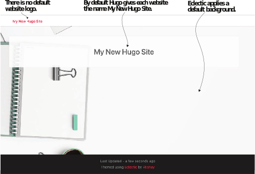
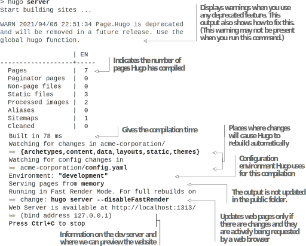

# 2.2 Adding a theme

Coming back to Acme Corporation’s sample website, before that website can see the light of the day, it needs a theme and some content. A theme in Hugo represents all the logic that converts markup documents into presentable web pages. It consists of template code, JavaScript, and CSS assets and images used for common elements like  icons and backgrounds. Creating a Hugo  theme is time-consuming, and it is a good  idea to try out some prebuilt themes to begin with.


**NOTE** If you plan to use a theme created by someone else, you may not need to learn the Go template language to use Hugo.


You can create a website by learning a markup language like Markdown and a metadata language like YAML. You can always modify the theme to customize the UI, but if you want to get a website up and focus on the content, you only need to know a content markup and a metadata language. For Acme Corporation, we will start with a prebuilt theme that’s ready to use. There are multiple ways to get a theme:

- Use Hugo Modules to integrate the theme. Hugo Modules is Hugo’s package management system that allows themes to have dependencies. Hugo can automatically fetch dependencies required by a theme when building your site using  Hugo Modules. Themes with dependencies will not work with other integration methods. Hugo Modules have setup requirements that we will discuss when introducing it in chapter 8.
- Use Git Submodules to reference the theme in the themes folder. The Git version management system can set this up for you. This allows one Git repository to include another repository as a module within it. The dependencies can be linked to another server location and built independently. While the submodule  feature     is a part of Git and needs no separate installation, it still needs to be set up.
This feature is less potent than Hugo Modules. Theme authors who have not updated their themes to support Hugo Modules mention Git Modules as the integration method for their theme. However, over time, the use of Git Submodules will diminish in the Hugo world, and we do not recommend using it in newer themes and websites.
- Download and copy the theme to the themes folder. The download-and-copy approach is the simplest of techniques. Because the theme code is available locally, we can easily read it to understand what the theme is doing, modify it, and view our website’s updates. When developing a new theme, this approach allows for making changes quickly and saves us from the overhead of managing different repositories. To simplify getting started, we will use the download-and-copy approach for the book’s first seven chapters.

## 2.2.1 Adding a theme to the website

We can find themes on the Hugo website at https://themes.gohugo.io/. While most themes work with the download-and-copy approach, some may have dependencies for which Hugo Modules are necessary. We will use the Eclectic theme, which has no such requirements. A copy of the Eclectic theme is provided in the code samples accompanying  this  book  (https://github.com/hugoinaction/hugoinaction/tree/chapter-02-resources/01). It is also available at https://github.com/hugoinaction/Eclectic.

We need to download and paste the Eclectic folder into the themes folder for our website for it to be made available. The files are present in the proper subfolder so that you can place them in the root folder of the website. Each listing comes with the path to the file and the filename where the changes need to be made. For loading Eclectic as the theme for our website, we need to specify it in the website configuration file using the theme key. Listing 2.3 tells Hugo to look for a folder named Eclectic in the themes folder and to load the theme from that folder.


**NOTE** In the chapter resources throughout the book, the files are provided in the proper relative paths from the website root and need to be placed in the exact same relative location for your website.



```yaml
Existing data that’s generated by the hugo new command.
theme: Eclectic
```



**CODE CHECKPOINT**	https://chapter-02-02.hugoinaction.com, and source code: https://github.com/hugoinaction/hugoinaction/tree/chapter-02-02.



**NOTE**   You  can  compare  various  GitHub  branches  by  navigating  to  https://github.com/hugoinaction/hugoinaction/compare/chapter-02-01..chapter-02-02, where chapter-02-01 and chapter-02-02 are branch names. The Readme   file   at   https://github.com/hugoinaction/hugoinaction   provides every code checkpoint (along with its respective section), a link to the hosted version, and the diff from the previous code checkpoint. It is a good idea to view the hosted version of a code checkpoint before reading the corresponding section of this book.


## 2.2.2 Running the dev server

We can run our Acme website in development mode using the command hugo server on the command line (we could also use hugo serve). This command creates a development server that provides local content. The development server mode compiles the code automatically when changed. It has near real-time updates to the website’s locally-hosted version (popularly called live reload) with content changes. The default port (the location in the machine where we can find the website) for Hugo is 1313, and unless something else is running at that port (in which case, it can be changed by --port <number> flag), the development mode website should be available  there.  You  can  open  http://localhost:1313  in  your  browser  to  find  the  default website as figure 2.4 shows. The default home page is unique to most themes but needs configuration to be used.

Listing 2.4 shows how we can run the Hugo development server by using the hugo server command. This command hosts the Hugo-based website locally at http://localhost:1313/ by default. It automatically rebuilds the server as the content changes so that we can view it in the web browser.



Figure 2.4 Default website with the Eclectic theme. When we chose the Eclectic theme for a Hugo-based website, Hugo created an index page based on that theme, which the website can render even if we provide no content for the page. (It will look better when we configure the page, but it still works without anything.) This page can be used as a starting point to develop the rest of the website. (Background image by theglassdesk on Pixabay.)





If we run hugo without additional arguments, Hugo compiles the entire website and places the files in the public folder. We also refer to development mode as server mode or live reload mode. It listens to changes in the filesystem and rebuilds the website with the update. Hugo also supports fast rendering in development mode, which involves building only the page requested on demand. Because  Hugo  is  blazingly  fast,  we  don’t  notice  the  delay  in rebuilding the web page. We can disable fast rendering or live reload if it interferes with the JavaScript state by using the command-line flags --disableFastRender and
--disableLiveReload, respectively. Note that you can run the website’s production version in development mode using the --environment command-line flag. Chapter 4 discusses the difference between the various build environments.

There is no need to quit the Hugo development server through most of this book as it supports live reload so we can easily switch content. But you are free to abort it at any time by pressing Ctrl-C and running the hugo server command again.


**TIP** The Hugo development server optimizes for refreshes with content changes. Theme changes affecting multiple files are error-prone when reloading. If you change a theme’s contents, it’s possible that caching in the browser or incrementally building with the development server will get in the way of viewing updates. Restart the dev server, clear the browser cache, and use hugo server --noHTTPCache --disableFastRender to help in these cases.



**Exercise 2.4**

The default port for Hugo is_____.


When you run the website in development mode for the first time, the images provided by the theme and its JavaScript and CSS files are optimized by Hugo and cached in the resources folder we discussed earlier in this chapter. This process may cause a slower build. It is OK to commit the resources folder to source control to prevent Hugo from generating it again.


**NOTE** Most Hugo themes need some configuration and content to be functional. You might get a blank screen if you try replacing Eclectic with a different theme and have not provided Hugo with the appropriate configuration.
