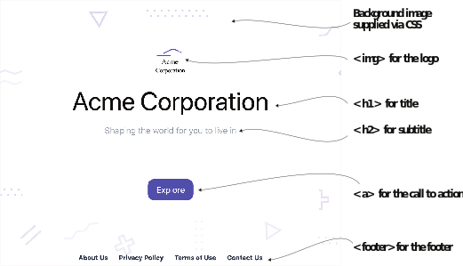

# 2.3 Adding content

We will convert the empty page generated with the Eclectic theme into a fully functional website. This conversion includes configuring the theme by providing it with some settings and metadata, adding pages like the privacy policy and terms of use, and overriding the theme’s landing page with a custom version.


**NOTE** Custom data for a theme is not portable. You will have to look at the theme’s documentation to figure out the theme-specific configuration. If you are still judging the theme as you develop the website, it is recommended to focus first on the standard template-based content pages (like posts) rather than the unique pages (like the landing page and Contact Us).



**Exercise 2.5**

The ___ command runs Hugo in development mode.


## 2.3.1 Configuration

The fact that the website ran so well with two lines of code is the magic of the well- thought-out defaults in Hugo. We can do better by passing it the right options for our website. The configuration file has two distinct parts: the top-level configuration, which is common across themes, and the theme-specific params section, which differs across themes. Let’s add some data to the configuration file, config.yaml. This is needed to be successful with the Eclectic template in Hugo. These changes provide the information to fill up the menus, the footers, copyright notices, and the title and author informa- tion, per the requirements of the Eclectic theme for Acme Corporation.
The updated configuration file is present in the chapter 2 resources folder that accompanies     this    book     (https://github.com/hugoinaction/hugoinaction/tree/ chapter-02-resources/02). You do not need to understand the entire file yet. We will be working with these settings in the following chapters, where they will become clearer. Listing 2.5 shows the configuration file that we’ll use for the Acme Corpora- tion website. A typical Hugo configuration file contains:

- Configuration options that are standard across all themes (such as the URL of the website, its name, and language)
- Options for specific Hugo features (like menu)
- Theme-specific parameters (like params)





Hugo supports multiple authors via a feature called taxonomies (discussed in section 4.4). Hugo also provides a standard way to define menus. The menu section in the con- figuration file has keys, each of which specifies a menu name. Each menu has a list of entries, which can have a unique identifier, a name to display, a URL, and a weight to sort menu items. In the configuration file, the params section is theme-specific; its contents can differ across themes.

We wrote the configuration file in listing 2.5 in the YAML metadata language, which we will discuss in chapter 3. It provides structured information using keys and values separated by colons. YAML is human-readable and case-sensitive, but changes in spacing can cause problems with the YAML parser.

Hugo also supports the more “spacing-friendly” TOML format. The resources with this book also contain the TOML version of  the configuration file. If you use that as   an alternative, config.yaml should be removed.


**NOTE** Update the actual baseURL of the website instead of http://example.org/ in the configuration file before publishing. Leaving the file example.org breaks absolute links in the website.


The Eclectic theme allows us to provide our logo and even control the website back- ground image by placing these in the assets/image folder (not in the themes/Eclectic/ assets/image folder). We will place logo.svg and background.svg in this folder to per- sonalize the website. We will need to create this folder if it does not exist. (You may need to restart your development server for the changes to take effect.) These files are present in the code bundle for chapter 2 (https://github.com/hugoinaction/hugoinaction/ tree/chapter-02-resources/03).


**CODE CHECKPOINT**	https://chapter-02-03.hugoinaction.com, and source code: https://github.com/hugoinaction/hugoinaction/tree/
chapter-02-03. ↻ Restart your dev server.


Hugo standardizes some previously specified parts (like menu and title) in the config- uration file. We will cover those parts in chapter 4. Other parts (like params) are differ- ent for each theme. Even image locations like that of the logo.svg are theme-specific.


**Exercise 2.6**

Which of the following is used to provide the website endpoint for Hugo to compile?
- a. baseURL
- b. endpoint
- c. website
- d. url
- e. host
- f. domain
- g. server


You can see the impact of providing the metadata on the Acme website instantly. With the configuration mentioned previously, the site should look similar to figure 2.5.


Figure 2.5 The Acme Corporation website looks much more complete after configuring the theme. Now the main menu and the footer section added in the configuration file are available on all pages. The logo and background images are updated as soon as we place the image files. (Abstract vector created by BiZkettE1 at www.freepik.com.)

## 2.3.2 Content pages

A website’s objective is to serve content, and we have none on our beautiful website so far. The entries added at the top menu of the website link to pages that do not exist! We need to create pages on the website to make it functional. We will begin by adding content to the pages linked to in the menu in this chapter and then will format the content in chapter 3.

We can create content pages as text or markup files in the content folder. We can place a privacy.md file in that folder with Markdown-based content to get the https:// localhost:1313/privacy   URL.   Similarly,   we   can   add   the   about.md,   credits.md, terms.md,  and  contact.md  pages  (https://github.com/hugoinaction/hugoinaction/ tree/chapter-02-resources/04). Hugo automatically applies the theme, and the page should render as soon as you add the document. This way, we can add as many pages as we desire to generate the website’s core structure. Markdown provides a variety of formatting options that we will study in chapter 3.

## 2.3.3 Index page

The index page (also called the home page or the landing page) is the first page of the website and is responsible for orienting the user on what to expect. Its content is unique and different than all other pages. A text-based content works well for some pages, but many websites implement custom content for the index page. Websites even have tailor-made carousels and sections with extensive imagery that would need a custom implementation. Hugo recognizes this and provides a unique template for the index page, which is called the index template. In many themes, the index template is customized in a theme-specific way, and the index page configuration is not portable across themes.


**NOTE** Most Hugo themes provide a folder called exampleSite, which con- tains a starter website using that theme. This folder is extremely useful in exploring theme-specific configurations and customization options.


Hugo’s templates are HTML files, but these can be in any text-based file format (for example, JSON, XML, or even plain text), with additional template tags that partici- pate in the compilation step. For users trying to build custom Hugo templates, it is a good idea to start with the index template because it impacts only one page of the website. Hugo templates can be overridden using the layouts folder. In this chapter, we will not be using any template tags and will start with a plain HTML template that we will place as layouts/index.html. It is still a Hugo template and has access to all the variables, which are optional.

For Acme Corporation’s index page, we will override the theme’s index page with a custom page, hardcoded in HTML and CSS, as figure 2.6 shows. This page will con- tain the website logo, title, subtitle, a button with a call to action (telling the reader to explore more), and a footer with links to additional pages.

In the layouts folder, we will place a new file named index.html with custom HTML content     (https://github.com/hugoinaction/hugoinaction/tree/chapter-02- resources/05). Because we are not using Hugo’s template language, we will be hard- coding all paths and using relative locations to various support-hosting locations.



Figure 2.6 We can create a custom landing page in a Hugo website by placing a file called index.html in the layouts folder. This page overrides the home page provided by the theme. For Acme Corporation, we used a landing page with hardcoded HTML and CSS and eschewed the theme-specific features of Eclectic to create pages based on structured data.

We can override templates in a Hugo theme by placing an HTML template file in the layouts folder as listing 2.6 demonstrates. Doing that provides someone who under- stands HTML with a quick way to customize a website without learning Hugo. Custom HTML can be unique to a particular website. Until we use Hugo’s template language, we have to be careful with the HTML we are writing as the custom HTML page does not change automatically when the content it links to changes.


```html
<!DOCTYPE html>
<html lang="en">
<head>
<meta charset="UTF-8">
<meta name="description" content="Welcome to the website of Acme Corporation, the leading creator
of digital shapes on the planet, providing precise shape creations that are ready to use.">
<meta name="viewport" content="width=device-width,
initial-scale=1.0" />
<link rel="stylesheet" href="./index.css">
<title>Acme Corporation</title>
</head>
<body class="home">

Relative paths for resources. Absolute paths cause problems when we publish this code with subfolders in a hosting environment.

<section>

<h1>Acme Corporation</h1>
<h2>Shaping the world for you to live in</h2>
<a href="./blog">Explore</a>
</section>
<footer>

Assets from the static folder. Assets referred to in the HTML should be provided in the static folder for correct links in the final website.

<a href="./about">About Us</a>
<a href="./privacy">Privacy Policy</a>
<a href="./terms">Terms of Use</a>
<a href="./contact">Contact Us</a>
</footer>
</body>
</html>

Hardcoded menus. In plain HTML, we have to assume that the URLs of the menu entries and their names match what is specified.
```



**NOTE** Hugo does not modify the HTML provided inside the template.


The plain HTML file needs images and an index file to function properly. The images in the assets folder, which we placed for the Eclectic theme, require the use of Hugo Pipes. (We will discuss Hugo Pipes in chapter 6.) For content that does not need pro- cessing, we have to use the static folder. Until we start using Hugo’s assets-processing pipeline, we will need to place a second copy of the assets in the static folder. This includes  static/index.css,  static/image/background.svg,  static/image/logo.svg,  and static/favicon.ico. These assets are provided with the chapter resources (https:// github.com/hugoinaction/hugoinaction/tree/chapter-02-resources/06).


**Exercise 2.7**

For theme independence, it is advisable to customize which page in plain HTML?
- a. privacy
- b. index
- c. robots.txt
- d.  English
- e.  settings



**CODE CHECKPOINT** https://chapter-02-04.hugoinaction.com, and source code: https://github.com/hugoinaction/hugoinaction/tree/chapter-02-04.
↻ Restart your dev server.


