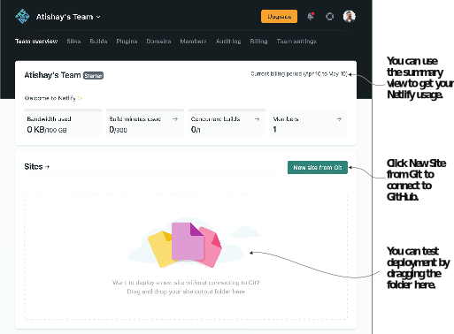
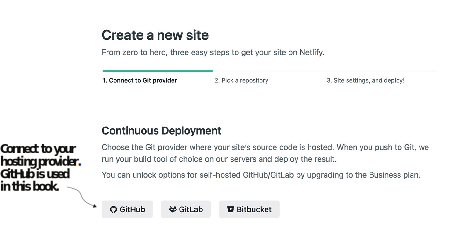
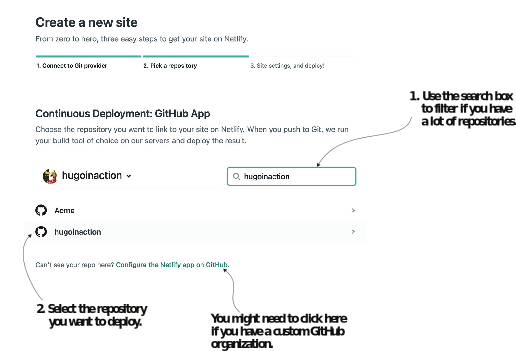
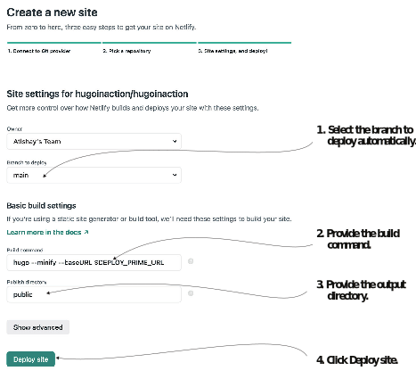
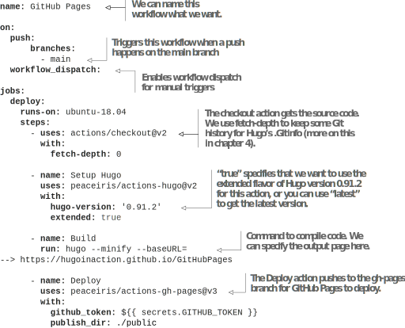
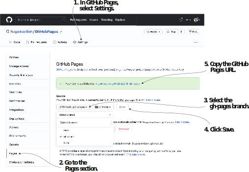
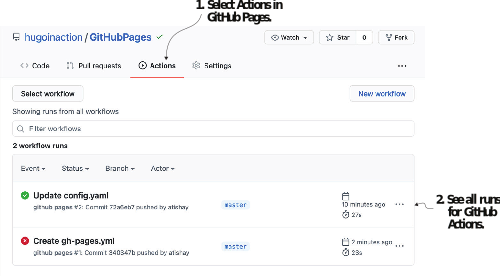

# 2.4 Continuous delivery

A huge benefit of Hugo and the Jamstack is the ability to have low maintenance and cheap and efficient hosting readily available. We get this power through continuous delivery from the code repository. Continuous delivery is the concept of deploying the changes to our code in an ongoing manner. Good continuous delivery pipelines are automated and require minimal manual effort.

There are many ways to achieve continuous delivery with Hugo, such as writing a script to push our code to a storage provider like Amazon S3 or to place it with Apache/Nginx at the web server layer as with any other web stack. We will focus on the approaches most popular within the Hugo community. You can find more hosting information   on   the   Hugo  website  (https://gohugo.io/hosting-and-deployment/), which maintains a running list of various popular hosting providers and scripts to set up Hugo-based hosting.

Although deploying a Hugo-based website on a public cloud provides access to many other services and immense power, the simplicity of Netlify and GitHub Pages is the best approach to get started with learning Hugo. These approaches also support continuous deployment, where changes are made live as soon as we submit the code to the code repository. We will focus on Netlify and GitHub Pages as our hosting solution in this book.


**NOTE** The following sections assume that the website’s source code has been uploaded to GitHub. Every code checkpoint in the book is a good time to commit changes and deploy it to get a new build.


## 2.4.1 Netlify hosting

Netlify, whose founder coined the term Jamstack, is a leading hosting service for static websites. Netlify provides deployment services with built-in support for Hugo. Netlify takes care of continuous integration and provides APIs for websites to utilize. We can connect our GitHub repository and get static hosting on Netlify (even for private repositories) for free, until we reach its bandwidth limits. Netlify provides a handy command-line tool to perform tasks without leaving the terminal. We can also offer our build instructions via a configuration file called netlify.toml. Netlify additionally supports domain purchases, DNS, and CDN management with things like custom headers.


**TIP** If you use Netlify, make sure to check out the branch domain feature. Netlify builds and hosts each pull request in a different website and can maintain different versions via branches. We’ll use this feature to host the various versions of the website that we demonstrate in this book. You can navigate to https://chapter-02-04.hugoinaction.com to see a live website with content up to this chapter so far.


Once  we  sign  up  for  Netlify  (https://app.netlify.com/signup),  it  provides  a  step-by-step wizard to host our website. If we have already pushed our website’s source code to GitHub, we can click New Site from Git as figure 2.7 shows, after signing into Netlify to begin deployment.

The New Site from Git button takes us to https://app.netlify.com/start, where we can connect with our hosting provider (figure 2.8). Once we select the hosting provider, we need to log in and authorize Netlify to access our code repositories.

Figure 2.7 After signing up, Netlify presents us with a screen that lists a summary of our Netlify usage and provides the means to set up a new Netlify website. We can connect to a hosting provider or upload our website directly. Connecting to a provider is recommended to get continuous deployment when pushing code.

Figure 2.8 Netlify supports connections with multiple hosting providers. Connecting to them is as simple as clicking a button and then logging in.

Once we provide the credentials, Netlify can browse our repository list and provide all repository names in Netlify’s UI for us to select the one we want to deploy (figure 2.9). Note that Netlify does not read GitHub organizations by default, so we need to configure Netlify by using a link on the bottom to provide access.

Figure 2.9 Once logged in, we can search for the code repository for the code we want to host via Netlify.

Next, we can specify the branch to build, the build command, and the output direcory (figure 2.10). We provide the website URL to Hugo with the command-line arguments hugo --minify --baseURL $DEPLOY_PRIME_URL. The baseURL flag overrides the setup in config.yaml with the one Netlify uses for building branches. If we use pull request previews and branch deploys, it might be better to give each deployment a proper URL. We can also specify build parameters in a file called netlify.toml (https://docs.netlify.com/configure-builds/file-based-configuration).


**NOTE** To specify the exact version of Hugo, we can click the Show Advanced button when we specify the build command and then add the environment variable HUGO_VERSION with the correct value, which is the version of Hugo we want to use (for example, 0.91.2). Netlify does not guarantee setting up the latest version of Hugo if the version number is not specified. It is better to have control over the build version by providing it manually.


Figure 2.10 Specifying the branch for continuous integration and providing the build command and the output folder to deploy our website. We can designate the Hugo version to use with advanced options by clicking the Show Advanced button.

## 2.4.2 GitHub Pages

GitHub is the Swiss army knife of development. With its extreme popularity in the developer community and its ability to have unlimited free hosting for open source code, GitHub is a perfect place to get started with static hosting. The Pages service can render static HTML from a branch or a folder in our source code repository. GitHub Actions perform continuous integration. There are multiple actions available in the GitHub Actions marketplace for Hugo. We will be using Hugo setup (https://github.com/marketplace/actions/hugo-setup) in this section.

The steps for hosting our Hugo-based Acme Corporation website on GitHub Pages follow. Listing 2.7 provides the code for enabling GitHub Pages.

1 Create the GitHub Actions file at .github/workflows/gh-pages.yml, which tells GitHub  the  actions  to  take  (https://github.com/hugoinaction/hugoinaction/tree/chapter-02-resources/07). When these changes are pushed to GitHub, these actions automatically execute, creating the gh-pages branch with the compiled version of our website.
2 In the GitHub settings for the repository, enable GitHub Pages from the ghpages branch repository (see figure 2.11). Once enabled, the URL of the website will be visible in the interface.
3 After deployment, change the base URL in the GitHub Actions file and in the config.yaml file from the sample value to the correct one provided in the GitHub Actions, then push it again. We can view the updates on the Actions tab on GitHub as figure 2.12 shows.





An example website using GitHub Pages is hosted at https://hugoinaction.github.io/GitHubPages/ with the source code at https://github.com/hugoinaction/GitHubPages/. We can navigate to the Actions tab in the GitHub UI to see the results of running GitHub Actions, which deploys the website.

Figure 2.11 Options for GitHub Pages as a host for a static website. Use the Branch: gh-pages option for Hugo.

Figure 2.12 The Actions tab on GitHub shows all executed actions. Each code push can potentially run a GitHub action.

Now the website should be available on the web, and we should be able to navigate to the link provided by GitHub in the pages section once it goes live. GitHub provides a CDN that distributes websites across the planet and is free for a website under its quota limits (size less than 1 GB, a monthly bandwidth of 100 GBs, and around 10 builds per hour as of writing this book). This is a good place for a personal website or for test-driving the Jamstack. Many GitHub Pages document source code already on GitHub, and Hugo is one popular tool for generating that.


Editing on the go

There is a popular misconception that websites built with the Jamstack architecture are difficult to edit unless you have the development environment set up. Most modern Jamstack websites have a continuous environment setup, and we can push it to production with a simple check-in. This system makes Jamstack more flexible than a traditional database-based website stack. We can change not only content but also designs, configurations, and even business logic without setting up a development environment. With scaling not a concern, it is easier to edit on the Jamstack than with the traditional web stack.

In case of minor edits, GitHub’s web interface is a valuable tool that provides the ability to edit the website from anywhere. There are applications like CodeHub, PocketHub, or Working Copy (available on both mobile and tablet) to create or modify Markdown documents from a Git repository. We can make our changes anywhere we want, and the continuous integration system ensures they go live within seconds of being committed. Unlike traditional stacks, setting up the local development environment for the Jamstack is much easier, and when we have to, it does not take days.


## 2.4.3 Vercel, Cloudflare, AWS Amplify, and other dedicated Jamstack hosts

Like Netlify, other dedicated Jamstack hosts provide similar feature sets like branch/ commit previews, automatic continuous integration and deployment, and  API  creation support and management. Vercel provides robust support for managing JavaScript and can be an advantage if our website is getting JavaScript-heavy. Cloudflare Pages are built by one of the biggest CDNs on the planet and provide unlimited band-width, better performance than most other services, and a well-defined means to create our APIs (with Cloudflare Workers and Cloudflare Workers KV). AWS Amplify is an AWS service that provides excellent integration with the rest of AWS. The Hugo hosting setup for Cloudflare, AWS Amplify, and Vercel is similar to Netlify, and one cannot go wrong in choosing any of these providers.

## 2.4.4 AWS, Azure, and Google Cloud file storage

If you are using the public cloud features for the other parts of the Jamstack or desire more fine-grained control than that provided with standardized hosting, deploying from Hugo to the cloud is also available. Hugo comes with a built-in command, hugo deploy (https://gohugo.io/hosting-and-deployment/hugo-deploy/),  to  deploy  the website to an AWS S3 bucket, Google Cloud Storage, or Azure Storage. Once we set up the authentication credentials on our machine, we can specify the link to the specific service in the deployment.targets.URL section in the config.yaml file. For example, to deploy to AWS S3, you would enter s3://<Bucket Name>?region=<AWS region>. Hugo automatically identifies the changes between the cloud and the current build and synchronizes those when we run hugo deploy <target name>. We can also specify the caching policies that the cloud exposes to the website’s users in the same section.

Figure 2.13 Publishing with the Jamstack. Alex does not give up on the Jamstack even after Bob gets additional resources to continue with the existing stack.