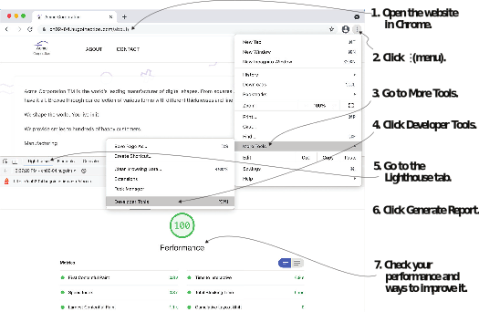
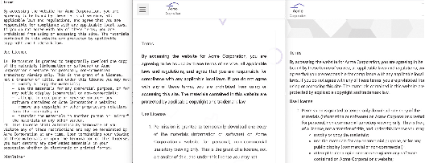

# 2.5 Meeting the goals for performance and maintainability

Hugo and the Jamstack promise solid performance and low  ongoing  maintenance. Both of these are not absolutes in themselves. There is a gradient: we need to choose  the right balance of features, ease of development and use, maintenance, and perfor- mance to get the best benefit. A website with no images would likely be faster to load than one with hundreds of them, but that does not mean that it would be the best  website for all use cases. Therefore, when analyzing performance and maintainability, we need to consider the use case.

## 2.5.1 Performance

Performance is one notable metric that Hugo’s development team uses to benchmark its builds. We should be able to get good performance for a typical use case without any significant difficulties. We are hosting all the web pages for Acme Corporation on a CDN (prerendered), and the client does not need to do much processing to display the site. While we should find the website quick to load, it is vital to get the perfor- mance as a number and tabulate that across builds to be able to compare changes and to fix regressions.

The standard tool for measuring performance is the Audit tool called Lighthouse (https://developers.google.com/web/tools/lighthouse/).   It’s   built   into   Google’s Chrome browser (figure 2.14). For Acme Corporation, the About page represents a regular page of the website, which we will measure for performance.



Figure 2.14 Performance audit for the About page for Acme Corporation using the Google Chrome Lighthouse performance test.


**NOTE** Chrome regularly updates the Lighthouse tool with new tests, so the measurement results might not exactly match the screenshot shown.


It is essential to measure the hosted site’s performance on the CDN as the develop- ment server from Hugo is not what the users get in production. It is built for develop- ment and does not provide the right results. To measure the hosted site’s performance,

- 1 Go to the View > Developer  > Developer Tools menu in Google  Chrome to  open the web inspector.
- 2 Go to the Lighthouse tab and run an audit. You should be able to achieve a decent audit score for performance on most Hugo websites.

Lighthouse may suggest issues in the theme. If so, there is an option to clone the theme or to create a bug for the theme developer to fix.

## 2.5.2 Maintainability

The maintainability of the web setup is difficult to measure directly. There is no  tool   to tell whether a stack is maintainable. One way to check how  much effort it would  take to maintain a system is to list each of its dependencies and figure out which dependencies require ongoing security updates, which need to be abandoned by the developer, or which can become difficult to update due to nested dependencies. We should also measure the effort to remove a dependency in case it is not actively main- tained. Luckily, for the Hugo-based setup we just discussed, we have few dependen- cies. In our measurement system, we can consider a rewrite, huge updates, or partial rewrites as high risks, and tweaks that do not involve many changes as medium risks.  At the same time, a low risk would refer to no minimal manual intervention. Let’s try   to assess this for the website we have built so far, right after the next exercise.


**Exercise 2.8**

What is the primary reason to benchmark the performance of a website?
- a. Find overall performance issues.
- b. Plot a graph to show on our website.
- c. Compare performance across multiple builds of our website and multiple builds of Hugo to find faulty behavior.
- d. Find bugs in our website.


Our Acme Corporation’s website created in this chapter depends on Hugo. Hugo has had breaking changes in the past releases, but most of them have been minor. We    do not need to update for security fixes because it is a development-only dependency. This could be rated as low in an ongoing effort if we are happy with the website or as medium for an upgrade.

The hosting on GitHub Pages requires no ongoing effort to maintain. This is among the most critical services for developers on the internet. We  can,  therefore,  rate both ongoing maintenance and upgrade as low. If we use Netlify, it manages the upkeep for us, and the effort there is also low. Because it is a lot less popular  than GitHub, there is an inherent risk of Netlify pivoting to a new business  model or shutting its doors. Migration to GitHub is easy for the type of website built here, and its overall risk is low.

The Eclectic theme chosen for Acme Corporation is dependent on a few JavaScript-based plugins. These plugins are stable, however, and haven’t had significant changes in years. Still, Eclectic is not heavily used, and if it gets abandoned, the team at Acme Corporation will have to pick up the task of adding fixes to support newer Hugo versions when they want to update the website. That would be a medium effort commitment (unless they want new features).

Overall, the ongoing work to keep the website we built in this chapter alive is meager.  If we need to upgrade it, the effort would be low to medium, depending on the break- ing changes in Hugo and the theme developer’s ability to adapt to those. Note that as we progress further along with this book, we will add more dependencies to our web- site, especially in part 2. This will increase the maintenance overhead. While  an  attempt has been made to look for dependencies that are self-contained, readers are advised to weigh the pros and cons of adding dependencies independently every time something is needed in their own projects.

## 2.5.3 Choose the theme wisely

The performance and maintenance risks of a website depend heavily on the theme selected. If the theme is not good, Hugo’s hard work maintaining its performance will not show in your website’s build time. The main maintenance risk to a Hugo-based website is the risk of depending on a theme that stops being compatible with the newer versions of Hugo. We can continue to use the older version of Hugo and the theme indefinitely without worrying too much about security issues because the con- tent is static. But if we ever want to update Hugo and the theme is not supported any- more, we would be on our own to maintain the theme. It is a good idea to be theme agnostic, at least early on in a website project, so that if we find a problem with the theme we are using, we can move to a different one quickly.

Themes can also be an excellent source for learning how to use Hugo best. Many developers using Hugo choose the themes as the starting point rather than the absolute solution. One big reason to choose Hugo is to customize everything, and forking  the theme is a powerful way to perform that task. We will be moving out of the Eclectic theme into our custom theme by the end of chapter 7.

If we want to continue to build our website with a theme maintained by someone else, it is a good idea to investigate portability. Hugo provides standardization across themes, and switching Hugo themes is not difficult (see listing 2.8). We will be adding another theme to Acme Corporation’s website to make sure our code is portable. We provide a copy of the Universal theme for Hugo in chapter resources (https://github.com/hugoinaction/hugoinaction/tree/chapter-02-resources/08)  and  also  host  it  at  github.com/hugoinaction/Universal. You can copy that theme to the themes folder and enable it with the website configuration. You may need to restart the development server.


```yaml
theme: Universal
```


While the previous code works and renders the website, there is more configuration that we need to do to get the maximum benefit of the Universal theme. For that, place logo.png in the static/image/logo.png folder and update the configuration to include the parameters in the following listing (below the existing params for footer) for Universal to be able to parse them (https://github.com/hugoinaction/hugoinaction/tree/chapter-02-resources/09).


```yaml
theme: Universal
params: 
  footer:
  ...
  style: blue
  logo: /image/logo.png 
  logo_small: /image/logo.png 
  about_us: >
    Acme Corporation is the world's leading manufacturer of digital shapes. From squares and circles to triangles and hexagons, we have it all. Browse through our collection of various forms with different thicknesses and line styles. We shape the world.
    You live in it.

  recent_posts: 
    enable: true
```


The configuration file for Universal is available in both TOML and YAML format in the code resources with this book (https://github.com/hugoinaction/hugoinaction/tree/ chapter-02-resources/10). Note that the configuration for Eclectic has not been removed, and we can switch between the two themes easily.


**CODE CHECKPOINT**	https://chapter-02-05.hugoinaction.com, and source code: https://github.com/hugoinaction/hugoinaction/tree/chapter-02-05.


Because each theme has a unique home page, switching themes will be considerably easier if we choose our own customized HTML-based home page. That way, if we render now or with a live reload, the home page remains the same. Because the About page is styled, it will match the Universal theme (figure 2.15) if we switch to that theme.



Figure 2.15 Terms of Use page for Acme Corporation in code (left), Eclectic (middle), and Universal (right). When we switch themes in Hugo, most of the content that we provide as Markdown still works. Only the parameters provided in places like the configuration file need to be reworked.

We will be reverting to Eclectic for the rest of the book. With a running website, it is time to add some more content, so we will do that in chapter 3.