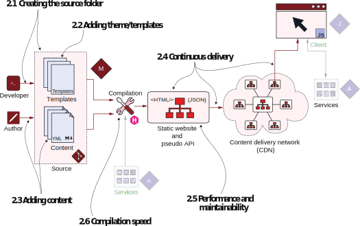

# Live in 30 minutes: You now have a website


**This chapter covers**
- Running the Hugo command line
- Setting up a Hugo website with themes and content
- Outlining the structure of a Hugo-based website
- Setting up a continuous deployment pipeline
- Measuring performance and analyzing website maintainability


Hugo is quick and easy to get started with. You can download Hugo and get going using just a basic text editor and a web browser. This chapter navigates through the entire length of Jamstack’s flow as figure 2.1 illustrates. We will create a website for a company named Acme Corporation. Acme Corporation is a leading manufac- turer of shapes like lines, circles, squares, and triangles in digital form. We will use the Hugo command line to bootstrap the website (section 2.1) with a prebuilt theme (section 2.2) and some ready-to-use content (section 2.3). We will also host the website on the internet (section 2.4) and analyze the decisions made in this
chapter for performance and maintainability (section 2.5). Note that we will enhance this website throughout the book.

Figure 2.1 This chapter runs through the entire flow of the Jamstack—from the developer to the published website.

Appendix A provides the information to get up and running with Hugo. You can also use the official website at https://gohugo.io/ to download Hugo as well as to refer to its documentation. Hugo is available on all major platforms. For this book, you    need Hugo with a version greater than or equal to 0.91.2.
