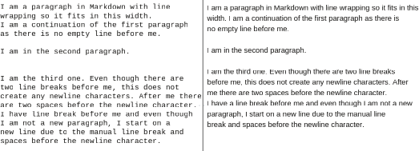
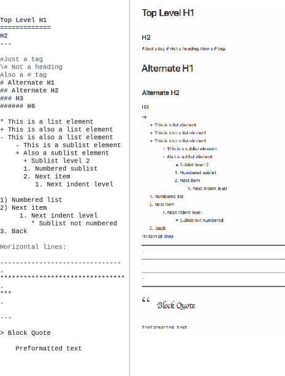
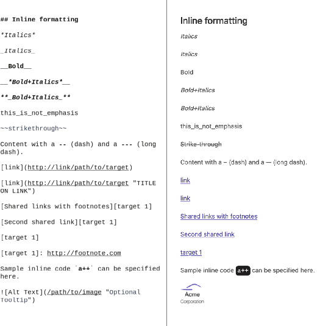
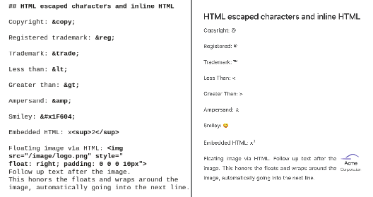
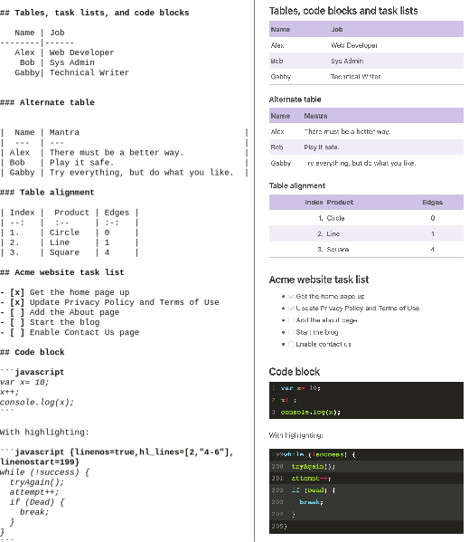
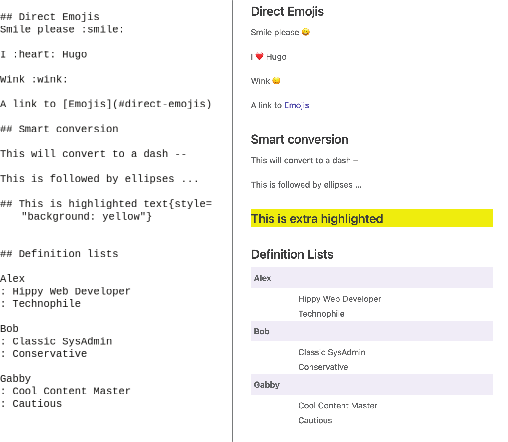

# 3.1 Writing content in Markdown

So far, we have used plain text to provide content for our web pages. With plain text, however, we get no structure, and a blob of text is not fun to read. Markdown is a light- weight document format for writing easy-to-read and easy-to-write documents with support for basic formatting and for structuring content using text-based constructs. In 2004, John Gruber and Aaron Swartz created Markdown as a human-readable, text- based formatting language. It standardizes on a text-based mechanism for specifying formatting. Although a compiler and a renderer improve readability, the language is easy enough to understand without it. This readability has made Markdown popular as a formatting language from the command line to Git commit messages, README files, plain text boxes, and chat pods.

Original Markdown had a limited set of features, extended by CommonMark (https://commonmark.org/) and further developed as GitHub Flavored Markdown (GFM), which is the popular variant (see https://github.github.com/gfm/). Hugo supports most of GFM and extends it even further. Hugo parses files created with the filename extension .md or .markdown as Markdown. The privacy, credits, terms, and about files in chapter 2 already have the .md extension and are ready to use with Markdown’s formatting capabilities.


**Markdown editors**

Markdown is a language that can be read and written in a plain-text editor without any support for this format. Many users don’t have a special editor for Markdown. Simple text editors like Sublime Text and VS Code provide color coding to help identify spe- cial formatting in Markdown. They also support a live preview of Markdown content in the output format.

If you are looking for a dedicated Markdown editor, tools like Typora (https:// typora.io/) and iA Writer (https://ia.net/writer) provide many capabilities for helping create good Markdown documents. These tools support keyboard shortcuts and inline as well as live previews. Online tools like Dropbox Paper (https://www.dropbox
.com/paper) also support a subset of Markdown. Apart from these, pandoc (https:// pandoc.org/) can take many file formats including Microsoft Office, Open Office, Latex, and MediaWiki and convert them to Markdown.


## 3.1.1 Paragraphs in Markdown

Markdown already formats blobs of text with an empty line between paragraphs (the <p> tag in HTML). The various pages we provided in chapter 2 did not look very ugly because of this feature. Figure 3.2 shows how the paragraph and line break elements render.

If we provide more than two line breaks, rendering content collapses them. The rendering also ignores single line breaks during this process. We can also use Mark- down in text boxes where automatic text wrapping is not available, and we can add   line breaks without impacting output, thereby keeping readability intact. To create a regular line break (<br> tag in HTML), add two spaces at the end of the line and then add a new line character using the Enter (Return) key.



Figure 3.2 Elements in Markdown, part 1: Paragraphs and line breaks

## 3.1.2 Headings, lists, and other block elements

We need headings, lists, and other block elements to provide proper structure for the Terms of Use and the Privacy Policy pages for the Acme Corporation website. Figure
3.3 shows these elements and how they are rendered in the browser. To create top- level headings,

- Before the heading text, use a hash mark (#). The single # sign creates a level 1 (H1) heading, and two ## signs make the level 2 (H2) headings. We can use hash marks like this to reach six levels of headings in most parsers (##, ###, and so forth).
- Under the heading text, add a row of equal signs for a level 1 heading or add hyphens (dashes) for the next level headings (H2, H3, and so forth). This underlining (created from the equal signs and dashes) highlights the  headings,  making  them  not only more readable but also easier to locate.

GFM requires a space after the hash mark to be considered a proper heading to distin- guish between hashtags that have become popular for labeling issues. For headings, hashes need to begin the start of a new line, preceding the text that we want to use for the heading. The in-between text (from one heading to the next) does not create headings but, rather, is our content.



Figure 3.3 Elements in Markdown, part 2: Headings, lists, and horizontal lines

We can add bulleted lists (the &lt;ul&gt; block element) by using either *, -, or + at the start of the sentence. Sublists are added by inserting four spaces before the bullet character. A number followed by a dot (.) or a closing parenthesis ()) creates numbered or ordered lists (the &lt;OL&gt; block element). We can nest different lists in Markdown.

We can create horizontal lines (the &lt;hr&gt; tag) using a series of dashes or asterisks (with a minimum of three). To add a blockquote, we prefix the text with &gt; as the first element in the line. Any text starting with four spaces or a tab character is considered a preformatted code block, which displays exactly as you write it with no line wrapping. Figure 3.4 shows the Terms of Use page for Acme Corporation (on the left) with  the corresponding block elements for headings and lists (on the right). The block elements highlighted in the image are an exercise for the reader. For that, the reader should update the Privacy Policy page with these elements. You can tally your changes


Figure 3.4 Addition of headings and lists and the corresponding block elements to the Terms of Use page for the Acme Corporation website
with  those  provided  in  the  chapter  resources  (https://github.com/hugoinaction/ hugoinaction/tree/chapter-03-resources/01).


**CODE CHECKPOINT**	https://chapter-03-01.hugoinaction.com, and source code: https://github.com/hugoinaction/hugoinaction/tree/chapter-03-01.



**Exercise 3.1**

Which symbols from the following list can help identify a heading in Markdown? (Select all that apply.)
- a. Asterisk (*)
- b. Underscore (_)
- c. Hyphen/dash (-)
- d. Equals sign (=)
- e. Plus sign (+)
- f. Hash mark (#)


## 3.1.3 Formatting, inline links, code, and images

While block elements give the page its structure, inline elements emphasize vital parts of the page. Figure 3.5 shows these inline elements (on the left) and how they are rendered in the browser (on the right).

Note that Hugo automatically formats hyperlinks on the page and converts them     to HTML anchor tags. This auto-linking is a feature provided by Hugo’s Markdown parser, so we do not need to write anything special to enable it. We can also create   links using a [visible text](http://example.org/path/to/file) format. We can also use the [visible text](http://link "Title") format, where "Title" is avail- able as a tooltip.

We can share links across text by writing a reference to them as [visible text][target 1] and then adding a footnote with the value of the reference by using the format [target 1]: https://example.org/path/to/target. Shared links also work in footnote locations directly; for example, [target 1] autolinks to the target 1 link that we just set.

Markdown provides basic formatting support using text-based markers. We can sur- round the desired text with an _(underscore) or an *(asterisk) for italics, or a (double underscore) for boldface. For both bold and italics, we can use **_<text>_** or
*<text>* . Double tildes (~~) are used for strikethroughs.

We can specify inline code by surrounding it with backticks like this, `inline code`, and we can place it in free-flowing content. It gets formatted with a monospace font in the HTML &lt;code&gt; tag.

Markdown creates &lt;img> tags to show images inline with the content. There is no support for specifying block images, image dimensions, or other details; that is left to the theme to implement. We can inline images using a similar syntax to links and



Figure 3.5 Elements in Markdown, part 3: Inline elements including bold, italics, underline, links, and images

prefix those with an ! (exclamation mark, commonly called a bang). To render an image inline in the text, we’d write . We can use relative paths in the image tag as well.
Using these features, we can properly format salient parts of the privacy policy for the Acme Corporation website. The formatted Privacy Policy page looks much more complete and professional now. Figure 3.6 shows a part of the completed Privacy Policy page on the right with the inline elements marked on the left. Updating the Privacy Pol- icy page to match this design is an exercise for the reader. The completed Privacy Policy
page is available in the code checkpoint as well as provided in the chapter resources (https://github.com/hugoinaction/hugoinaction/tree/chapter-03-resources/02).


Figure 3.6 The Privacy Policy page for Acme Corporation using block elements, inline links, and other formatting. Note that HTML uses mailto URLs for email links such as contact@example.org and tel: for phone numbers. The image only labels inline elements but the headings also need to be labeled.


**CODE CHECKPOINT**	https://chapter-03-02.hugoinaction.com, and source code: https://github.com/hugoinaction/hugoinaction/tree/chapter-03-02.
↻ Restart your dev server.


## 3.1.4 HTML

While we can do a lot in plain Markdown, pure HTML and CSS are even more power- ful. There is no way to represent a lot of HTML features with Markdown. Fortunately, Markdown recognizes this problem. If a Markdown document contains an HTML tag, the Markdown parser outputs the HTML tag as-is, and it will be present in the generated output. For example, if we use bold with &lt;em>emphasis&lt;/em>, it’s converted to
&lt;strong>bold with &lt;em>emphasis&lt;/em>&lt;/strong>. Markdown, therefore, is a  super-
set of HTML.

Technically, any valid HTML is also valid Markdown. We can use HTML tags with Markdown to pass those tags to our content. We can also write Unicode characters  using the escape syntax common in HTML and XML documents. This feature pro- vides access to the entire set of Unicode characters, including localization letters, emojis, symbols, and so on. Figure 3.7 shows these elements and how they are ren- dered in the browser.



Figure 3.7 Elements in Markdown, part 4: Escaping HTML and inline HTML

Although we can use any HTML to provide additional features that are unavailable  with Markdown, it is not a great practice to do so. In fact, it is strongly advised to mini- mize the use of embedded HTML in Markdown content. Inline HTML can turn into a secu- rity risk if we do not trust the content creators because they can add arbitrary


JavaScript and CSS. Having little control of the embedded HTML in the hands of the theme creator can turn into a big problem when attempting to update a theme. Addi- tionally, when we have the freedom to be creative with HTML, adding layouts, align- ment, color, and other stylistic features to the content, it becomes difficult to clean up. Hugo disables inline HTML by default. We can enable it in Markdown via the unsafe key in the markup/goldmark/renderer section) of the config.yaml file as the fol- lowing listing shows. Note that Unicode characters are not disabled. Also, there is little
need for inline HTML with the shortcodes feature that we will discuss in chapter 5.


```yaml
markup: 
  goldmark:
    renderer: 
      unsafe: true
```


When we created the configuration file for Acme Corporation’s website, we specified the copyright directive as Copyright &copy;. In figure 3.7, you can see the escaped HTML for the Unicode-based copyright symbol. The text that is entered for any key in config.yaml is plain text by default, but the theme authors have the option of treating that as Markdown (more details on this in chapter 6). Many themes support Markdown-based configuration parameters, giving us the power to customize format- ting for our content.

In the Privacy Policy page, we used TM in the first line to indicate Acme Corpora- tion’s trademark. Now would be a good time to replace it with &trade; to get the HTML trademark symbol. Note that you can also insert direct Unicode characters like
™ for the trademark symbol.

## 3.1.5 Tables, task lists, and code blocks

Hugo supports the extensions to Markdown popularized by GitHub as GFM, includ- ing the syntax for tables, task lists, and code blocks. Figure 3.8 shows these extensions and how they are rendered in your browser.

To create tables, we can write one row per line, separating each column with the pipe (|) character. We can write a row of dashes (-) to underscore the table header row. Hugo also supports a shorter form of Markdown tables where we can ignore the pipe characters at the outer edges of the rows. You can use colons and dashes in the table to define the column alignment. For example, :-- is left-aligned, :-: is center- aligned, --: is right-aligned, and --- is undefined (the default is based on language and theme).

Task lists follow the GitHub style, where we write a dash (-) followed by square braces ([]) to declare a task. You can even add a cross (x) between the brackets for a completed job. Task lists in Hugo render as disabled; there is no automatic enabling because updating content by clicking the “checkbox” is impossible without involving a server to edit the files.



Figure 3.8 Elements in Markdown, part 5: Tables, task lists, and code blocks

Markdown supports blocks of code using three back ticks (```), popularly called code fences, at the start and end of the code block. The language name can follow the begin- ning code fence to get language-specific code  highlighting.  Hugo  does  not  enable line numbers in code by default. We can allow these by setting markup/highlight/ lineNos in the global configuration file to true as the following listing shows.


markup: 
    highlight:
        lineNos: true
   	

Hugo supports highlighting code snippets or overriding code sections by passing additional options to code fences. For example, passing {linenos=true, hl_lines=[2,"4-6"],linenostart=199} tells Hugo to override the line number con- figuration, allowing those to be present, to start the line numbers at 199, and to high- light lines 2, 4, 5 and 6.

## 3.1.6 Emojis, IDs, and other Hugo extensions

Hugo extends Markdown with added features that make our day-to-day use of Mark- down easier and more fun. Emojis or emoticons are symbols used to depict an idea or emotion. Emojis are not enabled by default, and you need to add an entry in the con- figuration file to use them. The following listing shows how to enable these.


```yaml
...
theme: Eclectic
enableEmoji: true
```


With this change in config.yaml, we can use emojis in our content by surrounding the emoji name with colons (for example, :smile:). The syntax is similar in Slack, GitHub, Basecamp, Trello, Gitter, and Bitbucket, and Hugo supports the same set of emojis.  You  can  use  the  emoji  cheat  sheet  from  https://www.unicode.org/emoji/ charts/emoji-list.html for a list of supported emojis.

Hugo automatically converts headers to IDs so that we can link directly to them.   We can add custom classes, IDs, or attributes to any Markdown element by supplying them after the text in curly braces (for example, ## heading {#id .className attribute="value"} creates a second-level heading with the text “heading”, the id attribute as “id”, the CSS class “className”, and a custom attribute named “attribute” whose value is “value”).

Hugo also supports HTML definition lists, another type of list in HTML (besides ordered and unordered) that are relatively less used. To declare a definition list, you can specify the term on one line, followed by a :(colon), and a definition on the next line. Figure 3.9 shows these elements and how they are rendered in the browser. Apart from this, Hugo supports custom shortcodes by which we can extend Markdown by adding custom elements that render HTML, which we will discuss in chapter 4. You can read more about Hugo’s extensions to Markdown on the official website at https://gohugo.io/getting-started/configuration-markup.



Figure 3.9 Elements in Markdown, part 6: Emojis, smart conversions, and definition lists


**NOTE** Not all themes have support for all Markdown features. If you plan on relying on something from a third party, we advise that you first check for sup- port for all the Markdown features that you want to use. To figure out Mark- down support in a new theme, the markdown.md in the code content with this book can act as a good sample of all Markdown features.



**Exercise 3.2**

Which of the following features is not supported natively in Hugo’s Markdown?
- a. Bold
- b. Smaller font size
- c.  Italics
- d.  Table
- e. Headings
- f. Horizontal lines
