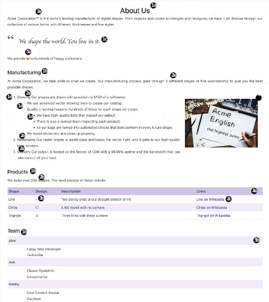

# 3.2 Markdown in action

Using all these content features, we will now update the About Us page for the Acme Corporation website to make it more presentable. Figure 3.10 shows the completed page. The core elements of the About page are already present in the sample text from chapter 2. The following changes will make the page more presentable.

Figure 3.10 The About Us page for Acme Corporation using advanced Markdown features: 1) block elements like headings and lists, 2) inline elements like bold, italics, and links, 3) inline HTML and character codes,
4) the tables, and 5) definition lists and an emoticon. (Font by Peax Webdesign; image under Creative Commons CC0 from PxHere.)

- 1 Block elements
  - a Add a top-level title with the text About Us.
  - b Make Manufacturing, Products, and Team second-level headings.
  - c Make the following a blockquote: We shape the world. You live in it.
  - d There is a numbered list in the Manufacturing section. Make some bulleted sublists for it.
- 2    Inline elements
  - a Format the text “three different” and the item names in the numbered list in the Manfacturing section as bold.
  - b Format the text “200 shapes” in the Products section as both bold and italicized.
  - c Convert text in the Products table to links.
- 3 Inline HTML and character codes
  - a Add a trademark sign after Acme Corporation at the top of the page.
  - b The character code for a circle is ? and for a triangle it’s ?. Add these to the Design column of the Products table. Note that two dashes automatically convert to a line.
  - c Add the embedded HTML for a right-floating image with a 20 px margin pointing  to  /image/draw.jpg  in  the  Manufacturing  section.  (You’ll  find draw.jpg in the resources for this chapter, but you need to move it to the static/image folder.)
- 4 Tables
  - a Convert the comma-separated list to the Products table.
- 5 Emojis and definition lists
  - a Convert the text “smiles” to the emoji (:smile:).
  - b Convert the description of team members in the Team area to an HTML definition list.

The  completed  About  page  is  provided  in  the  chapter  resources  (https://github.com/hugoinaction/hugoinaction/tree/chapter-03-resources/03) and as a code checkpoint for comparison.


**CODE CHECKPOINT**	https://chapter-03-03.hugoinaction.com, and source code: https://github.com/hugoinaction/hugoinaction/tree/chapter-03-03.
↻ Restart your dev server.


