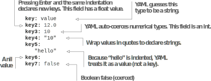
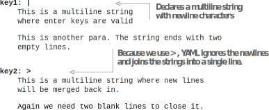
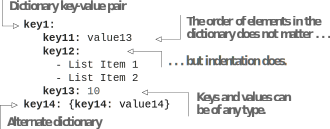
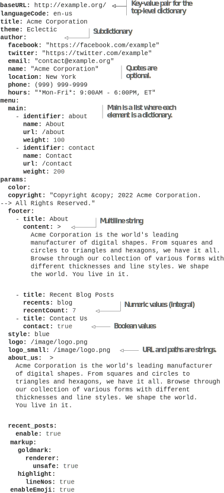

# 3.4 Metadata

By embellishing the raw textual data with formatting elements and structure, the pages individually look complete when rendered with the Eclectic theme, which forms the template and code associated with the Markdown data. While there is ample con- tent on the pages to form a website, we need to provide information that we can use to organize content and structure it in lists, menus, and so forth. Markdown is not the best language to offer structured data for this. Hugo supports another set of lan- guages that we call metadata languages. We can use these languages to provide this information. One of these is YAML (https://yaml.org/), which we use in this book. It is a popular language for software configuration and the easiest to read among the metadata languages.

YAML stands for YAML Ain’t Markup Language (the Y of the YAML stands for YAML, recursive acronym). It is a language for structured data with keys and values separated by a colon (:). The definition of YAML highlights the fact that the core use case of YAML is around structured data and not marking data like we do in Markdown or HTML. YAML is sensitive to spaces. We use YAML for the configuration file for the Acme Corporation website. YAML supports plain key-value pairs as its primary data structure and also has support for individual data elements and lists. In this section, we will go over the syntax and features supported by YAML in detail.

## 3.4.1 Comments
We use hash marks (#) for comments in YAML. Comments are single lines and can appear anywhere in a YAML document. The following listing shows the syntax for YAML comments.


```yaml
# This is a comment.
```


## 3.4.2 Basic data types

For human readability, YAML automatically guesses data types based on content. It supports strings, numbers, and Boolean data types. It also supports nil  (also called  null) types. If a key or a value is true or false, YAML automatically coerces it to the

Boolean data type. It guesses numbers as numbers, and everything else becomes a string. The following listing provides examples of YAML’s data types.



    

## 3.4.3 Multiline strings

YAML is sensitive to indentation, and newline characters define the beginning of a new YAML key-value pair. We can use the pipe character (|) to create multiline strings that honor new lines and the greater than sign (> ) to create multiline strings insensi- tive to new lines. The following listing provides examples of this.





## 3.4.4 Lists

We can declare lists in YAML using dashes (-) or square brackets ([]). The following listing shows how to add lists.





## 3.4.5 Dictionaries

Dictionaries, also called maps or objects, are key-value pairs. The top-level YAML object is also a dictionary. We can create dictionaries and subdictionaries in YAML, and they can contain all types. The next listing shows how to add dictionaries with YAML.






**Exercise 3.3**

YAML does not support which of the following data types?
- a. Date
- b. Boolean
- c. Map
- d. List
- e. Numbers


## 3.4.6Revisiting config.yaml

Now would be a good time to revisit config.yaml, which we created in chapter 2 and have been modifying since. It contains key-value pairs for elements such as baseURL and title. The order of these does not matter.
The author, menu, and params elements are dictionaries, while footer and main are lists in the params and menu dictionaries. Because types are automatically inferred, recentCount is a number, recents is a string, and true automatically converts to a Bool- ean. Listing 3.9 shows the most recent use of YAML elements in the configuration file.


**NOTE** The dashes before identifier in the main section in config.yaml are needed because the main menu is a list, where each list item is a dictionary.




