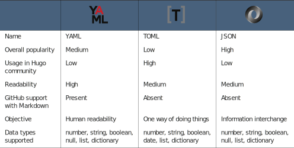

# 3.5 Other metadata languages

YAML also has the same tradeoff as Markdown: human readability over a strict specifi- cation. This tradeoff comes with complexities in parsers and weird edge cases that might not be easy to understand. We have chosen YAML in this book for the configu- ration file due to its popularity and ease of readability. Hugo supports TOML and   JSON as other metadata languages apart from YAML. Appendix B goes over TOML and JSON in detail, and table 3.2 provides a quick comparison of their features.

Table 3.2 Metadata language comparison

- TOML (Tom’s Obvious Minimal Language) has the objective of ensuring that there is one standard way of writing a particular data item. YAML’s automatic guess- ing of data types makes it easier to read but can lead to cases where YAML infers a wrong type. For example, plain text is a string, but if the plain text is the word true, it becomes a Boolean. TOML avoids that confusion with a strongly defined system where we have to enclose every string in quotes.
- JSON (JavaScript Object Notation) is a popular format for exchanging information and is much easier than YAML and TOML for generation and machine parsing. The most significant advantage of JSON is the availability of high-performance parsers in most programming languages and familiarity with this format among developers. Graphical editors and CMS solutions typically use JSON for Hugo interaction.


**NOTE** You will find a lot of resources from the Hugo community in the TOML format. TOML is more straightforward to copy and paste due to its nonstrict spacing policy. If you happen to write a parser, TOML will be much easier to parse. For an advanced Hugo user, TOML is an excellent language to know.
