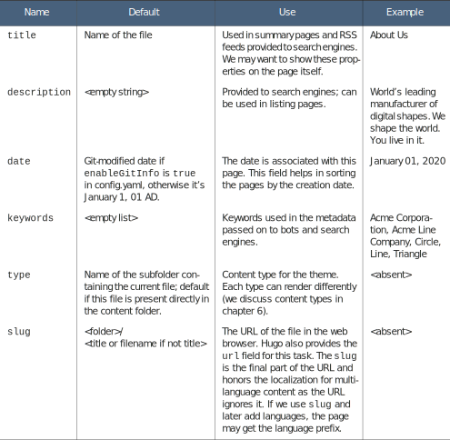
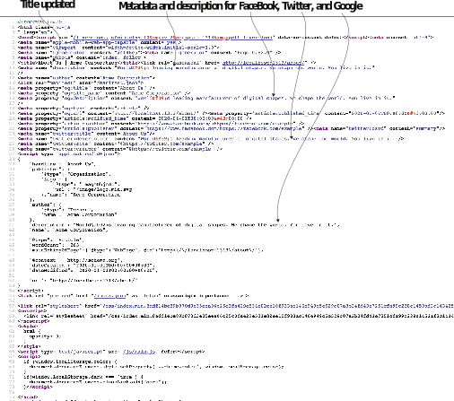
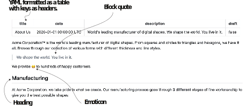
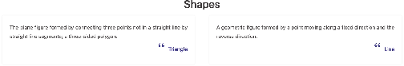

# 3.6 Front matter

Apart from the global site-wide configuration, we also need page-specific metadata like creation date, tags, URLs, author name, and so forth. Hugo needs this informa- tion to organize the page in the website and to provide information about this page to the broader internet, such as search engines and social networks. We can also show some metadata in the sidebar of the page.

To provide page-specific metadata, Hugo has the concept of front matter. The front matter is a set of key-value pairs that define the metadata for the content provided right before the content. With the front matter, we can provide metadata on the same file as the main content. The front matter is also called the page metadata section (page meta- data or metadata in short) as well as the page configuration. Those terms are used inter- changeably in this book.

To place YAML content in the front matter of a page, we need to wrap it with three dashes (---) and place it at the top of the page. The following listing shows how to use the three-dash format to identify YAML as the content metadata language.



    

Hugo is clever with the metadata and provides a reasonable set of defaults. That is why we have been able to get along so far, providing little metadata and still being able to render content. By default, Hugo receives the information from the filename, the Git version control system (if used), and the OS attributes like the modified date. We need to deal in the front matter only if we need to do something that Hugo cannot guess itself or need to override it to perform specific tasks.


**Metadata before content**

The concept of having metadata before the content has been present in computers since the beginning of programming. Pascal represents strings by a length followed by raw binary data of that length. Many binary file formats start with a signature that is the metadata associated with the file. For example, if you open a .pdf file in a text editor, it starts with %PDF, a .png file begins with .PNG, and a .gif file with GIF. Jekyll, the first modern static site builder, introduced metadata in the front matter for all static site builders, and Hugo adopted the concept.


## 3.6.1Common metadata elements in the front matter

The front matter consists of all the metadata properties that are associated with the specific page. Just like a website has a configuration file (config.yaml), we can place page-specific YAML content on the page itself. We can override these properties in the front matter. Table 3.3 presents some of the most common properties.

Table 3.3 Common front matter properties in Hugo. Examples shown are for the About Us page in Acme Corporation’s website.


To update these properties in the About Us page for the Acme Corporation website, we  can  add  the  code  in  listing  3.11  to  the  top  of  the  page  (https://github.com/ hugoinaction/hugoinaction/tree/chapter-03-resources/04). We can supply the front matter in YAML format, enclosing it in three dashes (---).


```yaml
--- 
title: About Us 
date: 2020-01-01T00:00:00Z 
description: World's leading manufacturer of digital shapes. We shape the world. You live in it. 
draft: false
--- 
<page content>
```


The Eclectic theme places the title on the page so we do not need to add it man- ually. Other than that, there seems to be no significant changes. You should see the updated description and the document title should also show up in the tab bar (see figure 3.11), when you view the generated HTML (see figure 3.12).


Figure 3.11 Address bar update with the front matter content


**CODE CHECKPOINT**     https://chapter-03-04.hugoinaction.com, and source code: https://github.com/hugoinaction/hugoinaction/tree/chapter-03-04.



**NOTE** The rest of this book discusses more front matter entries and use cases. One crucial feature missing in this chapter is the cascade front matter entry addressed in chapter 7.



**Exercise 3.4**

We can use the ________ front matter entry in Hugo to define a custom URL endpoint for the web page.


We can enable only some of the features such as draft via the front matter. The front matter will get more important once we start getting into taxonomies in chapter 4. The front matter and the content form the updates that a content creator has to work on regularly. With a working knowledge of these two areas, we can design as many pages of content as we want in a website. GitHub supports rendering front matter and Markdown when we use YAML in the front matter, making it easy to navigate the con- tent. Figure 3.13 shows the About Us page on GitHub.


Figure 3.12 Metadata updates with the front matter content


Figure 3.13 GitHub’s default rendering of the front matter along with Markdown


**Front matter language conversion**

Hugo supports all metadata languages in parallel. Different documents can use other metadata languages, and Hugo parses these correctly. Hugo can also convert con- tent between metadata languages. We can use the Hugo command line to convert the content to TOML by entering hugo convert toTOML <content file>. We can sim- ilarly convert to JSON/YAML by updating the command with toJSON and toYAML, respectively.

There is no real reason to do this conversion because Hugo supports all of these lan- guages in the front matter. Most users stick with the choice of metadata language they began with, but there is a straightforward command-line interface available if you need to switch to a different one.


## 3.6.2 Data-driven landing page using the front matter

Front matter is not just for metadata; we can use it to specify the data of the page. The theme authors are free to use the structured data supplied in the front matter with any page. Some elements like carousels benefit from structured data. We can provide individual pages for the carousel as key-value pairs. Theme authors can embed these in the right places in the template much more easily than they can do with Markdown, which acts as one big blob.

The Eclectic theme, for example, has support for photo and text carousels, icon- based lists, testimonials, client icons, etc., all driven by data that we can provide in the page’s front matter. You can place the provided data-driven.md file (https:// github.com/hugoinaction/hugoinaction/tree/chapter-03-resources/05)  in  the  con- tent folder to try out this feature. You can view the corresponding page at http:// localhost:1313/data-driven to get a page similar to that shown in figure 3.14.


**CODE CHECKPOINT**	https://chapter-03-05.hugoinaction.com, and source code: https://github.com/hugoinaction/hugoinaction/tree/chapter-03-05.




Figure 3.14 A carousel for the Acme Corporation website that makes use of the data-driven approach and uses the front matter with the Eclectic theme. We can place data-driven.md in the content folder to get this page.

Some themes (like the Universal theme) can also take the information in the global config.yaml or read it from the data folder. You should read the documentation for your theme to figure out how to use these features.

The approach of providing structured metadata in the front matter, as a global configuration, or in the data folder comes at a cost. Because structured data is specific to the theme, your custom data does not get picked up automatically if you switch themes. For many users, using a prebuilt theme and providing structured data are best suited to their needs because they likely chose that theme for those features. It is also easier to maintain data in a format like YAML rather than plain HTML.

Themes provide many built-in features and complicated logic to enable compati- bility across screen sizes when presenting our data. We will create our structured data- based web pages in chapter 6.


**Exercise 3.5**

True or False: Theoretically, we could build a Hugo website with all the content in the front matter and nothing in the Markdown body of the web pages.
