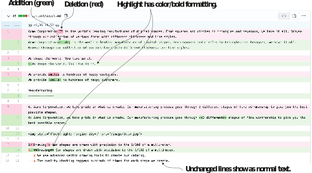
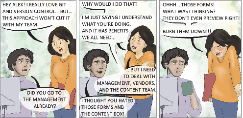
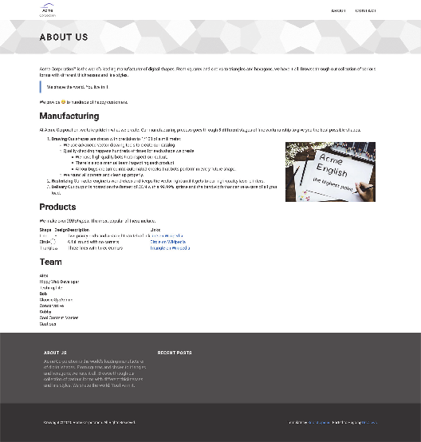

# 3.7 Benefits of using markup and metadata languages

In the Jamstack, we use markup and metadata languages across multiple files to replace the role of the database in the traditional web stack. The benefit of giving up on the database is not obvious when we move to the Jamstack. Databases have been optimized for over 30 years and provide vast storage optimizations and querying capabilities. Data- bases (both SQL and NoSQL) require some structure to the data they store. Databases expect some schema, even if it is different in every document. They are not very useful if there is no schema/structure at all, as in the case of formatted text.

In most database-oriented content management systems, the formatted content of the web page gets shoved into a single column or assigned to a single key. With textual content stored as files on disk, we get access to a massive set of utilities that work on text files, from standard bash tools like grep to general-purpose software like version management systems (Git).

## 3.7.1 Content versioning

When we write and commit text content alongside code using a version control sys- tem, we inherit the robust versioning scheme built for source code and can use it for versioning content. With Markdown, the formatting updates are easy to understand in the diff view. We get full support for forks, branches, and pull requests for content. We can have a proper software life cycle for the website content, including staging, branch views, and versioned content releases. If we want, we can write scripts to validate content, check spellings, or fix structure, which can trigger code commits, just like we built the website for GitHub deployment in chapter 2.

This support is present not only in Hugo but in the entire Jamstack. Jamstack enables this by moving content from databases to markup. We can see the diff view in action on GitHub by navigating to the commit pages for the changes we make to the Acme Corporation website. A sample diff view is shown in figure 3.15.

Figure 3.15 A sample diff view for the About page on GitHub. We can view, review, and manage each content change as code.

Figure 3.16 Content language over web forms: Gabby, the lead editor for the Acme Corporation website, tries to understand what moving from a web form to a document for content entry entails.

## 3.7.2 Theme independence

A lot of moving of the website from Markdown to the configuration is standardized. Content authors put things like text colors and HTML spacing in Markdown. The elements that we move make the content stable across multiple themes. We can switch themes and see our page render almost correctly. While Hugo generates the correct HTML for all Markdown, it is still up to the theme author to provide good styling for all of the Markdown features.
If you are interested in checking the portability of your code across themes, it is not a bad idea to try out the functionality across themes. The About Us page for the Acme Corporation website (figure 3.17) does not look shabby in the Universal theme.


**CODE CHECKPOINT**	https://chapter-03-06.hugoinaction.com, and source code: https://github.com/hugoinaction/hugoinaction/tree/chapter-03-06.


Figure 3.17 The About Us page for Acme Corporation website rendered using the Universal theme for Hugo

## 3.7.3 Cleanliness

The HTML markup generated by the WYSIWYG (what you see is what you get) editors present in tools like WordPress can be overly complicated and unreadable. We are also at risk of the WYSIWYG creators pasting arbitrary JavaScript into the content, which can turn into a security issue. Markdown is a much cleaner language than HTML. The likelihood of extra tags and mistakes is much lower when we write read- able text. Similarly, with Markdown, we have forms to enter metadata in traditional content management systems. There are many websites where the admin section is shoddily prepared, and a plain-text metadata language provides more flexibility and power than any of those forms ever could.