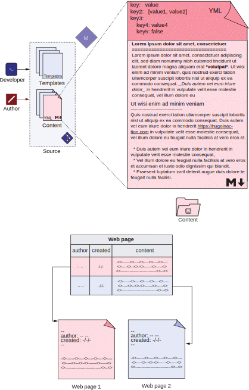

# 3 Using markup for content


**This chapter covers**
- Creating content using Markdown
- Using Hugo’s extensions to Markdown
- Understanding the markup languages supported by Hugo
- Using YAML for metadata in a Hugo-based website
- Playing with the various elements of the front matter


Most documents in the content folder of a Hugo website consist of textual content in a markup language and its associated metadata in a metadata language. Markdown is the most popular markup language and the most widely used. YAML is among the most popular languages for writing key-value configurations, where human readability is essential.

Figure 3.1 Most content documents in a Hugo-based website consist of markup in some metadata language like Markdown and structured metadata in a metadata language like YAML. The focus of this chapter is to format a single Markdown document (on the top). The bottom shows a comparison of database storage versus file-based storage for our content.

Figure 3.1 (top) shows the focus area for this chapter. In sections 3.1 to 3.3, we will focus on the Markdown language to provide content, and from section 3.4 onward, we will study the YAML language that adds the metadata. We will also look at the typical metadata entries in the front matter of a website. In this chapter, we will format the pages we created for the website we built for Acme Corporation in chapter 2.

In the traditional web stack, the content of a web page is stored in a single database cell, whereas the associated metadata fills up other columns in the content table or other tables in the database. In the Jamstack, the content (called the front matter) is of prime importance and is placed in a separate file with the rest of the metadata moved from the header section (as figure 3.1 shows on the bottom).