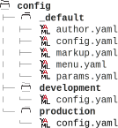
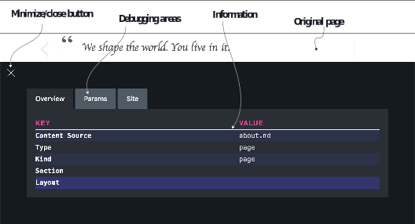

# 4.1 Customizing with the Hugo configurations

On the Acme Corporation website, so far we have had only one configuration file, config.yaml, where we have been piling our configurations. If we look at the Hugo documentation, we notice that many configuration parameters can be changed, which can quickly get overwhelming. A single configuration file is bound to become a bottleneck.

Another problem with our configuration file is that we cannot have different set- tings for development and production in one file. An essential practice for web devel- opment is to have different environments. This way, many teams can contribute independently. To debug easily, a web developer needs HTML that has not gone through minification (processing to reduce the file size for faster serving over the inter- net). In a testing environment, we may need more logging to enable the development team to reproduce issues quickly and to fix bugs. The content team needs a website as stable as the production team.

Hugo recognizes these problems and supports splitting the configuration files with environment-specific overrides to the base configuration via a config folder. In this section, we will split the configuration file into multiple files, building separate files  that override the default configuration. To do that, we will create a folder called con-  fig and add a folder called _default in the config folder and move the Acme Corpora- tion website to those folders. The _default folder is special; Hugo refers to the default content in that folder. This name is used not only for configurations but also for tem- plates, as we will see in chapter 7.

If we move the config.yaml file to the config/_default folder, the website will con- tinue to behave the same. But now that its contents are in a folder, we can divide the configuration file into multiple files for multiple properties. We can now move the author section in the configuration file to config/_default/author.yaml, and we can move the params and the markup sections to separate files. The filename is automati- cally mapped to a key when Hugo parses the configuration. This way, this information is isolated and more manageable. We will also split the menu in menu.yaml and extend this in section 4.2. The split files are also provided in the resources for this chapter (https://github.com/hugoinaction/hugoinaction/tree/chapter-04-resources/01).

Hugo supports environment-specific configuration overrides using folders for each environment in the config folder. These environments take the values from the _default folder and override the environment-specific values. We can now create a folder called production and put production-specific overrides in the configuration parameters in   that folder. Similarly, we can add a folder called development for development-specific configurations. Listing 4.1 provides the code to split the configuration directory for the Acme Corporation website. (The listing’s .yaml file document icon is by IYIKON from the Noun Project; the folder icon is from flaticon.)

When Hugo runs with a live reload server via hugo server, it defaults to the development configuration (the names “development” and “production” are hardcoded in Hugo as defaults). When built by the hugo command, by default, the mode changes to production. We can override the configuration to any name we want by specifying it in the environment variable HUGO_ENV or using the --environment flag in the Hugo command line. This override can be used, for example, to debug production-only bugs in the development server mode.



    


**The world of environments**

Most hosted software has the concept of environments. If we need to ensure that there is no downtime as we develop, we need to have a methodology to ensure only stable releases go live. It is crucial to label stable builds and move them to a higher environment tier for further testing before going live. The number of environments depends on the number of people involved and the degree of independence needed for independent tasks. A standard set of environments in a large project can include:
- Development—This is where active development happens. Developers may have separate branches or branch-specific environments, but we need a shared branch where all development teams merge their code and resolve conflicts. Development mode is the default when Hugo runs in live server mode.
- Testing—An environment with all completed features currently under auto- mated and manual testing.
- Staging /Alpha—Stabler environment for testing across teams in the com- pany. The companies might also provide access to this environment to some selected customers who are helping to fine-tune the software.
- Beta —A public prerelease that is ready to go live, and the company invites everyone to verify their workflows.
- Production —The current live/active environment served to the end users. Production is the default environment when you run Hugo without the live server.

Each team is different and can decide to use a different set of environments. Hugo provides total flexibility to name the environments and to have settings specific to them. The code changes for features under development should be managed by a version control system like Git.



In the development environment, let’s update the settings to disable minification by setting minify to false. (You can control minification settings for individual file types using this setting as well.) Additionally, the Eclectic theme supports a debug bar (cre- ated initially by JugglerX), which provides the front matter in a visible section on the web page as figure 4.2 shows. We can enable this by setting DebugMenu to true in the params section for development and can be launched by clicking the red wrench icon on the bottom right in the debug bar. In chapter 8, we will show you how to integrate this debug bar in other websites using Hugo Modules.



Figure 4.2 The debug bar in Eclectic (only when running in the development environment)

Listing 4.2 sets the overrides for the development environment to enable the debug bar, to disable minification, and to build drafts. Then listing 4.3 sets the overrides for the production environment to enable robots.txt and minification.


```yaml
buildDrafts: true 
minify: false 
params: 
 DebugMenu: true -- Enables the Debug menu via params
```



```yaml
enableRobotsTXT: true 
minify: true
```


Defaults in Hugo are specific to the environment; Hugo understands development and production natively. Therefore, many websites that use Hugo do not need sepa- rate environment-specific configurations.


**CODE CHECKPOINT**     https://chapter-04-01.hugoinaction.com, and source code: https://github.com/hugoinaction/hugoinaction/tree/chapter-04-01.



**Exercise 4.1**

The two default environments in Hugo are development and _______.


You can also use environment variables to provide configuration options for Hugo. For example, if you set the environment variable HUGO_ENABLEGITINFO to true, that overrides the enableGitInfo configuration setting in the Hugo configuration, forcing it to be true. We can use the ability to override the configuration settings using envi- ronment variables to set up Hugo on the build server via a configuration system out- side of Hugo. Note that environment variables are different from command-line flags. These can be set in the running shell and are accessible to all programs that run after they have been set. You can read more about environment variables at https://help.ubuntu.com/community/EnvironmentVariables.


Figure 4.3 Configuration as code. Bob learns that, due to its expense, configuration as code is not as flexible as the actual code.