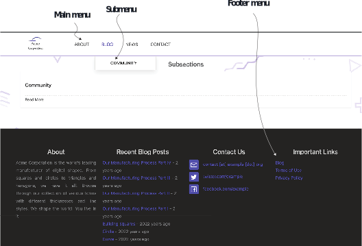

# 4.2 Organizing content with sections and menus

The essential tool to lay out content is the desired structure of the website that we will create from it. If we can physically represent the content we want to express on the sitemap logically, it makes our lives easier. This section provides some insights on how to go about laying out your content.

## 4.2.1 Sections

When a website has a lot of content, placing all of that in top-level pages makes man- aging the content challenging. Therefore, we can classify content into sections like blog, news, or products. We can use the path component of a web page’s URL to iden- tify its section. For example, in the URL https://example.org/blog/community/ welcome, the page named welcome belongs to the community subsection of the blog section of the website example.org. A subsection is not really a special construct in Hugo; it’s just a section in a section. Sections also have an index page like https:// example.org/blog that introduces the sections and provide a list of subsections and pages in them.

We can list all the areas in the website in the main menu or on the home page. To create a section in Hugo, we create a subfolder in the content folder. You can have nested subfolders for nested sections. Technically, the content folder (also called content root) that contains the home page (also called the root page or the index page) for the entire website is also a section, and all website sections are subsections of the content root. We can override the front matter of the home page using the content/_index.md file. The content root is the only section whose _index.md is optional. Because we override the index template with a plain HTML file in the Acme Corporation website, adding front matter specific to the page in content/_index.md has no effect.


**NOTE** We need to create a markup file named _index.md, even if empty, at the root of every section. Hugo uses this file to identify a website section. Hugo does not consider a folder to be a section without this file and might not display its contents.


Each section can have multiple pages that form its content. The sections have a tem- plate for the index page where we have access to all the pages and subsections. We use the section’s index page to help the user navigate the section. Custom parameters and data can customize the index template via the _index.md file in the section folder. We are free to choose the organization of pages as we desire to get the content structure we want.

Let’s add a news and a blog section to Acme Corporation’s website. In the blog sec- tion, let’s also add a community subsection for blog posts from community members using Acme products. Also, we will enable the automatic setting for the Git author dates for the content by setting enableGitInfo: true in the configuration file. The following listing enables access to Git commit information while building the website.


```yaml
... 
enableGitInfo: true
```


The content for these sections is provided in the chapter resources (https://github.com/hugoinaction/hugoinaction/tree/chapter-04-resources/02).  Figure  4.4 shows the corresponding Blog page. The sections present on the Acme Corporation website are shown on the right as filenames. The following listing provides the code for organizing the content in sections for the Acme Corporation website. (The list- ing’s Markdown icon is from octoicons; the folder icons are from flaticons.)


Figure 4.4 The blog for Acme Corporation’s website showing summaries from the different pages (top) and the subsections (bottom)



    	

We can navigate to http://localhost:1313/blog to view the entries in the blog section, to http://localhost:1313/blog/community to see the posts in the subsection for   com- munity-provided entries, and to http://localhost:1313/news to see those in the news section.


**NOTE** You need to commit the files to a Git repository for the dates to be read from Git by Hugo.


We can use the _index.md file in the blog folder to provide the settings and the content that show up on the /blog page. We can also add Markdown content for the index page to pick up and then use the front matter to override the settings. The index page has access to all the pages and subsections in the blog section.


**CODE CHECKPOINT**	https://chapter-04-02.hugoinaction.com, and source code: https://github.com/hugoinaction/hugoinaction/tree/chapter-04-02. Note: The changes are not reachable from the home page yet.



**Content summary**

The index pages of the sections in the Acme Corporation website automatically pro- vide a summary and titles of the posts in the section. Hugo generates the summary information automatically if we do not provide it. Although the index pages are the most common places where we can use a post’s summary, it can also be used else- where by the theme. Here are the ways to provide the summary:
- Automatic —By default, Hugo picks up the first 70 words of the content as the summary for the theme. The summaryLength variable in the website configu- ration file controls the number of words in the default summary.
- Manual—We can specify the summary length with the marker &lt;!--more--> at a location in the content to clip the summary if desired. Note that <!-- more--> is matched verbatim by Hugo. Adding spaces, changing to upper- case, or not having a proper HTML comment is not understood by Hugo. You can see this in use in the content/blog/tropical triangles/index.md file.
- Front matter —We can use the summary variable in the front matter to supply the summary text.

Note that the summary variable is different than the description variable. The summary variable in Hugo is a teaser into the content, while the description variable is more about the content sent to search engines. The description field can only be supplied via the front matter and does not have an automatic value based on content. Some themes like Eclectic give a higher priority to description and fall back to summary in the index pages.


## 4.2.2 Menus

The sections that we added to Acme Corporations’s website are not linked and, there- fore, not discoverable from the home page or from any content pages. Hugo provides a generic way to enable content to show up in the menus. We can include multiple menus on a website, and each theme defines its own set of menus and submenus. Each menu has a name, like main for the main menu, in the Eclectic and Universal themes. Each menu consists of a list of entries that form the whole of the menu.

We have already split the menu created in chapter 2 in the configuration file in section 4.1. Listing 4.6 shows the configuration that we created in menu.yaml. Let’s go over some of the fields in that configuration. Each menu entry has multiple fields:
- The identifier field uniquely defines the menu so Hugo can find it.
- The weight field orders the entries.
- The url field provides the relative path to the page from the website’s base URL defined in the configuration.

Hugo is flexible with the other fields and their purpose. Some themes use the name field for the menu’s display text, and others use the title field. To create a submenu, we need to provide the parent field with the identifier of the parent menu (see listing 4.9 for an example submenu).


```yaml
main:
  - identifier: about 
    name: About 
    url: /about 
    weight: 100
  - identifier: contact 
    name: Contact 
    url: /contact 
    weight: 200
```
    

Hugo provides two ways to include pages in the website menus. First, we can add menu items for the page in the configuration file. This approach helps localize and tightly monitor the menu. The second way is to specify the page menus in the front matter. This way, the menu becomes more dynamic and controlled by the content. If we delete a page, the menu automatically gets trimmed, and we do not have to worry about cleaning up stale links. The choice of which approach to use depends on our use case. If the objective is to have the menu in one place, the configuration file is the way to go. If we want to split the ownership of menus among the owners of different content sections for the website, then using the front matter is the way to go. Both can be mixed and matched as needed.

The Eclectic theme has two menus: the main menu and the footer menu. So far, we have only used the main menu. Let’s add a menu entry in the front matter of the _index.md file for the blog section to allow the blog to show up in the main and the footer menus. Listing 4.7 shows the configuration for this. We will also add a News submenu to the main menu. Listing 4.8 shows this configuration, and figure 4.5 shows the result of enabling all the menus.


```yaml
--- 
menu:
  main:
    name: Blog 
    identifier: blog 
    weight: 110
  footer:
    name: Blog 
    weight: 100
---
```



```yaml
--- 
menu:
  main:
    name: News 
    identifier: news 
    weight: 120
---
```
    



Figure 4.5 The Blog page for Acme Corporation’s website showing the main menu, a submenu, and the footer menu

The community section’s _index.md enables a submenu for that section in the Blog menu. The following listing shows its configuration.


```yaml
--- 
menu:
  main:
    name: Community 
    parent: blog 
---
```

    	

We also need to add the terms of use and privacy policy to the footer menu. The fol- lowing two listings show these configurations.


```yaml
--- 
menu:
  footer:
    name: Terms of Use 
    weight: 200
---
```



```yaml
--- 
menu:
  footer:
    name: Privacy Policy 
    weight: 300
---
```


While the footer menu has content, Eclectic does not show it until we explicitly enable it by adding menu: true in the config/_default/params.yaml file for the footer sec- tion. The following listing shows how to do that. Note that you may need to restart   your development server for these changes to take effect.


```yaml
... 
footer:
  ... 
  - title: Contact Us 
    contact: true
  - title: Important Links 
    menu: true
...
```


Because the home page does not use a menu yet, we will need to manually update the website’s home page to change the Explore button to link to the Blog page and then add an entry for the Blog and News pages in the footer in layouts/index.html. The fol- lowing listing enables direct links to the blog and news section in the website footer and changes the Explore button to link to the Blog page in the index page of the website.


```html
... 
<a href="./blog">Explore</a>
... 

<footer>
    <a href="./blog">Blog</a>
    <a href="./news">News</a>
... 
</footer>
```



**CODE CHECKPOINT**	https://chapter-04-03.hugoinaction.com, and source code: https://github.com/hugoinaction/hugoinaction/tree/chapter-04-03.
↻ Restart your dev server.



**Exercise 4.2**

Which menu placement is better if we want to cut and paste pages from one Hugo website to another?
- a. Layouts
- b. Front matter
- c. Theme
- d. Config



**Content management with a GUI**

For authors and editors that require a graphical environment to manage content without losing performance benefits with static site builders like Hugo, there are wrap- pers like Forestry.io, Hokus CMS, and Netlify CMS. These content management systems have graphical forms instead of YAML and Markdown. Tools like these can help teams with a diverse set of requirements to come on board and get the benefits of using Hugo. Nontechnical team members who prefer a graphical form can benefit from the Jamstack with a comfortable GUI on top. These forms place the files in suit- able locations and update the appropriate entries in the front matter and the config- uration files. We can use them interchangeably, along with directly editing the files.

Appendix C goes over integrating Netlify CMS with your website as the administrative interface for the content management system. The corresponding changes are pres- ent in all code checkpoints from chapter-04-03 onward.
