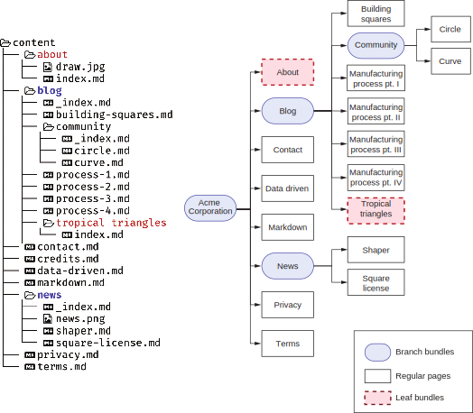
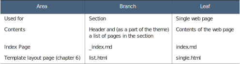

# 4.3 Better together with page bundles

A common problem with website source code is the scattering of the content across databases, filesystems, and third-party locations. Additionally, the images associated with the page live in a different place. That makes it difficult to properly clean up after we remove a page from the website. Because pages are not portable across websites,  the authors need access to multiple places to create them. Hugo, however, attempts to make the contents of a web page more self-contained. The menu field in the front mat- ter (that we just learned about) is one of the features that Hugo uses to do this.

Front matter menus allow each page to own its menu entries and lets us add and remove them independently. Another feature to enable this independence is page bundles. Page bundles are a collection of resources, both textual and nontextual (like images, PDF files, and fonts), which are sufficient to represent individual or a group of related pages. Page bundles can be independently placed or removed from a Hugo website to add the associated web pages. 

They help content authors localize changes to a web page or section to a specific folder on disk. There are two main types of page bundles: the leaf bundle and the branch bundle. Apart from these, we also have the less commonly used headless bundles.

## 4.3.1 Leaf bundles

Leaf bundles are a collection of textual and nontextual elements needed to inde- pendently represent the core contents of a single web page. The folder for leaf bun- dles contains the markup, the metadata, and the resources (images, PDF files, etc.) specific to the page. These may also include page-specific CSS and JS files.

We can convert any web page in Hugo to a leaf bundle by creating a folder at the same location as the markup file and with the same name (without the extension), then moving the markup file in this new folder and renaming it to index.md. We should move all the specific resources to the web page in this folder as well. The web page can use any assets in this folder and its subfolders, including images, PDF files, and metadata (YAML, TOML, or JSON) files.

We can move a leaf bundle independently to a different Hugo website, which pro- vides everything needed to render it correctly. A leaf bundle can have multiple markup files, but during the rendering process, it’s treated as a single web page and will not have direct access to any other markup files from the bundle apart from index.md.


**index.md vs. _index.md**

While _index.md and index.md are similar names, they are two very different files: index.md represents the content of a single web page, and _index.md represents a section’s root, which is a set of web pages. To understand this better, let’s look at an example.

Think of a website with the following URL endpoints: / (the root), /about, /blog, /terms, /blog/process-1, and /blog/process-2. In this website, the /about, /terms,/blog/process-1, and /blog/process-2 pages do not have child pages and represent individual web pages. These pages can be represented by index.md. The / and /blog endpoints have child pages and, therefore, need to be represented by _index.md.

Note that for single-page endpoints like /about, we can create about.md if we do not want to use page bundles. For /blog and /, we do not have such a choice.


The independence of the leaf bundle provides content creation and management capabilities that are not present in most other static site builders. Two authors can work on content independently in their branches, and the likelihood of a merge con- flict is minimal. A stripped-down version of the website can easily be created by empty- ing the content folder and then using it for content creation with minimal compilation overhead and full support for previewing. Contractors can be assigned to develop content using a generic Hugo theme, and they can submit their leaf bundle to the main website. The integration effort would be minimal.

The About page in the Acme Corporation website is the perfect page to turn into a leaf bundle. The draw.jpg image is used in the page, not anywhere else, and we should localize it to that page. We will create a subfolder named about in the content folder
and move draw.jpg from the static/image folder and about.md from the content folder to this about folder, renaming about.md to index.md. For a proper page bun- dle, the image should now be relative to the web page, and we should refer to it from the page. The path in the img tag needs to be replaced with the local one: from
/image/draw.jpg to draw.jpg. We could have alternatively created an image folder in
the  leaf  bundle  and  set  the  path  to  image/draw.jpg  if  we  want  to  keep  the  image resources in such a folder. We can navigate to http://localhost:1313/about and verify that the page looks the same as before.

Leaf bundles don’t need to have any files other than index.md. We can convert any page to a page bundle by creating a folder, moving the .md file to it, and renaming the file index.md. For example, we can convert content/blog/tropical triangles.md to a page bundle by creating a folder and moving the original file as index.md to the folder.


**CODE CHECKPOINT**	https://chapter-04-04.hugoinaction.com, and source code: https://github.com/hugoinaction/hugoinaction/tree/chapter-04-04.



**Which image files go where**

We have already mentioned three places to store images: a page bundle and two fold- ers called static and assets. This can get confusing early on when we try to decide which image goes where. The decision is actually straightforward. The images spe- cific to a page bundle belong to the page bundle. As we create more web pages, we should try to stay in the content folder and rarely update anything outside of this folder. The images used by the theme to render the website do not belong in that folder.

The folders static and assets are similar in their type of content with just one differ- ence: images in the assets folder can be preprocessed and optimized by Hugo (via Hugo Pipes, which we’ll cover in chapter 6). We need to use the images in the static folder as-is. Ideally, we should move as many images as possible to the assets folder to utilize the complete set of Hugo’s image optimization features for these files. The static folder, in this case, should only be used for images that are accessed directly from HTML without being processed by Hugo.


## 4.3.2 Branch bundles

Branch bundles form a collection of both textual and nontextual resources that repre- sent a website section. Technically, the section folder created for the blog, the news section for the Acme Corporation website with its subpages, and an _index file fit the definition of a branch bundle. To meet the definition in spirit, however, all the resources required by the index page should also be present in the folder. An ideal branch bundle contains page bundles for all the pages in the section, the _index file, and the resources referred to in the index page.

The objective of the independent branch bundle is the same as that of a leaf bun- dle: to allow sections to be dropped into the website and to become functional with no other change in the site. A branch bundle should ideally set its menu entries and pro- vide all the assets referred to in the branch and then be good to go. Figure 4.6 shows the various branch and leaf bundles in the Acme Corporation website so far.



Figure 4.6 Branch and leaf bundles in Hugo. On the left is the folder structure after creating page bundles. The right side shows the sitemap. Branch bundles show up as nodes with children in the sitemap (rounded corners), while leaf bundles are end nodes in the sitemap, just like a regular page.

We do not have any resources on any of the _index.md pages for Acme Corporation’s website. We will add an image (news.png) to the news section and turn that into a proper branch bundle by referencing it. The images and the corresponding _index.md for  the  news  section  are  provided  in  the  chapter  resources  (https://github.com/ hugoinaction/hugoinaction/tree/chapter-04-resources/03). Note that we cannot add subfolders for assets associated with a branch bundle. For this exercise, we will force the news image to center on the News page using Markdown attributes. The following listing shows how to add this image.


**Reusing page bundles**

Page bundles are meant for isolation and not reuse. If the desire is to reuse images, we need to place them in the top-level assets folder or the static folder. We can use page bundles along with shared images. One-off images used for specific pages should be present in page bundles, and we should ideally place the shared images (used across a vast set of pages) in the top-level folders. Sharing resources leads to extra cleanup and integration effort, however, but reusing these resources provides both bandwidth and storage savings. The tradeoff is a choice left to the web devel- oper, who should evaluate this on a case-by-case basis.



```yaml
--- 
menu:
  main:
  name: News 
  identifier: news 
  weight: 120
--- 
{style="text-align:_center_"} 
---------------------------------------------
```


Branch bundles are places from where the website branches into one or more pages. Note that in an edge case, where a branch bundle is yet to add pages, it will show up in a sitemap as a leaf, although Hugo treats it as a branch and shows an empty list of child pages when it renders. See table 4.1 for a comparison of branch and leaf bundles.


**Exercise 4.3**

Which of the following files are suitable to be placed in a page bundle?
- 1. The logo of a section
- 2. A unique border image used in the theme
- 3. The website logo
- 4. The website font



**CODE CHECKPOINT**	https://chapter-04-05.hugoinaction.com, and source code: https://github.com/hugoinaction/hugoinaction/tree/chapter-04-05.


Table 4.1 Branch vs. leaf bundles



## 4.3.3Headless bundles

Headless bundles are leaf bundles where the index file’s front matter has the property headless set to true. Headless pages do not have separate URLs, and Hugo does not render these bundles. Some themes use these for storing shared data. For example, instead of choosing the parameters for a structured footer, the theme author can use a headless page bundle for a more unstructured footer. The headless page with the name footer could store the markup-based content for it and its associated assets. This bundle provides the advantage of having assets associated with the footer together with the markup. Not many themes use headless page bundles, and we will not be investing in them for the Acme Corporation website.


**Clever uses for page bundles**

The page-specific assets linked in page bundles allow for the theme to standardize on the naming convention for these assets, which lets us use them without writing code. Eclectic supports creating a file called cover.png (or cover.jpg) in the page bun- dle and picks this up to use as the cover image for the page. This, however, does not provide any less discoverability of the front matter entry (banner, for example) than themes like Universal use. To make things easier, we can put a default image in the archetypes (discussed in chapter 5) for a page.

The cover images for all the pages on the Acme Corporation website are included in the chapter resources (https://github.com/hugoinaction/hugoinaction/tree/chapter-04-resources/04). You can use these to make your blog posts presentable. Note that the version of the Universal theme provided with this book supports cover images via page bundles, but this is not standard in Hugo, and most themes do not support it.



**CODE CHECKPOINT**	https://chapter-04-06.hugoinaction.com, and source code: https://github.com/hugoinaction/hugoinaction/tree/chapter-04-06.
