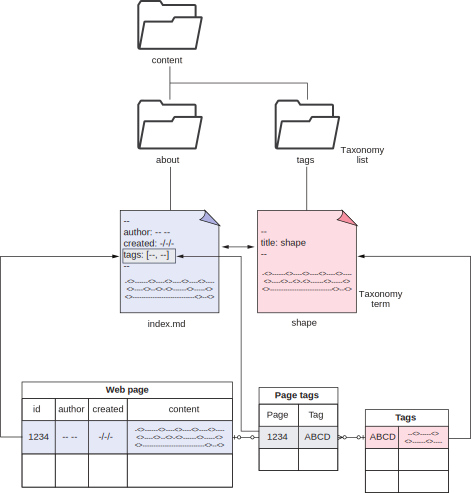
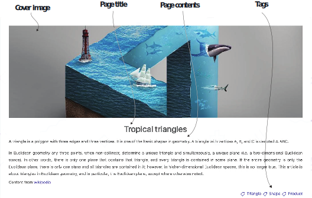
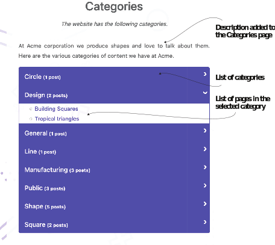
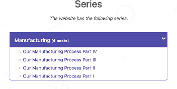

# 4.4 More than tags: Taxonomies

To organize content into sections in Hugo, we need to physically organize the files. It is easier to have individual files for each web page neatly organized into folders and sub- folders. In many cases, the logical organization of the website matches the physical organization on the disk. That is why Hugo, by default, generates the URLs with the sec- tion name as a part of the URL. But that alone may not be enough for good content discovery. There are infinite ways to organize content, and each use case is different.

As we organize content, we quickly realize the need to group pages such that the same page is a part of multiple categories. For example, we can place a web page about the differences between iPhone and Android in both the iPhone and Android sections. Having two copies is terrible for maintenance. Two different URLs would cause many problems because we will need to synchronize comments, social media appearances, and search engine content. In this case, it would be ideal to have one URL for the actual content, which could show up in the index pages for both the iPhone and Android categories.

Apart from categories, there may be other needs to have groups with unique index pages. Our users need support for tags to find similar content. Websites may need pages that have links to all the author’s posts. There could be a series where readers should read the posts in a specific order that’s predefined by the author.

Hugo understands the need for infinite ways to organize content and provides a generic solution. At the top level of content organization, Hugo allows us to define what is called taxonomies. Taxonomies are higher-level constructs that we can use to group the pages that describe relationships between web pages. In chapter 1, we moved the content from the database to the markup files. We gained the ability to rep- resent unstructured content better but lost some of the capabilities to provide struc- tured relationships. Taxonomies attempt to build relationships between web pages.

Figure 4.7 shows the mapping of concepts between a relational database approach of defining relationships and Hugo’s approach. In a relational database, the content lives in table cells. These tables have an identifier cell. Identifiers from two tables are placed together in a third table to build many-to-many relationships between the con- tent in those tables. In Hugo, each row in a table corresponds to a separate file in the filesystem. To define a relationship, we can provide the names (which act as the iden- tifiers) of the related files in the front matter of the content files, and Hugo takes care of creating those relationships. We do not have to create a join query to get these rela- tionships. They are available as variables in both pages.

Taxonomies have two parts: the lists and the terms. Each taxonomy list is a collection of taxonomy terms. A page can be associated with many taxonomy terms, and a taxon- omy term can be associated with many pages. Hugo builds many-to-many relationships between pages and taxonomies. We are free to define taxonomies and have our con- tent organized by whatever field we desire. For example, if we are building a website about movies, we would want pages with a list of movies in groups like genre or actor names. We would also want to list movies by director, actors, music director, and so forth. In Hugo, these would turn into taxonomy lists, where each particular genre or actor name becomes a taxonomy term with its index page.



Figure 4.7 Mapping from the traditional database structure to a Hugo taxonomy to define relationships between web pages

By default, Hugo defines categories and tags as taxonomy lists. We can group con- tent into categories and tags. Because tags and categories are logical constructs (they do not match with the filesystem), we can have web pages in numerous categories with multiple tags. Note that we do not need to create separate pages for every taxonomy list or term we use if we have no additional content to supply. During compilation, Hugo figures out the lists and terms used in the website and create pages for them.

Let’s work on taxonomies for the Acme Corporation website. First, we’ll add tags and categories for its posts. We can add these directly in the front matter of the page.


**Multiple renditions of a single page**

A page can have multiple URLs. Aliasing using the front matter allows us to render the same content many times. Template authors can implement the user interface (UI) for the page differently for different renditions. The power to have multiple copies of a page does not mean it is a good idea:
- Search engines penalize copies.
- Comments from one page do not flow into another.
- There is confusion among users about the absolute correct page of the website.

We should use this feature to have multiple renditions for cases like backward com- patibility. If you are coming from a different URL scheme or something that supported various URLs in the past and would like to maintain links, then aliases come in handy. Theme creators provide canonical references in their theme’s head section to pre- vent the search engine penalty across these aliases. The other management prob- lems with multiple copies of content remain, but Hugo provides a mechanism to have a unique template for each handle even though it may not be present in many themes. Note that we do not advise creating multiple copies of a single page.



This addition would auto-populate tags in the content and also generate a Categories page. In the index.md for tropical triangles, we will add the tags and categories to get a view similar to figure 4.8. The following listing shows the syntax for this.


```yaml
---
title: Tropical triangles
tags: [triangle, shape, product] 
categories: [shape, design]
---
```


The Eclectic theme displays the tags in the bottom right of the page and the catego- ries in the index page with the summary. Hugo also creates an index page (e.g.,
/tags/shape) for every tag on the website and a top-level /tags web page that lists all the tags on the website. The corresponding files are available in the chapter resources (https://github.com/hugoinaction/hugoinaction/tree/chapter-04-resources/05).


**CODE CHECKPOINT**	https://chapter-04-07.hugoinaction.com, and source code: https://github.com/hugoinaction/hugoinaction/tree/chapter-04-07.


We will also add the top-level Categories page to the footer menu. Although we can do this using the configuration file, we can create a branch bundle for the Categories taxonomy list to keep this information isolated. The following listing creates a top- level Categories page that shows up in the footer menu.



Figure 4.8 Elements of a page after adding tags. The figure shows the cover image, the page title, its contents, and the tags. (Image by Alexandr Nebesyuk on Pixabay.)


```yaml
---
title: Categories
menu:
  footer: 
    weight: 150
    name: Categories
---

At Acme corporation, we produce shapes and love to talk about them. Here are the various categories of content we have at Acme.
```


The  corresponding  file  is  present  in  the  chapter  resources  (https://github.com/ hugoinaction/hugoinaction/tree/chapter-04-resources/06).  The  generated  Catego- ries page should look like that shown in figure 4.9. You might need to restart your dev server for the changes to take effect.



Figure 4.9 Categories taxonomy list page for Acme Corporation, which lists all the available categories and their pages in the website

We can also create Markdown pages for each category. We can use these pages to pro- vide Markdown content that describes the category. For this, we’ll create a branch bundle at content/categories/<term>. By placing the _index.md file in the content/ categories/design folder, we can provide information to the page generated for the Design category.


**CODE CHECKPOINT**	https://chapter-04-08.hugoinaction.com, and source code: https://github.com/hugoinaction/hugoinaction/tree/chapter-04-08.
↻ Restart your dev server.


Tags and categories are the default taxonomies. For our example website, Acme Cor- poration has a series of posts around its manufacturing process. We need to migrate   this to the new website. For that, we need to create a new taxonomy called series (see figure 4.10). To create a new taxonomy, we can modify the taxonomies option in the site configuration (config.yaml) or create a new file called taxonomies.yaml
(https://github.com/hugoinaction/hugoinaction/tree/chapter-04-resources/07)	in the config/_default folder with the content in the following listing.



Figure 4.10 The series taxonomy for Acme Corporation lists all the series available on the Acme Corporation website.


```yaml
category: categories 
series: series 
tag: tags
```

    	
Hugo requires both plural and singular values for taxonomies. With this information, Hugo creates pages at <domain>/<plural value> for the index page and at <domain>/<plural value>/<term> for the individual terms in the taxonomy list. Hugo uses the singular value in the template when rendering it.

We can update the manufacturing process-related posts on the Acme Corporation website and assign them the manufacturing series. Once we add series: [manufac- turing] to the front matter for the posts, we can see the index page for a series at http://localhost:1313/series and the manufacturing series at http://localhost:1313/ series/manufacturing/. (You may need to restart the live server to view this.) We can add as many series to the website as needed. It is as valid a construct for grouping con- tent as are tags and categories.


**Exercise 4.4**

In a multi-author website, we want to represent the author using Hugo taxonomies. Which of the following options are best suited to list the works of a single author?
- a. Taxonomy list
- b. Taxonomy term
- c. Single post page
- d. A list/index page
- e. The website index
- f. We need to create a new page



**CODE CHECKPOINT**	https://chapter-04-09.hugoinaction.com, and source code: https://github.com/hugoinaction/hugoinaction/tree/chapter-04-09.
↻ Restart your dev server.

