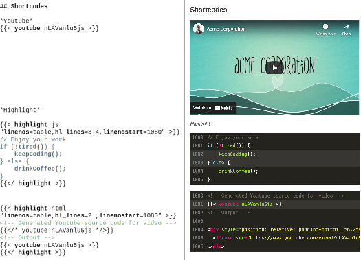
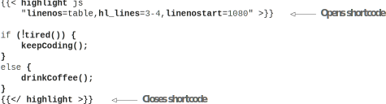

# 4.5 YouTube, Gists, and other snippets via shortcodes

As powerful as Markdown is, it does not have all the possible features that we might require in our content pages. Elements like those required for YouTube videos, GitHub Gists, Tweets, etc., are not a part of plain Markdown. While we can add these as HTML, Hugo provides a better, cleaner solution—shortcodes. Shortcodes are snippets of templates that we can include in the content files. These get replaced with the actual contents at compile time. They are equivalent to functions in the programming world.

With shortcodes, we can wrap reusable pieces of HTML into functions compiled during the page compilation. This way, content creators do not have to deal with the generation of the perfect HTML for a particular case that the shortcode author handles. Shortcodes can take arguments that can be processed in the template code. Shortcode authors have access to the entire website configuration and all its variables, Hugo’s built-in functions, and the entire theme to generate the HTML.

Shortcodes can be used in markup using double curly braces followed by HTML-like angle brackets: ({{&lt;...&gt;}}). The space between the angle brackets and the content inside is optional. Shortcodes take the name of the shortcode, followed by some arguments. Shortcodes support both named arguments (if supported by the shortcode) or unnamed arguments. The following listing shows how we call a shortcode called myshortcode.



    	

The Acme Corporation website has a teaser video that the company wants to incorporate in the About page. In the About page, we can add \{\{< youtube nLAVanlu5js >}} or \{\{< youtube id="nLAVanlu5js" >}} to get a YouTube video with the embedded ID, nLAVanlu5js. Fortunately, Hugo provides a built-in shortcode to render a YouTube video. Note that a YouTube video’s ID is available as the parameter after v in the YouTube URL (e.g., https://www.youtube.com/watch?v=nLAVanlu5js is the URL for the Acme Corporation video). You can also pass parameters like autoplay to the YouTube shortcode (see figure 4.11).


**NOTE** There are active discussions to move shortcodes built into Hugo out of Hugo’s core into a separate repository. That will allow us to link to specific versions of the shortcodes and to update outside of a Hugo release cycle.


You’ll find a copy of the bundled shortcodes like youtube and highlight used in this book in the layouts/shortcodes folder for the Acme Corporation website (https://github.com/hugoinaction/hugoinaction/tree/chapter-04-resources/08) to prevent incompatibility issues.

CODE CHECKPOINT     https://chapter-04-10.hugoinaction.com, and source code: https://github.com/hugoinaction/hugoinaction/tree/chapter-04-10.

Figure 4.11 There are multiple ways to use built-in shortcodes in Hugo. You can directly call the youtube shortcode, pass content to the highlight shortcode, or nest shortcodes.

## 4.5.1 Shortcodes with content

Shortcodes can also take content as an argument that the shortcode author can process using the Go template language. This way, shortcode creators can do processing on the passed content before rendering the final HTML. The content we give to a Hugo shortcode can be in the form of HTML or markup.

We can use HTML-like opening and closing angle braces inside the double curly braces to provide the opening and closing tags for the shortcodes. Hugo passes the content in the boundaries of the shortcode as-is to the shortcode, and the shortcode author can then do any processing on the supplied content as they wish.

One popular shortcode used in Hugo is the highlight shortcode, which provides syntax highlighting. This shortcode is an alternative to code fences and provides the same functionality (see figure 4.11). The following listing shows the syntax to add the highlight shortcode.



    

## 4.5.2 Nested shortcodes

We can build nested shortcodes by inserting a shortcode in another. The innermost shortcode is processed first, and its results pass on to the outermost shortcode. One clever use of this feature is to see the result of shortcode processing by passing it to the highlight shortcode. The following listing shows how to do this. Note that \{\{</* … */>}} is the comment syntax for Hugo shortcodes; Hugo does not process the content in this block as a shortcode (see figure 4.11).



    	

## 4.5.3 Built-in shortcodes

Hugo comes with its own built-in generic shortcodes. Some themes may come bundled with shortcodes for the users. We also have community-built shortcodes available that we can add to our website and use as needed. We are free to create custom shortcodes in the shortcodes subfolder within the layouts folder. Some of the built-in Hugo shortcodes include the following:
- gist—Takes the user and gist ID as parameters and renders a GitHub gist. You can also pass a filename if the gist has multiple files.
- ref—Takes a file path in the Hugo website and provides an absolute link to that file. If the url or slug is overridden in the front matter of a page, the ref shortcode follows the newly provided location.
- relref—Provides the relative link to the file in the Hugo website. This shortcode works similar to ref.
- figure—Renders an image with a caption.
- tweet—Renders a Tweet with the given ID.
- instagram—Embeds an Instagram image with the given ID.
- vimeo—Renders a Vimeo video with the given ID.
- youtube—Renders a YouTube video with the given ID.
- highlight—Adds syntax highlighting for the provided source code.
- param—Prints a passed parameter (useful for debugging purposes as well).