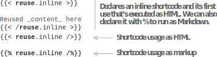

# 4.6 Content sharing using custom shortcodes

While sharing complicated logic is one use of shortcodes, we can also use shortcodes to minimize our copy and paste efforts and to keep our content clean. Shortcodes can be as simple as snippets of HTML or even Markdown content that needs to be shared to prevent duplication. With one source of truth, managing content gets a lot easier. While creating content, if we find that we are copying and pasting some text repeatedly, it is a good idea to wrap that text up in a shortcode, then call the shortcode to provide the content. For content sharing, we can create two types of shortcodes as described in the following sections.

## 4.6.1 HTML shortcodes

We can use custom shortcodes for placing inline HTML in our Markdown files by adding an HTML file in the layouts/shortcodes folder. Then we can use that filename as the shortcode to render it in the document.

We will embellish the About page for the Acme Corporation website by adding dividers via a shortcode (figure 4.12). To do that, we’ll create a file named divider.html in the layout folder and add the content provided in the chapter resources (https:// github.com/hugoinaction/hugoinaction/tree/chapter-04-resources/09)  to  create  a beautiful divider in plain HTML. Then we can use this file anywhere in our website to place a divider on the page. The following listing shows how to add this divider to multiple places on the About page. Note that you may need to restart your dev server for the changes to take effect.


```html
<div style="background-image: 
 linear-gradient(to right, transparent, #4f46e5, transparent); 
 margin:15px 0;height:2px;position:relative">
 <!-- Additional trick: We can add Unicode 
 characters as-is in HTML to render them.-->
 <span style="position:absolute; 
 left:calc(50% - 10px);
 line-height:2px;
 font-size:30px; 
 padding: 0 5px; 
 background: white; 
 color:#4f46e5">☺</span>
</div>
```



**CODE CHECKPOINT**	https://chapter-04-11.hugoinaction.com, and source code:  https://github.com/hugoinaction/hugoinaction/tree/chapter-04-11.
↻ Restart your dev server.




## 4.6.2 Markup-based shortcodes

While most shortcodes are HTML, we have the option to write shortcodes in markup languages like Markdown. Hugo converts the Markdown shortcodes to HTML if we call them using percent signs (%) instead of angle brackets (<>) as we do in regular shortcodes. This way, we can move data in a shared place and then use that from everywhere it is needed.

We can move the product information table from the About page into a shortcode and share it in the blog post about the manufacturing process on the Acme Corporation website. Let’s create a file named productInfo.md in the layouts/shortcodes folder and move the contents of the product information to this page. Then we can place the string {{——% productInfo %}} anywhere in our content to get the product information table. Let’s do that for the About page and the manufacturing process page on the Acme  Corporation  website  (https://github.com/hugoinaction/hugoinaction/tree/ chapter-04-resources/10).


**CODE CHECKPOINT**	https://chapter-04-12.hugoinaction.com, and source code: https://github.com/hugoinaction/hugoinaction/tree/chapter-04-12.


## 4.6.3Inline shortcodes

We have built shortcodes in a separate file (like productInfo.md), which is available globally and shared in the entire website. Alternatively, if we want to have a shortcode specific to the page, we can declare the shortcode in the Markdown content of the page and use it in that page. This shortcode can do everything a regular shortcode can. This does not create variables outside the page and, therefore, speeds up compilation along with keeping the global list of shortcodes clean. These shortcodes are called inline shortcodes because they are declared inline in the file where we invoke them.

Inline shortcodes are disabled by default because shortcodes can access the entire website configuration. If all content is coming from a trusted source, this is not an issue. We can enable inline shortcodes by creating a security configuration file (config/_default/security.yaml) with the setting enableInlineShortcodes: true. Once we do that, we can declare a shortcode in our content using .inline after the name we want to give to the shortcode.

Inline  shortcodes execute as soon as they are declared and cannot be nested. We  can generate both HTML and markup-based inline shortcodes. The following listing shows how to use inline shortcodes. Unlike regular shortcodes, we declare these inline with the content.





There is a lot more we can do with shortcodes, so we will explore some advanced shortcodes in chapter 5. This chapter concludes the usage of Hugo as a content management system. Using the features discussed so far and relying on an existing theme like Eclectic, we can build and maintain complicated websites.

Many Hugo users do not cross beyond this point in their journey to learn Hugo. While we can do a lot within the bounds of a Hugo theme, more power awaits in the Hugo template system. In the next set of chapters, we will build pieces of an independent theme that takes data in various ways, including from the front matter, separate files, or over the internet to create custom web pages. Moreover, we’re not through with Hugo’s content management features just yet. We will introduce some features like the cascade property in the following chapters.