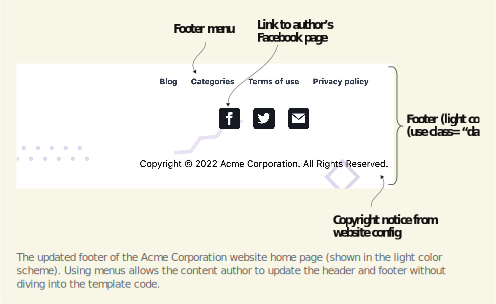

# 5.2 Using external data to add content

While we can obtain most web page data from the markup document, we can also get some of it outside the markup document. This data includes menus, other sections, and pages of the website and content generated by Hugo from the website or web page data.

## 5.2.1 Adding the menu

The links for the main pages on the home page break the independence of those pages. If we delete one of those pages, we will have a dangling link. Adding a link to that page involves copying and pasting content and then changing the text in an HTML file. This solution is not scalable. A better and more scalable solution is to have a menu for this content. This way, the pages can independently get assigned to a menu with the configuration or with the front matter.

While we can create a new menu for this information, a better idea for the Acme Corporation website is to render the main menu used throughout the website on the home page. The main menu is already present in the site.Menus.main variable. We can loop through this to create anchor tags for the various menu entries on the home page. Listing 5.21 adds a new section for the menu under the current context area with this information. Later, we will enhance the menu to match figure 5.4.





    

In listing 5.21, range is the primary looping function in the Go template language. The range function updates the context (.) in each run for the next menu entry. If there are no entries, Hugo does not process the code block inside the range. If needed, we can supply the else code block for this. The range function also has an alternate form to fill variables instead of updating context with a value and providing the index. Still, the context update version is more popular.

site.Menus is a Hugo-generated object with subproperties for each menu on the website, which internally contains all the menu entries sorted on the supplied weight. Each menu entry provides the Name and URL subproperties. Note that the main menu has submenus, which we are ignoring in this case. We can use the humanize function to capitalize the first letter of the name, thereby transparently dealing with all lowercase entries.

The else code block introduces comments in the Go template language. We are free to use HTML comments for this, but they do have some gotchas:
- HTML comments are generated and exposed in the output. Unless we strip them out during minification, they will increase the page size.
- Hugo executes any Go Template code in mustaches ({{...}}), even in the HTML comment block.

- HTML comments are suitable for the theme or page developer to send messages to the content author for the web page. On the other hand, Go template comments are stripped at compile time and are helpful for the theme or layout developer only.

- While a menu needs only the name, identifier, and weight, we can add custom pre and post properties to the menu entry to supply additional data to the template that it can use before or after the menu. In the chapter resources, we’ve added a post property   to   the   main   menu   (https://github.com/hugoinaction/hugoinaction/tree/chapter-05-resources/04) that can be used to populate the content. We can now use this property in our template as the following listing shows, updating the rendering of the main menu on the home page.






**Creating a new menu**

There is nothing special that we need to do to create a new menu in Hugo. All we need to do is to assign pages to the menu. For example, we could add the following to the About page to create a separate home menu:
```yaml
menu:
  home:
    name: About 
    identifier: about 
    weight: -500
```

With this, instead of looping through site.Menus.main, we can run the range loop through site.Menus.home and leave the rest of the code as-is.


We can also generate the header for the web page using the same main menu. We will move the website logo from the intro section to the header and render it as in figure

5.5. Listing 5.23 provides the code to set up the header.




```html
<header>

<a href="{{ site.BaseURL | absLangURL }}">

Acme Corporation
</a>
{{with site.Menus.main }}
<nav>
<button class="hamburger">☰</button>
<ul>
{{range .}}
<li>
<a href="{{.URL}}">{{.Name | humanize}}</a>
</li>
{{end}}
</ul>
</nav>
{{end}}
</header>
```


Note that when we develop the home page, we can use .Permalink to link to the current page.Using site.BaseURL as the link to the home page ensures that we can reuse this header in other pages (we will do this in the next chapter). We can also update the footer to the website to use a footer menu instead of hardcoded text in a similar fashion. Finally, the absLangURL function converts the URL to an absolute link for the current language. This function will come in handy when we convert to a multilingual website in chapter 13.


**Exercise 5.4**

Build the footer for the Acme Corporation website to match the view in figure 5.6 by generating the HTML that matches https://chapter-05-09.hugoinaction.com.
- a. To fill the social media icons, use the author information supplied in the configuration.
- b. The copyright information is present in the website parameters.
- c. The footer menu is already available in the website content, and you should use it.



The updated footer of the Acme Corporation website home page (shown in the light color scheme). Using menus allows the content author to update the header and footer without diving into the template code.


The CSS file makes a light-colored footer by default, but we can make it darker by adding the dark class to the footer tag. We will use the dark footer in the rest of the website. We will also take this opportunity to add the link to the Credits page in the footer. In credits.md, add the following:

```yaml
---
menu:
  footer:
    name: Credits 
    identifier: credits 
    weight: 400
---
---
```


**CODE CHECKPOINT**	https://chapter-05-09.hugoinaction.com, and source code: https://github.com/hugoinaction/hugoinaction/tree/chapter-05-09



**Section pages as menus**

Writing a menu entry with links to index pages in the sections of a website is such a common task that Hugo has defined this with an easier default. If we add, for example, sectionPagesMenu: sections to our configuration parameter sectionPagesMenu:
<name> (https://gohugo.io/templates/menu-templates/#section-menu-for-lazy-blog-gers), then a menu named Sections is automatically created with an entry for each section in the website. We do not need any references to the sections menu in our content and can just use sectionPagesMenu: sections in our configuration to populate the Sections menu with a link to the index page of each section.


## 5.2.2 Adding recent blog posts

The data added so far is mostly static and does not change frequently and, therefore, provides little benefit when using templates. A major benefit of static-site frameworks is auto-updating pages with data that changes. We will add a list of recent blog posts to the home page of the Acme Corporation website, which will auto-update with new entries as we add more blog posts. To do this, we will create one more section on the website’s home  page  with  a  list  of  recent  blog  posts  (https://github.com/hugoinaction/hugoinaction/tree/chapter-05-resources/06). Figure 5.6 shows the output of this section.



To provide content, we will get a list of child pages for the website belonging to the blog section and then render them in a small card layout with the title and the summary (manual or auto-generated). We will add images to the blog posts in the next chapter. Listing 5.24 provides the changes that we’ll make on the home page of the Acme Corporation website. These involve filtering the website pages for blog posts and getting the first three. The most interesting code in the template is the filtering logic, which is described in detail in figure 5.7.







In the listing, we filtered the page with the where statement content coming from the RegularPages property on the website. This property gives us a list of all content pages, excluding support pages like taxonomies and indexes, sorted by the date field in descending order. While we can change the sort order with the sort function, descending order by date is usually the desired behavior, and we do not need to change it. The where function takes a slice (list), a key, and a value. It filters the list based on elements whose value at the provided key (.Section) matches the value (blog). While the default operator is equality (=), we can override it by passing the custom operator before the value.


**NOTE** Because site is global, site.RegularPages is available across all templates.


The outer with statement performs two tasks: it updates the context variable so that we do not need to duplicate the where check twice and ensures that there is content in the blog section if that section is present. Hugo’s template engine is smart enough to identify an empty slice in a with statement and does not render in this case.

While the filtering code we are using is functional, we have hardcoded the key blog in the template. If we have a website layout with a different section name, this would become a problem. Hugo has a standardized key for this scenario, whose default value Hugo auto-generates.

We can use site.Params.mainSections to get the main sections within the website. By default, it contains the section with the maximum number of pages, but we can override this variable to support multiple sections or to add or remove them. Because it is a list, the default equality checks for where the operation does not work, and we will need to supply the in operator for this. The following listing updates the page filtering logic to look for the main section rather than the hardcoded blog section.






**CODE CHECKPOINT**	https://chapter-05-10.hugoinaction.com, and source code: https://github.com/hugoinaction/hugoinaction/tree/chapter-05-10.
