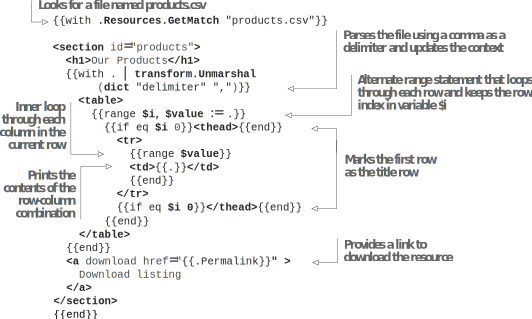

# 5.3 Playing with structured data

There are two general types of data in a web page: unstructured, free-flowing text (represented by a Markdown document), and structured or grouped data (represented by keys and values or rows and columns traditionally defined in a database). For example, in a shopping cart application, the product description should be unstructured, but if we put the price field in Markdown, extracting the price to show in multiple places would be tedious. There are multiple ways to provide structured data separately. One approach is to read a file from the disk. Another option is to use the front matter to provide structured data along with the metadata.

## 5.3.1 Using front matter for structured data

The .Params object in the site and the page-level variables belongs to the theme. The theme authors are free to decide what to add to these variables to provide structured data. Let’s put the concept to use for the Acme Corporation website home page. We will add a list of testimonials on the website’s home page using the front matter as shown in figure 5.8. Then, in listing 5.26, we will add a field called testimonials in the front matter   and   place   all   the   testimonials   there   (https://github.com/hugoinaction/hugoinaction/tree/chapter-05-resources/07).




**Exercise 5.5**

Which of the following are examples of structured data that will benefit from moving outside the Markdown content to structured data and into the front matter or separate files? (Select all that apply.)
- a. Music playlists
- b. Author biography
- c. Reviews of physical products
- d. List of top ten most liked blog posts
- e. Affiliate link to the product in review




```yaml
testimonials:
  - author: Brad
    from: Fictional Incorporated
    content: >
            We have been using the shapes from Acme in our products for ages. They are precise, smooth, and very well built.

  - author: Random
    from: Random Education
    content: >
            Sharp and sturdy - Just like you want them.

  - author: Richter
    from: Richter Measures
    content: >
            Undoubted accuracy. Safety guarantee. We love what Acme delivers.
```


Now we can read this variable on the page and render it appropriately. Listing 5.27 provides the changes to display the testimonials. This type of logic enables data-driven custom elements in the HTML, which use structured data provided as a parameter. It is good practice to check for their existence and to not create HTML tags surrounding a list if the list is empty. If it is not empty, we can loop through it and access inner properties like Content, From, and Author.



    	


**CODE CHECKPOINT**	https://chapter-05-11.hugoinaction.com, and source code: https://github.com/hugoinaction/hugoinaction/tree/chapter-05-11.


In listing 5.27, the top-level with call ensures that we add nothing if there is no testimonial section provided in the front matter. However, if it is present, we loop through the list of testimonials and print each of those in the HTML.

We used the same technique in section 3.6.2 to build a data-driven landing page using the Eclectic template. Theme authors have used structured data to create sidebars, carousels, accordions, and other advanced user interface elements.

## 5.3.2 Parsing files for data

For interoperability with other systems, a file-based approach to data gathering is extremely useful. Hugo supports parsing structured content that we can use to provide raw data from CSV-based spreadsheets, JSON-based API output, or individual YAML files. We can convert this data to slices (arrays) and dictionaries (maps) in Hugo and then use those to present the data as HTML. This feature is extremely useful in creating websites based on another system that provides output in a machine-readable format.

There are many ways to access files. For example, you can drop a JSON, CSV, YAML, or TOML file into the data folder in parallel with the content folder. The data in the file is available as a dictionary in the site.Data variable. We can also put the file at a fixed location and use readFile to get its contents and then use transform.Unmarshal to convert it from raw text to a dictionary. Page bundles can also be used for these files, where we can use $.Page.Resources.Get followed by transform.Unmarshal.

For Acme Corporation, we have a file called products.csv, which lists the product information for the products sold by the company. A separate inventory management system manages and exports the Excel-supported CSV format. We need to render this  as a table in the home page of the website (figure 5.9).



We can place products.csv in the root of the content folder to make it a part of the branch bundle  for  the  index  page  (https://github.com/hugoinaction/hugoinaction/tree/chapter-05-resources/08). The code in the following listing loops through the products.csv file and prints the values in a table. We will mark the first row of the table as a header.



 


**CODE CHECKPOINT**	https://chapter-05-12.hugoinaction.com, and source code: https://github.com/hugoinaction/hugoinaction/tree/chapter-05-12.

 
We can use the resources API to find the products.csv file in the page bundle for the current page. The resources APIs are a powerful way to access resources and process, manage, and transform them. We will delve more into resource APIs with Hugo Pipes in chapter 6.

In the previous listing, we took the file and parsed it using a comma (,) as the delimiter for CSV, which returns a slice of slices (nested array) representing a two-dimensional array. In the outer loop, we used the alternative form of the range expression. Instead of setting the context variable ., the corresponding value, $value, in the range is returned along with its index $i. Next, we used the index to identify the header row. Finally, we looped through the entries with an inner range to create the table for all rows. At the bottom of the section, we provided a downloadable link to the CSV file using the same resources API.