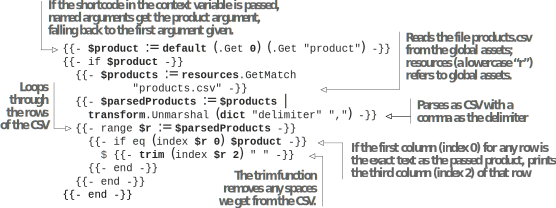

# 5.4 Enhancing life with the Go template language

We can do a lot more with the template language than just build web page templates. We can use the Go template language at various places to remove repetitive work and enhance the day-to-day workflows dealing with content. We can invent new shortcodes that enhance Markdown to provide a new feature. We can create archetypes or templates for content so that when we start to write the content later, we have a page with the essential metadata prefilled.

## 5.4.1 Template code in shortcodes

Shortcodes (which we used in chapter 4) are not just snippets of HTML. They are snippets of templates that have access to the complete template functionality. We can access all the variables of the site in them and can use those along with the passed parameters and the inner content to write our logic to render the shortcode.

Using the Go template language skills we have developed so far, we can write a shortcode that takes a product name, parses the price, and renders it to the website. For the shortcode to work in the whole website, we will need to move products.csv to a more accessible location, such as the assets folder. (The assets folder is the global folder for the content accessible through the Go template language.) Note that we will also need  to update the index page template to use this new location (using resources.get
instead of .Resources.Get). The following listing provides the custom shortcode to perform     these     tasks     (https://github.com/hugoinaction/hugoinaction/tree/chapter-05-resources/09).



    

The main thing to notice in listing 5.29 is that the context variable, ., is different in a shortcode. That’s because it refers to the shortcode and not to the page rendering it. Also, in the listing, we use {{- -}} instead of the standard {{ }} Go template mustaches (mustache is another common name for double curly braces). The reason for using {{- -}} (dashed mustaches) is that they remove all whitespace from both sides of the string output. We do not need aggressive space trimming in most cases because we do need a single space, and HTML ignores additional spaces.

In a case like the current example, where we need absolute zero spaces to allow complete space control in the Markdown document, dashed mustaches and the trim function are handy. We can also have single dashed mustaches like {{- … }} or {{ … -}} to trim spaces from the left and the right, respectively.

We can use the index function in Hugo to access the value from a list at a specific index. We can use this shortcode by calling it with the parameter \{\{< price "Square">}} or with named parameters like \{\{< price product= "Square">}}. We will add this to the Building Squares and the Circle blog posts as the following code snippet shows. Additionally, by using resources.GetMatch instead of .Resources.GetMatch, we target the global assets folder for content.

{-{< price "Circle" >}}         $4
{-{< price product="Square" >}} $2



## 5.4.2 Inner content in shortcodes

Shortcodes can also take inner content (discussed in section 4.5.1). We can access this and do any processing we need with this information using the Go template language. For example, the shortcode in the following listing repeats the inner content n times, where n is supplied as a parameter (https://github.com/hugoinaction/hugoinaction/tree/chapter-05-resources/10).



    


**CODE CHECKPOINT**	https://chapter-05-14.hugoinaction.com, and source code: https://github.com/hugoinaction/hugoinaction/tree/chapter-05-14.


The code in the previous listing should not be difficult to understand. The critical thing to remember with the repeat shortcode is the performance cost of looping. We should avoid heavy processing in a loop and precalculate (like running the Markdown
parser in this case) wherever possible. We can use this approach in the about section of the website to remind the team, by repeating five times, “The customer is our
**number 1** priority.” The following listing uses the repeat shortcode to add this reminder.


```html
Input

{-{< repeat 5 >}}
Customer is our **number 1** priority.
{-{< / repeat }} Nothing else.


Output
<ul>
<li>The customer is our <strong>number 1</strong> priority.</li>
<li>The customer is our <strong>number 1</strong> priority.</li>
<li>The customer is our <strong>number 1</strong> priority.</li>
<li>The customer is our <strong>number 1</strong> priority.</li>
<li>The customer is our <strong>number 1</strong> priority.</li>
</ul>  Nothing else.
```


## 5.4.3 Save some time with archetypes

The set of steps involved in writing content is repetitive. It consists of creating folders, filling in front matter and, in many cases, placing cover images. While these tasks are repetitive, they are unique to the theme and its layout. Whatever can be generalized across all websites has already been done by setting good default values for most front matter and other variables in Hugo.

As websites grow complex and more features are added, setting up content for a web page gets complicated. While we started with placing Markdown files in the content folder, we have already moved to page bundles. In the foreseeable future, we can imagine dense front matter with fields like date, draft, etc., which can become required fields.

Archetypes are templates for a Hugo post that we can use to automatically create the folder structure, fill in the front matter, and supply placeholder images for content so that we can get to writing quickly. When we use hugo new <filename>, a placeholder file is created in the content folder. When we made the website for Acme Corporation, the hugo new site command in chapter 2 created a default archetype. We can use this as a template to generate blog posts by issuing the following command:

```shell
hugo new blog/line.md
```

This command creates a line.md file in the content folder, which is marked as draft. We can start adding content, and when we are ready to publish this page, we can remove the draft field from the front matter. We can preview draft pages using hugo server --buildDrafts.
While the default archetype fills in the essentials, we can add more to the blog template. For regular Markdown posts, we can create a new file, for example, blog.md (https://github.com/hugoinaction/hugoinaction/tree/chapter-05-resources/11)    in the archetype folder with the content shown in the following listing.


```
---
date: {{ .Date }}
title: "{{ replace .Name "-" " " | title }}"
draft: true
tags:
-unknown
categories:
-general
---

Provide an awesome introduction here

<!--more-->

Here goes the main content.
```
    	

We can now delete content/blog/line.md and generate a new one. This time Hugo automatically picks up the blog template for the content in the blog section.


**Exercise 5.6**

Archetypes are a means for the 	to help the___with a great set of defaults.


We can also create page bundles in the archetypes. To add page bundles, create a subfolder named blog in the archetypes folder and move blog.md to it, renaming the file  index.md.  We  can  also  add  a  cover  image  if  we  so  desire  (https://github.com/hugoinaction/hugoinaction/tree/chapter-05-resources/12).  Now  we  can  create  a page bundle for the line blog post by using the kind flag in the new command. To do that, we remove line.md and run the command in the following listing.


```shell
hugo new blog/line --kind blog
```



**NOTE** Both blog.md and the blog folder should not exist simultaneously.



**CODE CHECKPOINT**	https://chapter-05-15.hugoinaction.com, and source code: https://github.com/hugoinaction/hugoinaction/tree/chapter-05-15.


Now the blog will have a folder named line with the index.md in it. If we add an image to the archetype page bundle, Hugo copies it to the template. This way, we can define complicated templates with placeholder data for content creators to get started quickly. For example, the Line page shows up when we run Hugo in development mode because we set buildDrafts to true in our development configuration. Using these features, we can make custom pages or ease our day-to-day activities in a Hugo website by moving repetitive work to shortcodes and archetypes.