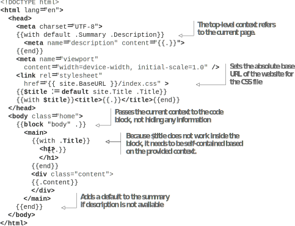
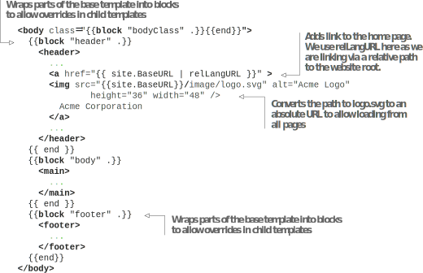

# 6.1 Using content types, base templates, and blocks to structure templates

So far, we have focused on creating index.html for the home page using the Go template language. While we don’t have a large and unmanageable file yet, it can quickly get out of hand if we keep adding code to this file. Also, with one file, we cannot share template code between various web pages that are slightly different.

In this section, we will start to build a template for accessibility beyond the index page. As we make the new template system, we will still have a functional website, albeit with two template designs: one with Eclectic and the other that we are building in parallel. We will migrate the website to the new code slowly to ensure minimum breakage. To do this, we will create a new content type with all the custom template code we are building and will allow the pages to switch between Eclectic and the new template. Then we will create a base layout for code sharing for the reusable pieces between the index page and the data pages using the Terms of Use as a sample page to migrate to the new content type.

## 6.1.1Encapsulating templates with different content types

A Hugo content type is a collection of templates that can render pages from markup according to a unique design. Conceptually, a content type is similar to a theme, but instead of being the entire website’s design, a content type only renders to a section. Each website can have multiple content types, each of which can display content differently. For example, in a typical website, we can have a design for a page associated with news posts and a different one for blog posts, and yet another design for a privacy policy page. We can model each type of page (blog, news, general text, etc.) with its distinct content type. Each content type can have an independent rendering template.

A theme is a collection of multiple content types that link to different parts of a website. Not all pages in a website need to look exactly similar, and content types allow for that variety. Each theme defines the default type that all pages revert to, unless they use custom content types defined by the theme for various sections within the website. By placing a file named index.html within the layouts directory, we can override the index template for the default type as defined by the theme. Hugo supports overriding any template in a theme by creating a file at the exact location in the layouts directory as was present within the theme. Hugo redirects all the code paths to the new file.

Unless we study the theme internals and make sure we are not breaking rendering for any code path, there is a high probability of causing unexpected behavior somewhere. We should avoid overriding templates directly, unless we are doing minor bug fixes to the theme. It is much safer to place our template changes within a new content type that does not interfere with the theme. Then we can slowly move all our pages to that type and decommission the theme from the website when our pages no longer use it. This approach allows us to incrementally move from one theme to another or to customized code (like we are doing), thus enabling more control. A new content type defines a new type of rendering for markup-based content different than the theme.

Before adding more template code to the website, we will create a new content type to isolate our changes. We can choose any name for the content type that is unused by the theme to safeguard against collisions. We will name this content type modern (for the modern design) and will move the index page to this type definition. To perform this task, let’s create a folder named modern within the layouts directory and move index.html to that folder. Next, in the index file for the home page, which is content/_index.md, we will update the type to modern as the following listing shows.


```markdown
type: modern
```



**NOTE** Hugo uses the default template provided by the theme to render content for the index page unless the type field is present.



**CODE CHECKPOINT**  https://chapter-06-01.hugoinaction.com, and source code: https://github.com/hugoinaction/hugoinaction/tree/chapter-06-01.



**Hugo’s clever template lookup order**

Hugo cleverly assigns a suitable template based on the intent of the website developer. For example, if we create a folder named blog in the content directory, Hugo sets the content type for all files in the folder as blog. Then if we create a folder named blog in the layouts folder and begin to define templates for those pages, they will automatically get picked up by the blog section in the website. On the other hand, if no such content type is specified, the default templates are automatically loaded.

This content type selection is made possible by a well-designed template lookup order in Hugo. When Hugo needs to render the page, it goes through an ordered list of files and executes the first one as the template for the web page. This list is huge due to backward compatibility, and it provides many ways to name template files. However, we strongly advise sticking to the straightforward type-to-folder convention in our code with manual overrides using the type field in the front matter. Hugo’s website provides the template lookup order at https://gohugo.io/templates/lookup-order/.


## 6.1.2Providing the base template for reuse

Most web pages have a similar HTML structure. There is a head section with meta data and a header, main, and footer that define the interface where the header and the footer reside across the whole website. Hugo has the concept of a  base template  that can hold these common elements shared across the entire website. The base template holds the skeleton of the website. It contains default  HTML for the common  parts of a web page, which can be overridden for specialized cases if needed. All templates in a type can inherit from and customize the base template for that  type. If a   type does not provide the base template, we can use the default base template for the entire website.

The base template in Hugo is named baseof.html. Let’s create a basic baseof.html file in the modern folder. This file stores the Acme Corporation web page skeleton that we will use across all pages that use the modern type. By creating baseof.html, we have severed ties to the template provided by Eclectic and can focus on our custom theme.

## 6.1.3Defining blocks of code

Let’s create a skeleton in the base file, baseof.html. The <head> tag in the index page is not specific to the home page, so we can move it to the base template. The content in the <body> tag is page-specific, and we will retain it within the index.html specified template. Then, in baseof.html, we will place the base template (https:// github.com/hugoinaction/hugoinaction/tree/chapter-06-resources/01).

A block defines content that we can override in specialized templates. The base template uses blocks for pieces of content that can be overridden by the child templates. We can provide a default value for non-overridden templates. Hugo executes the code inside the block of the base template if the template used by a particular page does
not override this block. We can have as many blocks as we desire in a template, including nested blocks. The following listing shows the syntax for creating a block in Hugo.


```html
<!-- Block creation -->
<!-- In baseof.html -->
{{block "blockname" blockArgument}}
{{end}}

<!-- In derived template -->
{{define "blockname"}}
<!-- The dot (.) refers to the supplied block argument here -->
<!-- We can still access $ if we need the top-level template (page) variable access -->
{{end}}
```


The block has two arguments: the block’s name and the context variable to pass to the block. Passing the value of context variable replaces the value of . in the block. We will give the current context (which is also the global context $) to the block from the base template.

As we add blocks to allow overriding customizable portions of the template, we also need to ensure that  the pages derived from  the base template can load properly from  all URLs. In listing 6.3, we change the URL to index.css and base it on the website  base URL rather than relative to the current page’s URL. Note that the base template should be as generic as possible to work with all content in the specific type. Also note that all blocks should have reasonable default values, and all parameters should be optional.



   

In the base template, the top-level context refers to the current page. All page types have the Title and Description properties. However, these can still be undefined, so we need to check for them. We add a default value to the .Summary if .Description is not available. Because the pages can be at any location, we use the absolute base URL of the website for the CSS file.

The block statement is used to define a block that can be overridden in the child templates. We provide default content for the blocks in the base template so that if we create a new template, it will provide a meaningful rendering even if all the blocks are not overridden. The last argument of a block statement is similar to the with statement, and it becomes the context variable for the block. In listing 6.3, we passed the current context to block, not hiding any information. Note that $title does not work inside the block, which needs to be self-contained, based on the provided context.


**Exercise 6.1**

The root template in a Hugo website holding the skeleton of the HTML is called _________
- a. root.html
- b. base.html
- c. baseof.html
- d. primary.html
- e. index.html
- f. parent.html


The code in listing 6.3 is almost the same as the head portion abstracted from our index page. On the index.html page, we can now fill in the value of block by using the define keyword as listing 6.4 shows. When we use define, we inform Hugo that the template defines blocks within the base template. Hugo will not use the base template   if there is no define within a template. Also note that $title needs to be redefined to be used inside the body.


```
{{define "body"}} 
<!-- Redefines $title -->
{{$title := ...}} 
...Contents of the body tag...
{{end}}
```
    


**CODE CHECKPOINT**	https://chapter-06-02.hugoinaction.com, and source code: https://github.com/hugoinaction/hugoinaction/tree/chapter-06-02.


In the previous listing, we defined the body block in the base template. The context variable . is supplied by the base template. When we use the define keyword, the default implementation of the block in the base template is not used. The index page should now look exactly as before, but Hugo composes it from two files instead of one—from the base and the index templates.

## 6.1.4 Reusing the base template in a different layout

With the base template present, the code is ready to be reused on other pages. We used index.html to represent the index page of the website. The name “index” is not random. Hugo developers chose this to mean the home page of the entire website, whereas in everyday web development, the index file represents the home page of that specific section (or folder). In Hugo layouts, it always means the website’s home page. In Hugo, the various types of pages we render are called layouts. There are four main layouts supported by Hugo:
- The list layout renders index pages of sections within the website. This usually provides a list of all subsections and a list of all pages within the section. Rendering the base page of each branch bundle (_index.html) uses the list layout.
- The single layout represents a regular web page with content stored in a markup document or a leaf bundle. All leaf bundles (index.md) and plain Markdown documents (mypage.md) use the single layout.
- The index layout renders the home page of the entire website, which is present at the root of the website. This layout is a specialization of the list layout and is present because the home page is generally different than the section list pages. If the index layout is absent, Hugo uses the list layout for the website’s home page.
- The 404 layout forms the basis of all error pages within the website. This layout creates a unique page (/404.html) that we can configure on the hosting server for page not found (HTTP 404) errors. We are free to create more error pages such as 503.html for the 503 server errors, although with static hosting using the Jamstack, the chances of a 500 series error are low. Many developers do not need anything beyond the 404 pages.

Apart from these, we have two more layouts: taxonomy and terms. These are used to render a list of terms (e.g., the list of tags) and a list of pages associated with the terms
(e.g., the list of pages tagged as square), respectively. These layouts can typically reuse most of the work we do for the list layouts. (We will go into these in more detail in chapter 7.) The list and the single layouts are the most critical layouts in Hugo, corresponding to the branch and the leaf bundles, respectively.
Let’s add single.html for single pages in the website. We can add code specific to the single pages here. In single.html for the Acme Corporation website, we do not want to override the base template but, instead, use the contents of the base template as-is. Hugo treats a template as an entire web page if a template does not start with a defined block. Hugo renders an empty page if we leave the page blank rather than running the base template. To inform Hugo to load the base template, we need to define a dummy block, which we will not use. The following listing shows how to do this.


```
{{define "garbage"}}
<!-- Never gets rendered -->
{{end}}
```


Note that if we put the comment outside of the define block, this does not work. It will fail because only define blocks are allowed in templates that override parts of a template.

Next, we will assign this template to the Terms of Use page. In terms.md, we will add type:modern to the front matter to perform this assignment and then convert it to the design shown in figure 6.2. The contents of the Terms of Use page now use the



CSS of the home page, which does not provide good formatting. Listing 6.6 shows   how to add a layout-specific class override. We will do this in the body tag in baseof.html.


```
<!-- There’s no need to escape quotes within the block. -->
<body class="{{block "bodyClass" .}}{{end}}">
```
    

We can use code blocks anywhere we want in a template. They perform simple string replacements and do not care about the  HTML structure of our web pages. Therefore, if we place bad HTML in some tag (e.g., quotes in bodyClass), the output can be broken. Note that templates automatically XML-encode special characters  coming  from the markup document, and therefore, we can add them to HTML tag attributes without additional encoding. The following two listings show how to override the bodyClass in index.html and single.html, respectively, to cater to this. Note that after we add a proper define to the single page (listing 6.8), we can remove the dummy define "garbage" (from listing 6.5).


```html
{{define "bodyClass"}} home {{end}}
```



```html
{{define "bodyClass"}} page {{end}}
```



**CODE CHECKPOINT**	https://chapter-06-03.hugoinaction.com, and source code: https://github.com/hugoinaction/hugoinaction/tree/chapter-06-03.



**Exercise 6.2**

The layout used by Hugo for a regular web page is stored in a file named ______.


We can define as many overrides as needed in a single file. Hugo does not check the validity of the final HTML. We should ensure that we do not cause invalid HTML due to the content of our overrides. Using a quote (") in the class attribute, bodyClass, in our example closes that attribute and produces unexpected results.

Our Terms of Use page is still incomplete. We have a header and a footer on the home page ready to be moved to the base template. We should always create a new block when we do this to allow for overrides as needed. We will generalize the code to cater to all the pages by making the image path absolute, thereby allowing it in any
subpage. The following listing moves the header and the footer to the base template to share across all pages.






**CODE CHECKPOINT**	https://chapter-06-04.hugoinaction.com, and source code: https://github.com/hugoinaction/hugoinaction/tree/chapter-06-04.


With these changes, the index page template now has only the things specific to that page, and the shared parts like the head and the footer that we can use elsewhere have moved to the shared template. The Terms of Use page looks like a complete web page. We will come back to the home page to improve it further, however.