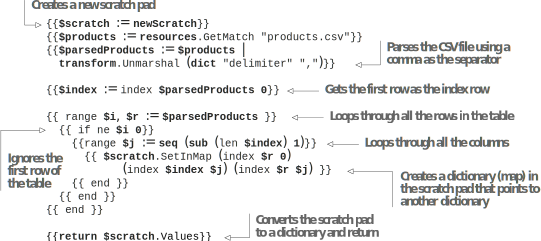

# 6.2 Reusing content with partials

As we introduced new sections to our home  page,  it  pushed the  footer menu down, far away from the top of the website. While those links are not as important as the header, we would like to have them available without scrolling (commonly called above the fold, which comes from newspapers where articles hidden under the fold on the front page were considered less important). Ideally, we want to reuse the code to ren- der the footer.

Inheritance (where a template gets or inherits the entire code of the base template with rights to modify or mutate certain parts), provided by the base template and code block, is not suitable for code reuse at arbitrary locations on a web page. For that, we need composition, where we have a reusable piece of template code that we can plug in wherever we want. We can use shortcodes to share snippets of shared functionality in the markup data, and we can use partials to share common snippets of code in the templates.

Partials are function equivalents in standard programming languages, which pro- vide support for isolating a piece of computation that generates some output to a ren- dered HTML file and returns some data. Partials take arguments, do some processing using those arguments, and log data into the output HTML file, returning the compu- tation results to the caller. Partials are among Hugo’s most important template features, and understanding the concept of partials is important to being successful with Hugo. Table 6.1 compares using partials versus base template code for reuse.

Table 6.1 Partials vs. base template-based code reuse


## 6.2.1 Moving to a partial

Let’s start by moving the footer menu to a partial. To do this, we will create a file called  layout/partials/menu.html  and  move  the  code  to  generate  the  menu-based links used on the home page to that file. Note that we are not using the modern sub- folder under layouts. Partials are available across all content types in Hugo. Also, we can override the partials used in a theme locally and change its behavior by creating a file with the same name in the layouts/partials folder.

Partial overrides allow us to replace parts of a page used with a theme and to cus- tomize those parts. The partials folder allows subfolders to be used as namespaces, although we don’t need one for now (https://github.com/hugoinaction/hugoinaction/ tree/chapter-06-resources/02). The following listing shows how to share our code to create the footer menu from a partial.


```html
{{with site.Menus.footer }}
<nav>
    <ul>
    {{range .}}
    <li>
        <a href="{{.URL}}">{{.Name | humanize}}</a>
    </li>
    {{end}}
    </ul>
</nav>
{{end}}
```


To call a partial, we use the partial statement followed by the name and the context variable. The following listing uses this statement to add the footer menu to the hero section of the index page.


```html
<section id="intro">
...
{{ partial "menu.html" . }}
</section>
```


Just like a block statement, the partial statement also needs to be passed a context variable. Passing the context variable as-is loads menu.html so we can reuse it in the footer. The next listing provides the code for this.


```html
{{block "footer" .}}

<footer class="dark">
{{ partial "menu.html" . }}
...
</footer>
{{end}}
```



**CODE CHECKPOINT**	https://chapter-06-05.hugoinaction.com, and source code: https://github.com/hugoinaction/hugoinaction/tree/chapter-06-05.


## 6.2.2 The partial context

Partials in Hugo are self-contained and isolated, having access to no variables apart from the ones passed to them. The $ variable inside a partial does not reference the global page object but the top-level context variable passed to the partial instead. While we can pass the entire top-level context from the caller to a partial, it is better to limit this data. This limitation ensures maximum reuse of the partial and performance
optimization via caching in a much better way. Otherwise, we pass too much information to the partial, much more than what is needed.

We can reuse the partial between the footer and the main menu if we pass the menu directly. In the following listing, we update the partial to take the specific menu to render instead of the hardcoded main menu for the website, making it capable of rendering different menus.





We can reuse the previous listing using the code in the footer menu. The following listing shows this use.


{{ partial "menu.html" site.Menus.footer }}



**CODE CHECKPOINT**	https://chapter-06-06.hugoinaction.com, and source code: https://github.com/hugoinaction/hugoinaction/tree/chapter-06-06.


The partial statement in the Hugo is similar in concept to a JavaScript module or a PHP include. Now we can use {{ partial "menu.html" site.Menus.main }} as the argument for the main menu, and {{ partial "menu.html" site.Menus.footer }} would render the footer.

One problem with moving the main menu to a partial is the loss of the hamburger button used to render the main menu on mobile devices. Because it is not needed everywhere, we need to pass additional arguments to the partial to figure out when to render this button.

A Hugo partial takes only one argument. To allow passing multiple values, we can convert that argument to a dictionary or a slice, which have multiple values. Slices cause readability issues as the order of the arguments becomes important, and unde- fined arguments are hard to support. To avoid these issues, the following listing uses dictionary arguments as an optional element for the menu to reuse the partial for the header.


{{with $.Menu }}
<nav>
{{if $.Button}}
<button class="hamburger">☰</button>
{{end}}
<ul>
{{ range $.Menu }}
<li><a href="{{.URL}}">{{.Name | humanize}}</a></li>
{{end}}
</ul>
</nav>
{{ end }}
    	

We can now load the header menu with the hamburger button using the partial and passing true for the button option. The following listing provides the code for this. Note that we do not need to pass the Button parameter in the footer because the default value will fail the if check.


```
{{ partial "menu.html"
(dict "Menu" site.Menus.main "Button" true)
}}
```



**CODE CHECKPOINT**	https://chapter-06-07.hugoinaction.com, and source code: https://github.com/hugoinaction/hugoinaction/tree/chapter-06-07.


## 6.2.3 Bringing back the submenu using additional parameters to the menu partial

We lost the submenu from the header when we moved to our content type. Now would be a good time to bring it back. Hugo supports infinite nesting of submenus in a tree data structure and uses the parent-child terminology to represent a menu and its submenus, respectively. Each menu object has a property called .HasChildren and a slice (array) called Children that we can use to render those objects. The following listing adds the submenus as nested unordered lists in the menu partial. For cases like the footer, where there are no submenus, this call has no impact.


```html
<li>
<a href="{{.URL}}">{{.Name | humanize}}</a>
{{if .HasChildren}}
<ul>
{{ range .Children }}
<li><a href="{{.URL}}">{{.Name | humanize}}</a></li>
{{ end }}
</ul>
{{end}}
</li>
```



**CODE CHECKPOINT**	https://chapter-06-08.hugoinaction.com, and source code: https://github.com/hugoinaction/hugoinaction/tree/chapter-06-08.


Hugo’s Menu objects provide additional features like highlighting an active menu when we are on the right page. These extensions are beyond the scope of this book. Additionally, Hugo’s documentation offers a ready-to-use menu template that covers more cases than we were able to do in our code here.

## 6.2.4 Partials and performance

When a template is present in multiple pages, one template invocation takes place for every page. Over a lot of pages, this can slow down the website compilation. Partials allow us to perform caching to prevent duplicate calls. Before we use this feature, let’s spend a few minutes understanding the performance of the code we just wrote.

Hugo provides a build flag, --templateMetrics, which is case-sensitive. When sup- plied, it measures the impact of each template on the overall build. Note that many Hugo operations run in parallel. Therefore, the sum of all the times provided is much more than the time taken to compile the website. The code in listing 6.18 runs perfor- mance metrics on the Acme Corporation website. Note that the numbers are highly dependent on the hardware and software running and may not be the same at all times. (Hugo and its themes are constantly evolving to improve performance, and these numbers can change dramatically.) The file, menu.html, that we just created has run four times already.



    

The key column to note in listing 6.18 is the count column. The single page template (_default/single.html) is called 16 times to render 16 pages. The shortcodes are reported separately. The menu partial (partials/menu.html) has already called the menu template five times to render the home page and the Terms page. Let’s move the Privacy Policy page to the modern template type as well. The menu.html file is called seven times, adding one time for the header and one for the footer for this new page.


**CODE CHECKPOINT**	https://chapter-06-09.hugoinaction.com, and source code: https://github.com/hugoinaction/hugoinaction/tree/chapter-06-09.


To prevent this repetition, we can use partialCached instead of partial. At a mini- mum, partialCached takes the same arguments as partial. If we replace all partial calls with partialCached without passing another argument, we would see that partials/ menu.html executes only once. This execution is an obvious mistake as it forces the header and the footer to have the same menu.


**CODE CHECKPOINT**	https://chapter-06-10.hugoinaction.com, and source code: https://github.com/hugoinaction/hugoinaction/tree/chapter-06-10.


To ensure that the header and the footer have their own menu, partialCached can take an arbitrary number of arguments, each of which is combined to create a unique key. We need to add separate arguments to partialCached, one for each rendered. Listing 6.19 adds the arguments to the index page. Then listing 6.20 adds the argu- ments to the base template file, baseof.html.




```html
{{ partialCached "menu.html" (dict "Menu" site.Menus.footer) "footer"}}
```
   	


```html
{{ partialCached "menu.html" (dict "Menu" site.Menus.main "Button" true)
➥ "main" }}
{{ partialCached "menu.html" (dict "Menu" site.Menus.footer) "footer"}}
```

   	
We could have added true as a cache key alongside main, but this is unnecessary. That’s because the main menu always has a button, and the main key is unique enough.


**CODE CHECKPOINT**    https://chapter-06-11.hugoinaction.com, and source code: https://github.com/hugoinaction/hugoinaction/tree/chapter-06-11.


Now, as we add pages, the count of the partial’s execution does not increase. Partials take a single argument (which can be a dictionary object, dict, with multiple values)  to ensure independence. This allows for efficient caching. The additional arguments     in partialCached can be added easily to partials without changing the partial code.


**TIP** The easiest way to reduce the time taken by a template is to move some implementation to a partial and use a partialCached for slow processing HTML that is the same across pages.


## 6.2.5A detour to partial returns

It would have been partiality against the partial function (pun intended) to have not mentioned the return statement when introducing partials. So far, we have used par- tials as equivalents of shortcodes in the template files. Although rendering in HTML is an important use case for partial and partialCached, partials also act as functions in the Go template language. We can use partials to do string and number crunching or to access the network or the filesystem, and then provide the processed result in a vari- able. Partials already support caching via partialCached.


**Exercise 6.3**

True or False: The blocks present in the base template are executed by Hugo only once and the output is shared across multiple pages.


For this chapter, let’s make the price shortcode we created in chapter 5 execute faster. The price shortcode reads a CSV file that provides the price of any Acme Corporation product. We will cache the prices for all the products in a single partial   (https://github.com/hugoinaction/hugoinaction/tree/chapter-06-resources/
03) accessible across all pages. This way, the reading and parsing of the CSV file hap- pens only once.

Because a table is two-dimensional, we can create a dictionary of dictionaries to represent it. The outer dictionary has the product’s name (row header) as the key and  the product information as its values. The  inner dictionary uses the column headers     as the key and the product’s price and rating as the values. The following listing pro- vides a sample of this function’s output in JSON format.


```json	
{
"Circle": {
"Colors": "Red, Green, Blue, Orange", "Price": "2",
"Rating": 4
},
"Square": {
"Colors": "Red, Pink, Blue",
"Price": "4",
"Rating": 5
}
}
```
    

Hugo’s slice and dict data structures are immutable and cannot be modified. There- fore, we will use the scratch data structure for this partial. Hugo’s scratch structure is a read-write data store that can act as a temporary variable to hold data. It works like a mutable dictionary, where we can add or remove values easily. Listing 6.22 creates a
partial to get the product information from the CSV file, which can then be parsed and cached.



   

The partial in this listing uses no variable from the outside. It returns the same results regardless of the arguments, and we do not need different variants for different inputs. Note that only one return is allowed within a partial in Hugo. Also, when creat- ing a dictionary in the scratch pad that points to another dictionary, the outer dictio- nary uses the first item in the row ($r) as the index whose value is a dictionary that uses the first entry in each column ($index) as the key. Now we can update the price shortcode to utilize this partial. The following listing shows how to do this. Note that partialCached needs at least one key.


```html
{{$product := default (.Get 0) (.Get "product")}}
$ {{index (index (partialCached "products.html" "key") $product) "Price" }}
```



**CODE CHECKPOINT**	https://chapter-06-12.hugoinaction.com, and source code: https://github.com/hugoinaction/hugoinaction/tree/chapter-06-12.


In the code in the previous listing, we got the product information using the parame- ters passed to the shortcode. We used partialCached to call the cached partial named products. We gave it a string as an argument because it does not need a variable. Inside the partial, we created a scratch pad with the key as the product name and the value as its price. We can verify that the partial executes only once using the template
metrics provided by Hugo. Table 6.2 compares partials and shortcodes and their use in Hugo.

Table 6.2 A comparison of partials and shortcodes and their use in Hugo



**Inline partials**

Hugo also supports defining partials inline. If we want to reuse the same code multi- ple times within the same file, but do not want to generate a separate file, an inline partial can come in handy. Inline partials can also act as private functions, while reg- ular partials act as public functions. We can also use the define keyword to define a block that, in turn, defines a partial. The following code shows how to implement these various declarations.

```
{{ $variable := partial "inline-partial" . }}
...
{{ partial "inline-partial" . }} {{/* Ignoring return values */}}
...
{{ define "inline-partial" }}
...
{{return $returnValue}}

{{end}}
```
