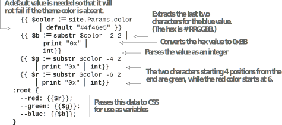
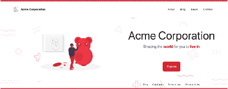
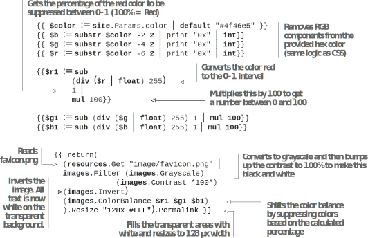
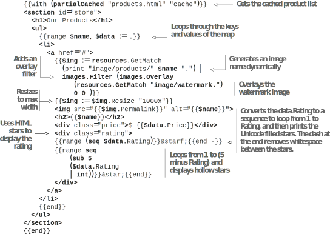

# 6.3 Asset handling with Hugo Pipes

By moving HTML generation to Hugo’s template system, we have significantly eased the job of HTML generation, which we can now do based on a markup document. However, problems remain with images and other assets like JavaScript and CSS. There is a lot of work involved in changing the aspect ratios and resizing images into multiple files for thumbnail, mobile, desktop, etc., which we need to do to get good performance. Also, to be markup- or metadata-based, there needs to be a way for the markup-based information to get into JavaScript or CSS. Hugo Pipes are Hugo’s answer to these problems.

Hugo provides utility methods to manage resources from a page bundle, the global assets folder, and any file path supplied. Most of these methods take a single argument, and we use them with the pipe operator discussed in section 5.1.7. Hugo Pipes is a set of Hugo’s features for resource management.

## 6.3.1 Handling textual assets

We are currently using the static folder for background.svg, index.css, and logo.svg assets apart from favicon.ico. (logo.png was used for the Universal theme, and we will remove that when we remove support for that theme.) We can move all of those files   to the assets folder and use Hugo Pipes to process them further. Hugo supports using Pipes for all text-based file formats.

Let’s start with index.css. The following listing reads the CSS file using Hugo Pipes. Then we need to move the index.css file to the assets folder for this to function.   Finally, we can load this file using the resources API.


{{ $css := resources.GetMatch "index.css"}}
<link rel="stylesheet" type="text/css" href="{{$css.Permalink}}">



**CODE CHECKPOINT**	https://chapter-06-13.hugoinaction.com, and source code: https://github.com/hugoinaction/hugoinaction/tree/chapter-06-13.


With resources.GetMatch, we can place the default file in the asset folder of the theme to be overridden in the website. Note that we used the same feature in the products.csv file earlier. To get an exact resource, we can use resources.Get, although GetMatch supports wildcards (also called globs).

The real power of Hugo Pipes comes with the support for processing. Hugo can process CSS files with the SCSS processor (only in the extended flavor) and the PostCSS postprocessor. SCSS (or SASS) is a CSS superset language that supports nesting, functions, and compile-time variables in CSS. The philosophy behind SCSS is compile-time optimization and code generation. This approach matches that of the Jamstack, and  both work well together. Let’s rename the assets/index.css file to assets/index.scss and use the SCSS preprocessor via Hugo Pipes using $css := resources.GetMatch "index.css" | resources.ToCSS.

First, we need to verify if the version of Hugo we have installed is the extended version. For that, let’s run the command hugo version on the command line. If you have the extended version of Hugo installed, you should see extended in the commandline output:

Hugo Static Site Generator v0.91.2/extended

The SASS compiler comes in two flavors: the version that is embedded in Hugo, which does not need a separate binary (LibSass), and the version where the SASS compiler runs as an external process (Dart Sass). Dart Sass is newer and feature-rich, but we need an external script to install it. We can configure the SASS compiler that we want to use in the website configuration.

You will need the extended version of Hugo to use the SCSS features. Note that in many platforms (including Chocolatey on Windows), the package manager installs
the regular (non-extended) version of Hugo by default. There is no harm in using the extended version because a bigger compiler binary has no impact on the final output size or on performance. Listing 6.25 complies SCSS into CSS for us.


**NOTE** You do not need SCSS to complete the code examples in this book. If you do not have Hugo extended installed, you can skip this specific code checkpoint and continue along through the rest of the book.



{{ $css := resources.GetMatch "index.scss" | resources.ToCSS }}



**CODE CHECKPOINT**	https://chapter-06-14.hugoinaction.com, and source code: https://github.com/hugoinaction/hugoinaction/tree/chapter-06-14.


Hugo does not care about the filename extension. We can pass index.css through the SCSS transpiler if we need to. SCSS is beyond the scope of this book. It is not essential to Hugo, and we will not go into it in depth. We only need CSS for styling content, which is the output of SCSS compilation. For readers who do not want to use the extended version of Hugo, we will revert this change, although you are free to con- tinue using SCSS for your websites.

We can use the PostCSS processor for CSS via resources.PostCSS(requires installing postcss-cli) without any configuration changes. We can also process JavaScript files through  the  Babel  transcompiler  (requires  installing  @babel/cli  and  @babel/core) for getting access to future JavaScript features via the pipe babel for older versions of web browsers. A much better approach is to use Hugo’s built-in JavaScript bundler, js.Build (we’ll discuss js.Build in chapter 10).


**NOTE** Hugo has a special integration with the JavaScript ecosystem. Chapter  10 is dedicated entirely to using JavaScript within Hugo-based websites.


When using a CSS/JS processor with Hugo Pipes, we can run the JavaScript or CSS files through the Hugo template parser with full access to the entire system of variables, functions, and partials, and make their contents data-driven just like the HTML. The theme color for the Acme Corporation website currently is blue. If we move this   to the template system, we can control this from the Acme configuration file. We already defined this color in config.yaml as color in the parameters. We can access the parameter via \{\{site.Param "color"}}. Remember from chapter 5 that site is the global variable provided by Hugo for the site variables. It is available in all partials as well as templates. Using site instead of $.Site provides maximum flexibility when using this template across partials.

While the color value is present in the configuration, we do not use it inside index.css and background.svg, which currently use the hardcoded value, "#4f46e5". We need these values to be dynamic so that we can change them in one place in the
configuration. To do this, we need to convert these files to a template. Then we can run Hugo’s template rendering through this and generate the actual files for the website at compile time. Hugo provides a function called resources.ExecuteAsTemplate to process any resource file as a Hugo template. To do this, we will start with logo.svg and background.svg.

Let’s create a copy of these files and add a .tpl extension to them. While not required, it is a good idea to rename the template files and add the .tpl extension to help in identification.  Next  we  need  to  replace  all  occurrences  of  "#4f46e5" with
{{site.Params.color | default "#4f46e5"}} in  these  files  (https://github.com/hugoinaction/hugoinaction/tree/chapter-06-resources/04). Note that we will not be removing the older background.svg and logo.svg until chapter 8, where we completely move out of the Eclectic theme. Listing 6.26 provides the code to change to the background.svg template so we can use the supplied theme color. Then listing 6.27 changes the logo.svg template.


```html
<style type="text/css">
...
.st2{fill:none;stroke:{{site.Params.color | default "#4f46e5"}};
stroke-width:4;stroke-miterlimit:10;opacity: 0.2}
...
.st6{fill:{{site.Params.color | default "#4f46e5"}}; opacity: 0.2}
...
</style>
```



```
<style type="text/css">
.st0{fill:{{site.Params.color | default "#4f46e5"}};}
...
</style>
```


The CSS file for the Acme Corporation website uses CSS custom properties for each color component (red, green and blue) to define its theme. If we simply coded this    with  the  color  value,  a  string  replacement  of  "#4f46e5" with  {{site.Params.color}}) would have sufficed. For passing individual color values, we need to do a little more work. The following listing provides individual theme colors to CSS variables from Hugo.



    

The CSS file also contains background SVG images with a hardcoded background color, rgb(79, 70, 229). We should do a find and replace operation in the whole file to replace the hardcoded color value with rgb({{$r}},{{$g}},{{$b}}). We cannot use
$color directly here as that would need to be URL-encoded.

Next, we need to load these files into our website via resources.ExecuteAsTemplate as shown in the following listing. We will also be piping the output through resources.minify to reduce its file size.


```
{{ $css := resources.GetMatch "index.css.tpl"
| resources.ExecuteAsTemplate "index.css" "nothing"
| resources.Minify }}
```

    	
resources.ExecuteAsTemplate takes the name of the target file and the context vari- able to pass to the template. Like partials, a resource template executes in an isolated environment, and the $ variable consists of the data we pass directly. The reason for that is the same as that of a partial: to allow caching with maximum reuse. Because the site variable is globally available, we don’t need parameters for template execution. Once this is done, we can load the logo.svg in the base template by parsing it and executing   it similarly to how we did with index.css. The following listing shows this process.


```
{{ $logo := resources.GetMatch "image/logo.svg.tpl"
| resources.ExecuteAsTemplate "logo.svg" "nothing"
| resources.Minify }}

```


We can update the index.css.tpl to render the background.svg template. The following listing shows how to update index.css to use the .tpl file for this.


```html
{{ $background := resources.GetMatch "image/background.svg.tpl" |
resources.ExecuteAsTemplate "background.svg" "nothing" | resources.Minify}} background: url({{$background.Permalink}}) 0 0/cover;
```



**NOTE** The caching mechanism for Hugo becomes compromised if we use resources.ExecuteAsTemplate. It is strongly advised to use resources.ExecuteAsTemplate within a partial and to call it with partialCached to prevent unnecessary recalculation. We leave the task of moving logo.svg and index.css parsing into separate partials as an exercise for the reader.



**CODE CHECKPOINT**     https://chapter-06-15.hugoinaction.com, and source code: https://github.com/hugoinaction/hugoinaction/tree/chapter-06-15.


Now we can control the color in the website configuration (for example, to "#DC2626") to get a different theme color for the website (as shown in figure 6.4) for use in the rest of the book.


**CODE CHECKPOINT**     https://chapter-06-16.hugoinaction.com, and source code: https://github.com/hugoinaction/hugoinaction/tree/chapter-06-16.





Another important feature is support for CSS concatenation. Hugo can easily merge multiple CSS files into one for release, but we cannot concatenate images. In the resources  for  chapter  6,  you  will  find  the  file  additional.css.tpl  (https://github
.com/hugoinaction/hugoinaction/tree/chapter-06-resources/05). We can place this file in the assets folder for consumption. Then we can concatenate it using resources.Concat. Note that resources.Concat needs valid mime types to work. Therefore, we will use index.css and not index.css.tpl for the concat API. The following listing uses this API to allow loading multiple CSS templates via a single call.






**CODE CHECKPOINT**	https://chapter-06-17.hugoinaction.com, and source code: https://github.com/hugoinaction/hugoinaction/tree/chapter-06-17.


To get a slice (array) of all files matching a glob pattern, we can use resources.Match. This way we can develop independent files and supply a merged version in production. Note that additional.css provides a subtle change in the design on the website’s header, which we can use to verify the loading of this file.


**Exercise 6.4**

Add a hero image to the Acme Corporation website home page. The hero image is supplied as an SVG image in the chapter resources (https://github.com/hugoinaction/hugoinaction/tree/chapter-06-resources/06). The generated HTML should match https://chapter-06-18.hugoinaction.com, with the SVG image dynamically generated so that it matches the website colors. The following figure shows the home page after we add the image.





**CODE CHECKPOINT**	https://chapter-06-18.hugoinaction.com, and source code: https://github.com/hugoinaction/hugoinaction/tree/chapter-06-18.


## 6.3.2 Handling images

While vector graphics and SVGs are great for file sizes, not everything is easily build- able using vector graphics. Raster images like JPEGs and PNGs are significant portions of the modern web, forming the bulk of the network traffic for many websites. 
Hugo Pipes broadly supports these images, including manipulations that allow us to prepare them for optimal delivery over the web. Although our blog posts have images, we do not use these on the index page of our website. Without the images, our blog posts look incomplete.

To add a cover image for blog posts, the resources in the global assets location are accessible via resources.GetMatch. The following listing shows how we can access the resources present in page bundles via Page.Resources.GetMatch to add the cover image.


```html
<li class="post">
<a href="{{.Permalink}}">
{{$title := .Title}}
{{with (.Resources.GetMatch "cover.*")}}

{{end}}
...
</a>
</li>
```



**CODE CHECKPOINT**	https://chapter-06-19.hugoinaction.com, and source code: https://github.com/hugoinaction/hugoinaction/tree/chapter-06-19.


The code in the previous listing has a significant performance issue. The cover images for the blog posts are huge and have more pixels than what is needed to render them in the small view on the home page. We cannot resize them in the page bundle because the single page needs bigger images. Hugo provides support for dynamically resizing images during compilation for this use. Here are the resizing options in Hugo:

    .Resize—This option resizes the image. It can take parameters in the form of the desired width and height. For example, \{\{ $hero.Resize "200x200"}} resizes the hero image to 200×200 px, ignoring the aspect ratio. If we use
{{ $hero.Resize "200x"}}, the image is resized to the width of 200 px with the height based on the aspect ratio, and {{ $hero.Resize "x200"}} resizes the image to the height of 200 px with the width calculated based on the original aspect ratio.

    .Fit—This option resizes the image to fit within the supplied box. For example, {{ $hero.Fit "200x200"}} ensures that either the width or the height is 200 px and the other dimension (height or width) is less than 200 px. A  1000×800 image will shrink to 200×160 while a 800×1000 image will become 160×200. This is similar to the CSS property object-fit: contain or back-ground-fit: contain.

    .Fill—This option resizes the image to fill the  supplied box while cropping  the outside parts. For example, {{ $hero.Fill "200x200"}} creates a 200×200 image where the image would be resized and cropped either in the length or      the breadth. This is equivalent to object-fit: cover or background-fit: cover. .Fill in Hugo can also take an optional parameter that defines the part of the image to keep. For example, if we use .Fill "200x200 left", Hugo leaves the leftmost part of the image intact. Hugo also offers an option called smart, where Hugo automatically detects the important part of the image.


**Further optimizations**

While Hugo processes assets as per the supplied parameters, further optimization of assets is still possible. Many developers use postprocessing on Hugo’s output to optimize further. Most hosts, including Netlify, offer asset optimization as a feature of their CDN hosting.

We can include specific plugins for this processing. We can postprocess manually by taking the contents of the public or the docs folders and passing images through a tool like ImageOptim, CSS through CSSMin, and JavaScript through Terser to further optimize the generated assets. We can also use the HTML picture tag or srcset attribute in the img tag to provide the browser with options to load the correct image based on the viewport size.


The maximum size needed for the cover images on the home screen has a width of approximately 1000 px (to handle 2× scaling in high-density displays). The following listing shows how we can use the .Resize option to restrict the cover images to a shorter size. We also add loading=lazy to load these images lazily, thereby speeding up the initial rendering of the website. Note that lazy loading is an HTML and not a Hugo performance feature.



   

This code provides massive savings when loading the index page in terms of file size. It is highly recommended to convert images to the WebP format, which offers further file size reductions. We can pass webp as an option in .Resize (for example, .Resize "1000x webp"). This option converts the image to the WebP format if we use the extended flavor of Hugo. WebP has >95% browser adoption, and unless we are targeting ancient browsers, it is safe to use WebP as the only format for images on our websites. If older browser support is needed, we can use the HTML picture tag to provide both WebP and JPEG/PNG versions of the image. To keep the dependency on the extended ver- sion of Hugo optional, we are not using WebP for this book.


**CODE CHECKPOINT**	https://chapter-06-20.hugoinaction.com, and source code: https://github.com/hugoinaction/hugoinaction/tree/chapter-06-20.


We can also provide artistic filters to the image like a blur, sepia, or grayscale. Figure 6.5 includes a list of some of these filters.

The favicon for the Acme Corporation website is still in the same color as the hardcoded “old” theme. Unfortunately, due to choppy support for SVG favicons by the various browser vendors, we need to have at least a PNG copy of the favicon linked to our website. We can use Hugo’s image-processing filters to recolor our favicon, using    the    theme    color    (https://github.com/hugoinaction/hugoinaction/tree/chapter-06-resources/08).



Note that the math here is complicated, and while it showcases the flexibility offered by Hugo, in most cases, you do not need something this complex. We will calculate the favicon in a cached partial to prevent rerunning our math and then using it inside the head section of our website. The following listing shows how to recolor the favicon dynamically using the color present in the configuration.



    	

To understand what is happening, let’s take an example. Say we want to recolor the  icon to rgb(220,38,38). We first convert all the things that define this color as white, rgb(255,255,255), with the rest of the image as transparent. Next we calculate the RGB value:

```
r1 = (220/255 - 1) * 100 = -13.73%
g1 = (38/255 - 1) * 100 = -85.10%
b1 = (38/255 - 1) * 100 = -85.10%
```

Using these as the color-balance filter, we can now recolor our image with the new  RGB values:

```
Color balance = current color + current color * balance shift

newR = 255 - 255 x 13.73/100 = 220
newG = 255 - 255 x 85.10/100 = 38
newB = 255 - 255 x 85.10/100 = 38
```

We can call this in the head section of our base template to load the favicon. The following listing shows the code for this.


```html
<link rel="icon"
type="image/png" href="{{partialCached "favicon.png.html" $ "nothing"}}">
```
    	


**CODE CHECKPOINT**	https://chapter-06-21.hugoinaction.com, and source code: https://github.com/hugoinaction/hugoinaction/tree/chapter-06-21.


We can redo the products section on the index page to include a list of cards with product images rather than using a table and provide a rating for these. We have all the information already except for the product images, which are provided in the chapter resources (https://github.com/hugoinaction/hugoinaction/tree/chapter-06-resources/09). Because Acme Corporation sells the images, we do not want to expose raw images over the internet. Hugo offers support for an Overlay filter that we can use to provide a watermark. The following listing adds the watermark and then uses Unicode stars (&star; and &starf;) to provide the star ratings. Figure 6.6 shows a completed card.



    

We do not need to move this to a partial. Hugo does not recompute images if nothing changes. The case where cached partials are helpful is when there is a dynamic calcu- lation, like executing the SVGs and the color calculation in the favicon.


**TIP** Unicode symbols provide significant savings in terms of bytes in compar- ison to SVGs and font icons.





**CODE CHECKPOINT**	https://chapter-06-22.hugoinaction.com, and source code: https://github.com/hugoinaction/hugoinaction/tree/chapter-06-22.


## 6.3.3 Other assets

We can also use Hugo Pipes to access other nontextual assets like PDFs, ZIPs, or other binary content files. Although Hugo does not understand their contents, we can use accurate relative and absolute links to those files. If the files are missing, the build fails. If we delete the code that uses the file, the file does not copy over to the output directory. These features make it worthwhile to have an empty static folder and copy over content using the Hugo pipeline.


**Exercise 6.5**

Which of the following are the reasons to use Hugo Pipes over prebuilding content outside Hugo or using browser JavaScript? (Select all that apply.)
- a. Hugo Pipes run when the user requests data and, therefore, no needless execution happens for data that is never requested.
- b. Hugo Pipes have access to the website configuration and front matter where we can consolidate all the website settings like theme color, which can be passed on to the relevant JavaScript, CSS, or image code by Hugo.
- c. Hugo Pipes can cache files across builds, only updating content when it changes.
- d. Hugo Pipes can generate multiple sizes for images based on need, and the size requirement can be changed by a simple string replacement in code.
