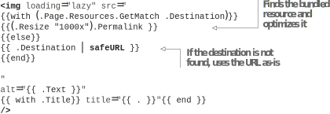

# 6.4 Controlling Markdown rendering

We also have images present in the Markdown documents, which we are not optimizing for production. These can also slow down loading the website. To control how Hugo renders content in the Markdown documents, Hugo provides hooks (called render hook templates) into the Markdown parser, where we can customize the rendering for Mark- down elements. We can override the rendering of images, links, and even headings if we want. When optimizing images, we will override the image-rendering functionality in Markdown to limit the maximum size of the images to 1000 px. The following listing shows how we can add a image render hook in the modern content type, which uses   the   resize function   (https://github.com/hugoinaction/hugoinaction/tree/chapter-06-resources/10).



    	

It is difficult to see visually if our Markdown hook was actually executed because we are not changing the image. We can view the HTML source of the web page and check for lazy loading (loading="lazy") to verify.